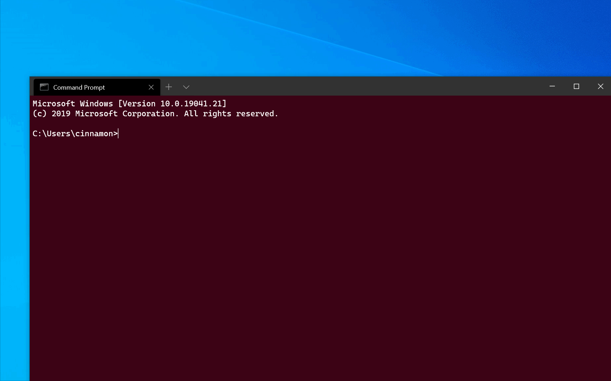

# Using command-line arguments for Windows Terminal

You can use `wt.exe` to open a new instance of Windows Terminal from the command line. You can also use the execution alias `wt` instead.

> [!NOTE]
> If you built Windows Terminal from the source code on [GitHub](https://github.com/microsoft/terminal), you can open that build using `wtd.exe` or `wtd`.



## Command line syntax

The `wt` command line accepts two types of values: **options** and **commands**. **Options** are a list of flags and other parameters that can control the behavior of the `wt` command line as a whole. **Commands** provide the action, or list of actions separated by semicolons, that should be implemented. If no command is specified, then the command is assumed to be `new-tab` by default.

```bash
wt [options] [command ; ]
```

To display a help message listing the available command-line arguments, enter: `wt -h`, `wt --help`, `wt -?`, or `wt /?`.

## Options and commands

Below is the full list of supported commands and options for the `wt` command line.

| Option | Description |
| ------ | ----------- |
| `--help`, `-h`, `-?`, `/?` | Displays the help message. |

| Command | Parameters | Description |
| ------- | ---------- | ----------- |
| `new-tab` | `--profile, -p profile-name`, `--startingDirectory, -d starting-directory`, `commandline` | Creates a new tab. |
| `split-pane` | `-H, --horizontal`, `-V, --vertical`, `--profile, -p profile-name`, `--startingDirectory, -d starting-directory`, `commandline` | Splits a new pane. |
| `focus-tab` | `--target, -t tab-index` | Focuses on a specific tab. |

## Command line argument examples

Commands may vary slightly depending on which command line you're using.

### Open a new profile instance

To open a new terminal instance, in this case the command will open the profile named "Ubuntu-18.04", enter:

<!-- Start tab selectors. -->
#### [Command Prompt](#tab/windows)

```bash
wt -p "Ubuntu-18.04"
```

#### [PowerShell](#tab/powershell)

```powershell
wt -p "Ubuntu-18.04"
```

#### [Linux](#tab/linux)

```bash
cmd.exe /c "wt.exe" -p "Ubuntu-18.04"
```

Execution aliases do not work in WSL distributions. If you want to use wt.exe from a WSL command line, you can spawn it from CMD directly by running `cmd.exe`. The `/c` option tells CMD to terminate after running.

---
<!-- End tab selectors.  -->

 The `-p` flag is used to specify the Windows Terminal profile that should be opened. Substitute "Ubuntu-18.04" with the name of any terminal profile that you have installed. This will always open a new window. Windows Terminal is not yet capable of opening new tabs or panes in an existing instance.


### Terminal sings you a song ([v1.1 preview feature](https://insider.windows.com/))

This is just a test to demonstrate incorporating preview features via a release branch in the GitHub repo. The preview feature link would like to an FAQ section once we add an FAQ page explaining how Windows Insider previews work and how to sign up.

<!-- Start tab selectors. -->
#### [Command Prompt](#tab/windows)

```bash
telnet towel.blinkenlights.nl
```

#### [PowerShell](#tab/powershell)

```powershell
telnet towel.blinkenlights.nl
```

#### [Linux](#tab/linux)

```bash
telnet towel.blinkenlights.nl
```

---
<!-- End tab selectors.  -->

> [!IMPORTANT]
> This feature is only available in the [v1.1 preview release](https://insider.windows.com/) of Windows Terminal.

### Target a directory

To specify the folder that should be used as the starting directory for the console, in this case the d:\ directory, enter:

<!-- Start tab selectors. -->
#### [Command Prompt](#tab/windows)

```bash
wt -d d:\
```

#### [PowerShell](#tab/powershell)

```powershell
wt -d d:\
```

#### [Linux](#tab/linux)

```bash
cmd.exe /c "wt.exe" -d d:\
```

Execution aliases do not work in WSL distributions. If you want to use wt.exe from a WSL command line, you can spawn it from CMD directly by running `cmd.exe`. The `/c` option tells CMD to terminate after running.

---
<!-- End tab selectors.  -->

### Multiple tabs

To open a new terminal instance with multiple tabs, enter:

<!-- Start tab selectors. -->
#### [Command Prompt](#tab/windows)

```bash
wt ; ;
```

#### [PowerShell](#tab/powershell)

```powershell
wt `; `;
```

PowerShell uses a semicolon ; to delimit statements. To interpret a semicolon ; as a command delimiter for wt command-line arguments, you need to escape semicolon characters using backticks. PowerShell also has the stop parsing operator (--%), which instructs it to stop interpreting anything after it and just pass it on verbatim.

#### [Linux](#tab/linux)

```bash
cmd.exe /c "wt.exe" \; \;
```

Execution aliases do not work in WSL distributions. If you want to use wt.exe from a WSL command line, you can spawn it from CMD directly by running `cmd.exe`. The `/c` option tells CMD to terminate after running.

---
<!-- End tab selectors.  -->

To open a new terminal instance with multiple tabs, in this case a Command Prompt profile and a PowerShell profile, enter:

<!-- Start tab selectors. -->
#### [Command Prompt](#tab/windows)

```bash
wt -p "Command Prompt" ; new-tab -p "Windows PowerShell"
```

#### [PowerShell](#tab/powershell)

```powershell
wt -p "Command Prompt" `; new-tab -p "Windows PowerShell"
```

PowerShell uses a semicolon ; to delimit statements. To interpret a semicolon ; as a command delimiter for wt command-line arguments, you need to escape semicolon characters using backticks. PowerShell also has the stop parsing operator (--%), which instructs it to stop interpreting anything after it and just pass it on verbatim.

#### [Linux](#tab/linux)

```bash
cmd.exe /c "wt.exe" -p "Command Prompt" \; new-tab -p "Windows Powershell"
```

Execution aliases do not work in WSL distributions. If you want to use wt.exe from a WSL command line, you can spawn it from CMD directly by running `cmd.exe`. The `/c` option tells CMD to terminate after running and the `\;` forward-slash + semicolon separates commands.

---
<!-- End tab selectors.  -->

### Multiple panes

To open a new terminal instance with one tab containing three panes running a Command Prompt profile, a PowerShell profile, and your default profile running a WSL command line, enter:

<!-- Start tab selectors. -->
#### [Command Prompt](#tab/windows)

```bash
wt -p "Command Prompt" ; split-pane -p "Windows PowerShell" ; split-pane -H wsl.exe
```

#### [PowerShell](#tab/powershell)

```powershell
wt -p "Command Prompt" `; split-pane -p "Windows PowerShell" `; split-pane -H wsl.exe
```

PowerShell uses a semicolon ; to delimit statements. To interpret a semicolon ; as a command delimiter for wt command-line arguments, you need to escape semicolon characters using backticks. PowerShell also has the stop parsing operator (--%), which instructs it to stop interpreting anything after it and just pass it on verbatim.

#### [Linux](#tab/linux)

```bash
cmd.exe /c "wt.exe" -p "Command Prompt" \; split-pane -p "Windows PowerShell" \; split-pane -H wsl.exe
```

Execution aliases do not work in WSL distributions. If you want to use wt.exe from a WSL command line, you can spawn it from CMD directly by running `cmd.exe`. The `/c` option tells CMD to terminate after running and the `\;` forward-slash + semicolon separates commands.

---
<!-- End tab selectors.  -->

The `-H` flag (or `--horizontal`) indicates that you would like the panes to be split horizontally. The `-V` flag (or `--vertical`) indicates that you would like the panes split vertically.

### Tab title

To open a new terminal instance with custom tab titles, use the `--title` argument. To set the title of each tab when opening two tabs, enter:

<!-- Start tab selectors. -->
#### [Command Prompt](#tab/windows)

```bash
wt --title tabname1 ; new-tab -p "Ubuntu-18.04" --title tabname2
```

#### [PowerShell](#tab/powershell)

```powershell
wt --title tabname1 `; new-tab -p "Ubuntu-18.04" --title tabname2
```

#### [Linux](#tab/linux)

```bash
cmd.exe /c "wt.exe" --title tabname1 \; new-tab -p "Ubuntu-18.04" --title tabname2
```

Execution aliases do not work in WSL distributions. If you want to use wt.exe from a WSL command line, you can spawn it from CMD directly by running `cmd.exe`. The `/c` option tells CMD to terminate after running and the `\;` forward-slash + semicolon separates commands.

---
<!-- End tab selectors.  -->

### Tab focus

To open a new terminal instance with a specific tab in focus, use the `-t` flag (or `--target`), along with the tab-index number. To open your default profile in the first tab and the "Ubuntu-18.04" profile focused in the second tab (`-t 1`), enter:

<!-- Start tab selectors. -->
#### [Command Prompt](#tab/windows)

```bash
wt ; new-tab -p "Ubuntu-18.04" ; focus-tab -t 1
```

#### [PowerShell](#tab/powershell)

```powershell
wt `; new-tab -p "Ubuntu-18.04" `; focus-tab -t 1
```

#### [Linux](#tab/linux)

```bash
cmd.exe /c "wt.exe" \; new-tab -p "Ubuntu-18.04" \; focus-tab -t 1
```

Execution aliases do not work in WSL distributions. If you want to use wt.exe from a WSL command line, you can spawn it from CMD directly by running `cmd.exe`. The `/c` option tells CMD to terminate after running and the `\;` forward-slash + semicolon separates commands.

---
<!-- End tab selectors.  -->

## Examples of multiple commands from PowerShell

Windows Terminal uses the semicolon character `;` as a delimiter for separating commands in the `wt` command line. Unfortunately, PowerShell also uses `;` as a command separator. To work around this, you can use the following tricks to run multiple `wt` commands from PowerShell. In all the following examples, a new terminal window is created with three panes - one running Command Prompt, one with PowerShell, and the last one running WSL.

The following examples use the `Start-Process` command to run `wt`. For more information on why the terminal uses `Start-Process`, see [Using start](#using-start) below.

### Single quoted parameters

In this example, the `wt` parameters are wrapped in single quotes (`'`). This syntax is useful if nothing is being calculated.

```powershell
start wt 'new-tab "cmd" ; split-pane -p "Windows PowerShell" ; split-pane -H wsl.exe'
```

### Escaped quotes

When passing a value contained in a variable to the `wt` command line, use the following syntax:

```powershell
$ThirdPane = "wsl.exe"
start wt "new-tab cmd ; split-pane -p `"Windows PowerShell`" ; split-pane -H $ThirdPane"
```

Note the usage of  `` ` `` to escape the double-quotes (`"`) around "Windows PowerShell" in the `-p` parameter to the `split-pane` parameter.

### Using `start`

All the above examples explicitly used `start` to launch the terminal.

The following examples do not use `start` to run the command line. Instead, there are two other methods of escaping the command line:

* Only escaping the semicolons so that `PowerShell` will ignore them and pass them straight to `wt`.
* Using `--%`, so PowerShell will treat the rest of the command line as arguments to the application.

```powershell
wt new-tab "cmd" `; split-pane -p "Windows PowerShell" `; split-pane -H wsl.exe
```

```powershell
wt --% new-tab cmd ; split-pane -p "Windows PowerShell" ; split-pane -H wsl.exe
```

In both of these examples, the newly created Windows Terminal window will create the window by correctly parsing all the provided command-line arguments.

However, these methods are _not_ recommended currently, as PowerShell will wait for the newly-created terminal window to be closed before returning control to PowerShell. By default, PowerShell will always wait for Windows Store applications (like Windows Terminal) to close before returning to the prompt. Note that this is different than the behavior of Command Prompt, which will return to the prompt immediately.
