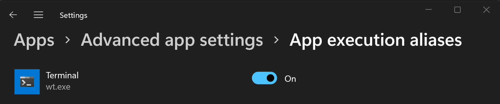

# Using command line arguments for Windows Terminal

You can use `wt.exe` to open a new instance of Windows Terminal from the command line. You can also use the execution alias `wt` instead.

> [!NOTE]
> If you built Windows Terminal from the source code on [GitHub](https://github.com/microsoft/terminal), you can open that build using `wtd.exe` or `wtd`.


## Command line syntax

The `wt` command line accepts two types of values: **options** and **commands**. **Options** are a list of flags and other parameters that can control the behavior of the `wt` command line as a whole. **Commands** provide the action, or list of actions separated by semicolons, that should be implemented. If no command is specified, then the command is assumed to be `new-tab` by default.

```cmd
wt [options] [command ; ]
```

> [!NOTE]
> The behavior of the `wt.exe` command may be affected by the [`windowingBehavior` property](./customize-settings/startup.md#new-instance-behavior). This setting can be adjusted to default between opening a new window or opening a new tab.

To display a help message listing the available command line arguments, enter: `wt -h`, `wt --help`, `wt -?`, or `wt /?`.

## Options and commands

Below is the full list of supported commands and options for the `wt` command line.

| Option | Description |
| ------ | ----------- |
| `--help, -h, -?, /?` | Displays the help message. |
| `--maximized, -M` | Launches the terminal maximized. |
| `--fullscreen, -F` | Launches the terminal as full screen. |
| `--focus, -f` | Launches the terminal in the focus mode. Can be combined with `maximized`. |
| `--pos x,y` | Launches the terminal at the given position. `x` or `y` can be omitted, to use the default value from the settings. |
| `--size` `c,r` | Launches the terminal with the specified number of columns (`c`) and rows (`r`). |
| `--window, -w window-id` | Runs the given command in a specific window. |


The `--window` parameter can be used to send commands to existing terminal windows.

`window-id` may either be the integer ID of a window, or the name of a window. It also accepts the following reserved values:
* `new` or `-1`: Always run this command in a new window
* `last` or `0`: Always run this command in the most recently used window

If no window exists with the given `window-id`, then a new window will be
created with that id/name.

For example, running `wt -w _quake` will open a new ["quake window"](./tips-and-tricks.md#quake-mode). Running that command again will open a new tab in the existing quake window.

### New tab command

Used to create a new tab. See also the [`newTab` action](./customize-settings/actions.md#new-tab).

| Command | Parameter | Description | Values |
| ------- | ---------- | ----------- | ------ |
| `new-tab`, `nt` | `--profile, -p profile-name` | Creates a new tab based on the profile name assigned. | Profile name |
| `new-tab`, `nt` | `--startingDirectory, -d starting-directory` | Creates a new tab based on the starting directory path assigned. | Directory path |
| `new-tab`, `nt` | `--title title` | Creates a new tab with the title assigned. | Text to use as the tab title |
| `new-tab`, `nt` | `--tabColor hex-color` | Creates a new tab with the tab color assigned. | Hex color as #RGB or #RRGGBB |
| `new-tab`, `nt` | `--suppressApplicationTitle` | Override the profile's `suppressApplicationTitle` setting, and set it to `true` |  |
| `new-tab`, `nt` | `--useApplicationTitle` | Override the profile's `suppressApplicationTitle` setting, and set it to `false` |  |
| `new-tab`, `nt` | `--colorScheme scheme-name` | Override the profile's `colorScheme` setting, and set it to the scheme from the settings with the name `scheme-name` | The name of a color scheme in the settings |
| `new-tab`, `nt` | `--appendCommandLine` | Appends the provided command-line to the profile's default command instead of replacing it |  |
| `new-tab`, `nt` | `--inheritEnvironment, !--reloadEnvironment` | Inherit the terminal's own environment variables when creating the new session, rather than creating a fresh environment block. This defaults to set when a `command` is passed. |  |
| `new-tab`, `nt` | `commandline` | Creates a new tab based on the command line assigned. | Executable with optional commands |

> [!TIP]
> If you change the title of a tab in Windows Terminal and want that title to persist, you must enable the [suppressApplicationTitle](./customize-settings/profile-advanced.md#suppress-title-changes) option by setting it to `true`.

### Split-pane command

Used to create a new split pane. See also the [`splitPane` action](./customize-settings/actions.md#split-a-pane).

| Command | Parameter | Description | Values |
| ------- | ---------- | ----------- | ------ |
| `split-pane`, `sp` | `-H, --horizontal`, `-V, --vertical` | Creates a new split window pane either horizontally or vertically. | N/A. No additional values to assign. |
| `split-pane`, `sp` | `--profile, -p profile-name` | Creates a new split window pane based on the assigned command line profile. If this parameter is not assigned, the default profile will be used. | Profile name |
| `split-pane`, `sp` | `--startingDirectory, -d starting-directory` | Creates a new split window pane based on the assigned starting directory path. If this parameter is not assigned, the default starting directory will be used. | Directory path |
| `split-pane`, `sp` | `--title` | Creates a new split window pane with the assigned title. | Text to use as the tab title |
| `split-pane`, `sp` | `--tabColor` | Creates a new split window pane with the assigned tab color. | Hex color as #RGB or #RRGGBB |
| `split-pane`, `sp` | `--size, -s size`| Creates a new split window pane with the assigned size. | Float that specifies the portion of the parent pane to use represented by a decimal. For example, `.4` to represent 40% of the parent pane. |
| `split-pane`, `sp` | `commandline` | Creates a new split window pane based on the assigned command line. | Executable with optional commands  |
| `split-pane`, `sp` | `--duplicate, -D` | Creates a new split window pane that is a duplicate of the current pane. | N/A. No additional values to assign. |
| `split-pane`, `sp` | `--suppressApplicationTitle` | Override the profile's `suppressApplicationTitle` setting, and set it to `true` |  |
| `split-pane`, `sp` | `--useApplicationTitle` | Override the profile's `suppressApplicationTitle` setting, and set it to `false` |  |
| `split-pane`, `sp` | `--colorScheme scheme-name` | Override the profile's `colorScheme` setting, and set it to the scheme from the settings with the name `scheme-name` | The name of a color scheme in the settings |

### Focus-tab command

Used to focus a specific tab within the window. See also the [`switchToTab` action](./customize-settings/actions.md#open-a-specific-tab).


| Command | Parameter | Description | Values |
| ------- | ---------- | ----------- | ------ |
| `focus-tab`, `ft` |  `--target, -t tab-index` | Focuses on a specific tab according to it's tab index number. | Tab index as an integer |

### Move-focus command

Used to move focus within the window. See also the [`moveFocus` action](./customize-settings/actions.md#move-pane-focus).

| Command | Parameter | Description | Values |
| ------- | ---------- | ----------- | ------ |
| `move-focus`, `mf` | `<direction>` |  Move focus between panes. | See below for accepted `direction` values |

Accepted `direction` values
* `up`, `down`, `left`, or `right` move focus in the given direction.
* `first` moves focus to the first leaf pane in the tree.
* `previous` moves the focus to the most recently used pane before the current pane.
* `nextInOrder`, `previousInOrder` moves the focus to the next or previous pane in order of creation.

### Move-pane command

Used to move a pane within the window. See also the [`movePane` action](./customize-settings/actions.md#move-pane).

| Command | Parameter | Description | Values |
| ------- | ---------- | ----------- | ------ |
| `move-pane`, `mp` | `--tab,-t <index>` |  Move the active pane to the given tab in the window | The zero-indexed index of the tab to move the pane to. |

### Swap-pane command

Used to swap the position of two panes within the window. See also the [`swapPane` action](./customize-settings/actions.md#swap-panes).

| Command | Parameter | Description | Values |
| ------- | ---------- | ----------- | ------ |
| `swap-pane` | `<direction>` |  Swap the pane with the pane in the given direction | See below for accepted `direction` values |

Accepted `direction` values (these are the same values as the `move-focus` sub command)
* `up`, `down`, `left`, or `right`: Swap the active pane with the one in the given direction.
* `first`: Swap the active pane with the first leaf pane in the tree.
* `previous`: Swap the active pane with the most recently used pane before the current pane.
* `nextInOrder`, `previousInOrder`: Swap the active pane with the next or previous pane in order of creation.

## Command line argument examples

Commands may vary slightly depending on which command line you're using.

### Passing an argument to the default shell

To start an instance of Windows Terminal and have it execute a command, call `wt.exe` followed by your command.

Here's an example of calling Windows Terminal to pass a [ping](/windows-server/administration/windows-commands/ping) command argument to echo an IP address:

```powershell
wt ping learn.microsoft.com
```

Here's an example of calling Windows Terminal to open a new tab with a PowerShell command line, confirming to call the [Start-Service](/powershell/module/microsoft.powershell.management/start-service) command, and opening another new tab with Windows Command Prompt open to the `/k` directory:

```cmd
wt new-tab PowerShell -c Start-Service ; new-tab cmd /k dir
```

### Target a specific window

Below are examples of how to target specific windows using the `--window,-w` option.

<!-- Start tab selectors. -->
#### [Command Prompt](#tab/windows)

```cmd
// Open a new tab with the default profile in the current window
wt -w 0 nt

// Open a new tab in a new window with the default profile
wt -w -1 nt

// Open a new tab in the first-created terminal window with the default profile
wt -w 1 nt

// Open a new tab in the terminal window named foo with the default profile. If foo does not exist, create a new window named foo.
wt -w foo nt
```

#### [PowerShell](#tab/powershell)

```powershell
// Open a new tab with the default profile in the current window
wt -w 0 nt

// Open a new tab in a new window with the default profile
wt -w -1 nt

// Open a new tab in the first-created terminal window with the default profile
wt -w 1 nt

// Open a new tab in the terminal window named foo with the default profile. If foo does not exist then, create a new window named foo.
wt -w foo nt
```

#### [Linux](#tab/linux)

```bash
// Open a new tab with the default profile in the current window
cmd.exe /c "wt.exe" -w 0 nt

// Open a new tab in a new window with the default profile
cmd.exe /c "wt.exe" -w -1 nt

// Open a new tab in the first-created terminal window with the default profile
cmd.exe /c "wt.exe" -w 1 nt

// Open a new tab in the terminal window named foo with the default profile. If foo does not exist then, create a new window named foo.
cmd.exe /c "wt.exe" -w foo nt
```

Execution aliases do not work in WSL distributions. If you want to use wt.exe from a WSL command line, you can spawn it from CMD directly by running `cmd.exe`. The `/c` option tells CMD to terminate after running.

---
<!-- End tab selectors.  -->

### Open a new profile instance

To open a new terminal instance, in this case the command will open the profile named "Ubuntu-18.04", enter:

<!-- Start tab selectors. -->
#### [Command Prompt](#tab/windows)

```cmd
wt -p "Ubuntu-18.04"
```

#### [PowerShell](#tab/powershell)

```powershell
wt -p "Ubuntu-18.04"
```

#### [Linux](#tab/linux)

```bash
cmd.exe /c "wt.exe" -p "Ubuntu-18.04"
```

Execution aliases do not work in WSL distributions. If you want to use wt.exe from a WSL command line, you can spawn it from CMD directly by running `cmd.exe`. The `/c` option tells CMD to terminate after running.

---
<!-- End tab selectors.  -->

The `-p` flag is used to specify the Windows Terminal profile that should be opened. Substitute "Ubuntu-18.04" with the name of any terminal profile that you have installed. This will always open a new window. To open a new shell tab in an existing (already open) instance of Windows Terminal, use: wt -w [window id](#options-and-commands) [executable name]. For example, `wt -w 0 cmd` to open a Command Prompt shell in the most recent instance of Windows Terminal. If you're launching a profile (shell executable combined with color scheme, title, command, other settings pertaining to how it interacts with the console session), you must use the profile name in the command: `wt -w 0 -p "Profile Name"`.

### Target a directory

To specify the folder that should be used as the starting directory for the console, in this case the d:\ directory, enter:

<!-- Start tab selectors. -->
#### [Command Prompt](#tab/windows)

```cmd
wt -d d:\
```

#### [PowerShell](#tab/powershell)

```powershell
wt -d d:\
```

#### [Linux](#tab/linux)

```bash
cmd.exe /c "wt.exe" -d d:\
```

Execution aliases do not work in WSL distributions. If you want to use wt.exe from a WSL command line, you can spawn it from CMD directly by running `cmd.exe`. The `/c` option tells CMD to terminate after running.

---
<!-- End tab selectors.  -->

### Multiple tabs

To open a new terminal instance with multiple tabs, enter:

<!-- Start tab selectors. -->
#### [Command Prompt](#tab/windows)

```cmd
wt ; ;
```

#### [PowerShell](#tab/powershell)

```powershell
wt `; `;
```

PowerShell uses a semicolon `;` to delimit statements. To interpret a semicolon `;` as a command delimiter for wt command-line arguments, you need to escape semicolon characters using backticks. PowerShell also has the stop parsing operator (`--%`), which instructs it to stop interpreting anything after it and just pass it on verbatim.

#### [Linux](#tab/linux)

```bash
cmd.exe /c "wt.exe" \; \;
```

Execution aliases do not work in WSL distributions. If you want to use wt.exe from a WSL command line, you can spawn it from CMD directly by running `cmd.exe`. The `/c` option tells CMD to terminate after running.

---
<!-- End tab selectors.  -->

To open a new terminal instance with multiple tabs, in this case a Command Prompt profile and a PowerShell profile, enter:

<!-- Start tab selectors. -->
#### [Command Prompt](#tab/windows)

```cmd
wt -p "Command Prompt" ; new-tab -p "Windows PowerShell"
```

#### [PowerShell](#tab/powershell)

```powershell
wt -p "Command Prompt" `; new-tab -p "Windows PowerShell"
```

PowerShell uses a semicolon `;` to delimit statements. To interpret a semicolon `;` as a command delimiter for wt command-line arguments, you need to escape semicolon characters using backticks. PowerShell also has the stop parsing operator (`--%`), which instructs it to stop interpreting anything after it and just pass it on verbatim.

#### [Linux](#tab/linux)

```bash
cmd.exe /c "wt.exe" -p "Command Prompt" \; new-tab -p "Windows PowerShell"
```

Execution aliases do not work in WSL distributions. If you want to use wt.exe from a WSL command line, you can spawn it from CMD directly by running `cmd.exe`. The `/c` option tells CMD to terminate after running and the `\;` backslash + semicolon separates commands.

---
<!-- End tab selectors.  -->

### Multiple panes

To open a new terminal instance with one tab containing three panes running a Command Prompt profile, a PowerShell profile, and your default profile running a WSL command line, enter:

<!-- Start tab selectors. -->
#### [Command Prompt](#tab/windows)

```cmd
wt -p "Command Prompt" ; split-pane -p "Windows PowerShell" ; split-pane -H wsl.exe
```

#### [PowerShell](#tab/powershell)

```powershell
wt -p "Command Prompt" `; split-pane -p "Windows PowerShell" `; split-pane -H wsl.exe
```

PowerShell uses a semicolon `;` to delimit statements. To interpret a semicolon `;` as a command delimiter for wt command-line arguments, you need to escape semicolon characters using backticks. PowerShell also has the stop parsing operator (`--%`), which instructs it to stop interpreting anything after it and just pass it on verbatim.

#### [Linux](#tab/linux)

```bash
cmd.exe /c "wt.exe" -p "Command Prompt" \; split-pane -p "Windows PowerShell" \; split-pane -H wsl.exe
```

Execution aliases do not work in WSL distributions. If you want to use wt.exe from a WSL command line, you can spawn it from CMD directly by running `cmd.exe`. The `/c` option tells CMD to terminate after running and the `\;` backslash + semicolon separates commands.

---
<!-- End tab selectors.  -->

The `-H` flag (or `--horizontal`) indicates that you would like the panes to be split horizontally. The `-V` flag (or `--vertical`) indicates that you would like the panes split vertically.

### Multiple tabs and panes

The `new-tab` and `split-pane` commands can be sequenced to get multiple tabs, each with split panes. To open a new terminal instance with two tabs, each with two panes running a Command Prompt and a WSL command line, with each tab in a different directory, enter:

<!-- Start tab selectors. -->
#### [Command Prompt](#tab/windows)

```cmd
wt -p "Command Prompt" ; split-pane -V wsl.exe ; new-tab -d c:\ ; split-pane -H -d c:\ wsl.exe
```

#### [PowerShell](#tab/powershell)

```powershell
wt -p "Command Prompt" `; split-pane -V wsl.exe `; new-tab -d c:\ `; split-pane -H -d c:\ wsl.exe
```

PowerShell uses a semicolon `;` to delimit statements. To interpret a semicolon `;` as a command delimiter for wt command-line arguments, you need to escape semicolon characters using backticks. PowerShell also has the stop parsing operator (`--%`), which instructs it to stop interpreting anything after it and just pass it on verbatim.

#### [Linux](#tab/linux)

```bash
cmd.exe /c "wt.exe" -p "Command Prompt" \; split-pane -V wsl.exe \; new-tab -d c:\\ \; split-pane -H -d c:\\ wsl.exe
```

Execution aliases do not work in WSL distributions. If you want to use wt.exe from a WSL command line, you can spawn it from CMD directly by running `cmd.exe`. The `/c` option tells CMD to terminate after running and the `\;` backslash + semicolon separates commands.  Note to specify a Windows directory as the starting directory for `wsl.exe` that two backslashes `\\` are required.

---
<!-- End tab selectors.  -->

### Pane title

To open a new terminal instance with custom titles for each terminal pane, use the `--title` argument. To set the title of each pane when opening multiple tabs, enter:

<!-- Start tab selectors. -->
#### [Command Prompt](#tab/windows)

```cmd
wt --title tabname1 ; new-tab -p "Ubuntu-18.04" --title tabname2
```

#### [PowerShell](#tab/powershell)

```powershell
wt --title tabname1 `; new-tab -p "Ubuntu-18.04" --title tabname2
```

PowerShell uses a semicolon `;` to delimit statements. To interpret a semicolon `;` as a command delimiter for wt command-line arguments, you need to escape semicolon characters using backticks. PowerShell also has the stop parsing operator (`--%`), which instructs it to stop interpreting anything after it and just pass it on verbatim.

#### [Linux](#tab/linux)

```bash
cmd.exe /c "wt.exe" --title tabname1 \; new-tab -p "Ubuntu-18.04" --title tabname2
```

Execution aliases do not work in WSL distributions. If you want to use wt.exe from a WSL command line, you can spawn it from CMD directly by running `cmd.exe`. The `/c` option tells CMD to terminate after running and the `\;` forward-slash + semicolon separates commands.

---
<!-- End tab selectors.  -->

Panes in the same tab can have different titles, which will reflect on the tab title depending on which pane has focus. To name independent panes, you can set the title after splitting the panes by entering:

<!-- Start tab selectors. -->
#### [Command Prompt](#tab/windows)

```cmd
wt --title pane1 ; split-pane -p "Command Prompt" --title pane2
```

#### [PowerShell](#tab/powershell)

```powershell
wt --title pane1 `; split-pane -p "Command Prompt" --title pane2
```

PowerShell uses a semicolon `;` to delimit statements. To interpret a semicolon `;` as a command delimiter for wt command-line arguments, you need to escape semicolon characters using backticks. PowerShell also has the stop parsing operator (`--%`), which instructs it to stop interpreting anything after it and just pass it on verbatim.

#### [Linux](#tab/linux)

```bash
cmd.exe /c "wt.exe" --title pane1 \; split-pane -p "Command Prompt" --title pane2
```

Execution aliases do not work in WSL distributions. If you want to use wt.exe from a WSL command line, you can spawn it from CMD directly by running `cmd.exe`. The `/c` option tells CMD to terminate after running and the `\;` forward-slash + semicolon separates commands.

---
<!-- End tab selectors.  -->

### Using application title

To open a new terminal instance allowing applications within it to set the tab title by sending title change messages, use the `--useApplicationTitle` flag. To suppress these messages, use the `--suppressApplicationTitle` flag. If none of these flags are provided, the behavior is inherited from the profile's settings. To open a tab with title `tabname` that will not be overridden by the application, enter:

<!-- Start tab selectors. -->
#### [Command Prompt](#tab/windows)

```cmd
wt --title tabname --suppressApplicationTitle
```

#### [PowerShell](#tab/powershell)

```powershell
wt --title tabname --suppressApplicationTitle
```

#### [Linux](#tab/linux)

```bash
cmd.exe /c "wt.exe" --title tabname --suppressApplicationTitle
```

Execution aliases do not work in WSL distributions. If you want to use wt.exe from a WSL command line, you can spawn it from CMD directly by running `cmd.exe`. The `/c` option tells CMD to terminate after running and the `\;` backslash + semicolon separates commands.

---
<!-- End tab selectors.  -->

### Tab color

To open a new terminal instance with custom tab colors, use the `--tabColor` argument. This argument overrides the value defined in the profile, but can be overridden as well using the tab color picker. In the following example, a new terminal is created with two tabs of different colors:

<!-- Start tab selectors. -->
#### [Command Prompt](#tab/windows)

```cmd
wt --tabColor #009999 ; new-tab --tabColor #f59218
```

#### [PowerShell](#tab/powershell)

```powershell
wt --tabColor '#009999' `; new-tab --tabColor '#f59218'
```

PowerShell uses a semicolon `;` to delimit statements. To interpret a semicolon `;` as a command delimiter for wt command-line arguments, you need to escape semicolon characters using backticks. PowerShell also has the stop parsing operator (`--%`), which instructs it to stop interpreting anything after it and just pass it on verbatim.

#### [Linux](#tab/linux)

```bash
cmd.exe /c "wt.exe" --tabColor #009999 \; new-tab --tabColor #f59218
```

Execution aliases do not work in WSL distributions. If you want to use wt.exe from a WSL command line, you can spawn it from CMD directly by running `cmd.exe`. The `/c` option tells CMD to terminate after running and `\;` separates commands.

---
<!-- End tab selectors.  -->

When `--tabColor` is set for a tab, it is associated with the first pane of this tab. Hence in a tab with multiple panes, the color will be applied only if the first pane is in focus. To set the tab color for additional panes, you will need to add the `--tabColor` parameter to the `split-pane` subcommand as well. In the example below, a tab with two panes is created with tab colors specified for each pane:

```powershell
wt new-tab --tabColor '#009999' `; split-pane --tabColor '#f59218'
```

### Color scheme

To open a new terminal instance with a specific color scheme (instead of the `colorScheme` set in the profile), use the `--colorScheme` argument. This argument overrides the value defined in the profile.

<!-- Start tab selectors. -->
#### [Command Prompt](#tab/windows)

```cmd
wt --colorScheme Vintage ; split-pane --colorScheme "Tango Light"
```

#### [PowerShell](#tab/powershell)

```powershell
wt --colorScheme Vintage `; split-pane --colorScheme "Tango Light"
```

PowerShell uses a semicolon `;` to delimit statements. To interpret a semicolon `;` as a command delimiter for wt command-line arguments, you need to escape semicolon characters using backticks. PowerShell also has the stop parsing operator (`--%`), which instructs it to stop interpreting anything after it and just pass it on verbatim.

#### [Linux](#tab/linux)

```bash
cmd.exe /c "wt.exe" --colorScheme Vintage \; split-pane --colorScheme "Tango Light"
```

Execution aliases do not work in WSL distributions. If you want to use wt.exe from a WSL command line, you can spawn it from CMD directly by running `cmd.exe`. The `/c` option tells CMD to terminate after running and `\;` separates commands.

---
<!-- End tab selectors.  -->

### Tab focus

To open a new terminal instance with a specific tab in focus, use the `-t` flag (or `--target`), along with the tab-index number. To open your default profile in the first tab and the "Ubuntu-18.04" profile focused in the second tab (`-t 1`), enter:

<!-- Start tab selectors. -->
#### [Command Prompt](#tab/windows)

```cmd
wt ; new-tab -p "Ubuntu-18.04" ; focus-tab -t 1
```

#### [PowerShell](#tab/powershell)

```powershell
wt `; new-tab -p "Ubuntu-18.04" `; focus-tab -t 1
```

PowerShell uses a semicolon `;` to delimit statements. To interpret a semicolon `;` as a command delimiter for wt command-line arguments, you need to escape semicolon characters using backticks. PowerShell also has the stop parsing operator (`--%`), which instructs it to stop interpreting anything after it and just pass it on verbatim.

#### [Linux](#tab/linux)

```bash
cmd.exe /c "wt.exe" \; new-tab -p "Ubuntu-18.04" \; focus-tab -t 1
```

Execution aliases do not work in WSL distributions. If you want to use wt.exe from a WSL command line, you can spawn it from CMD directly by running `cmd.exe`. The `/c` option tells CMD to terminate after running and the `\;` backslash + semicolon separates commands.

---
<!-- End tab selectors.  -->

## Examples of multiple commands from PowerShell

Windows Terminal uses the semicolon character `;` as a delimiter for separating commands in the `wt` command line. Unfortunately, PowerShell also uses `;` as a command separator. To work around this, you can use the following tricks to run multiple `wt` commands from PowerShell. In all the following examples, a new terminal window is created with three panes - one running Command Prompt, one with PowerShell, and the last one running WSL.

The following examples do not use `start` to run the command line. Instead, there are two other methods of escaping the command line:

* Only escaping the semicolons so that `PowerShell` will ignore them and pass them straight to `wt`.
* Using `--%`, so PowerShell will treat the rest of the command line as arguments to the application.

```powershell
wt new-tab "cmd" `; split-pane -p "Windows PowerShell" `; split-pane -H wsl.exe
```

```powershell
wt --% new-tab cmd ; split-pane -p "Windows PowerShell" ; split-pane -H wsl.exe
```

In both of these examples, the newly created Windows Terminal window will create the window by correctly parsing all the provided command-line arguments.

However, these methods are _not_ recommended currently, as PowerShell will wait for the newly-created terminal window to be closed before returning control to PowerShell. By default, PowerShell will always wait for Windows Store applications (like Windows Terminal) to close before returning to the prompt. Note that this is different than the behavior of Command Prompt, which will return to the prompt immediately.

## Add Windows Terminal executable to your PATH

To add the Windows Terminal executable file (wt.exe) to your PATH, enable its "app execution alias" in the **Manage app execution aliases** page of Windows Settings. The Windows Terminal alias is turned on by default, but may be worth confirming if you're having issues accessing it.

If you are still having trouble accessing app execution aliases, you might need to check whether your PATH contains: `%LOCALAPPDATA%\Microsoft\WindowsApps`. Do not attempt to make changes to `C:\Program Files\WindowsApps`.


