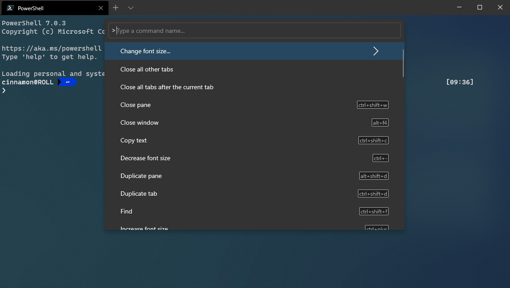
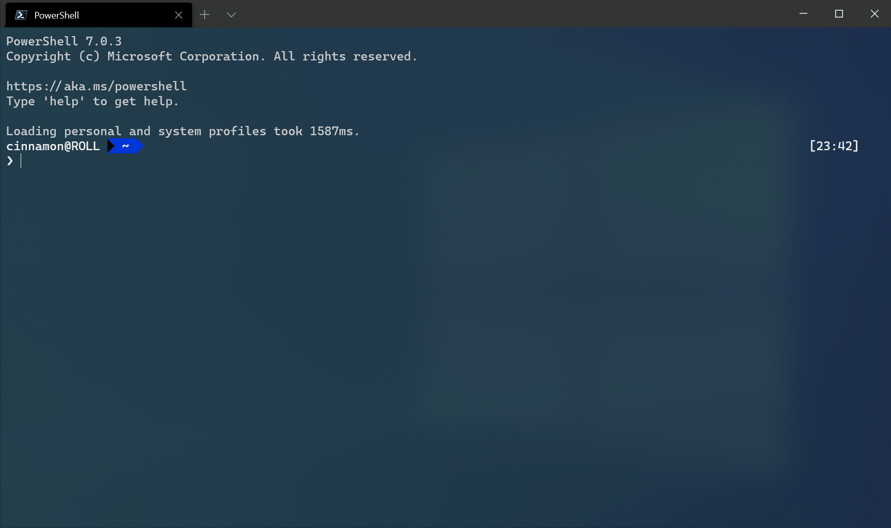

# How to use the command palette in Windows Terminal ([Preview](https://aka.ms/terminal-preview/))

> [!IMPORTANT]
> This feature is only available in [Windows Terminal Preview](https://aka.ms/terminal-preview/).

The command palette lets you see which commands you can run inside Windows Terminal.

## Invoking the command palette

You can invoke the command palette by typing `ctrl+shift+p`. This can be customized by adding the `commandPalette` command to your key bindings.

```json
{ "command": "commandPalette", "keys": "ctrl+shift+p" }
```

## Command line mode

If you'd like to enter a `wt` command into the command palette, you can do so by starting with the `>` character. This will run the `wt` command in the current window. More information on `wt` commands can be found on the [Command line arguments page](./command-line-arguments.md).



## Defining commands

Commands are automatically generated for each of the actions in your `keybindings`, when possible. If you'd like to add other commands to the command palette, you can define them in three different ways.

#### With a value for `keys` without a `name`

This is the behavior that is documented on the [Actions page](./customize-settings/actions.md). These commands can be invoked with the defined key binding. The commands will appear in the command palette if Windows Terminal can autogenerate a reasonable name for it.

```json
{ "command": "newTab", "keys": "ctrl+shift+t" }
```

#### Without a value for `keys`, but with a `name`

These commands will only be added to the command palette. They cannot be invoked with a key binding. `name` overrides the autogenerated name.

```json
{ "name": "Open my default tab", "command": "newTab" }
```

#### With a value for `keys` with a `name`

These commands will be added to the command palette and can be invoked with the keyboard. The `name` property will override the autogenerated name.

```json
{ "name": "New tab", "command": "newTab", "keys": "ctrl+shift+t" }
```

### Adding an icon

You can optionally add an icon to a command that appears in the command palette. This can be done by adding the `icon` property to the command. Icons can be a path to an image, a symbol from [Segoe MDL2 Assets](https://docs.microsoft.com/windows/uwp/design/style/segoe-ui-symbol-font), or any character, including emojis.

```json
{ "icon": "C:\\Images\\my-icon.png", "name": "New tab", "command": "newTab", "keys": "ctrl+shift+t" },
{ "icon": "\uE756", "name": "New tab", "command": "newTab", "keys": "ctrl+shift+t" },
{ "icon": "⚡", "name": "New tab", "command": "newTab", "keys": "ctrl+shift+t" }
```

### Nested commands

Nested commands let you group multiple commands under one item in the command palette. The example below groups the font resize commands under one command palette item called "Change font size...".

```json
{
    "name": "Change font size...",
    "commands": [
        { "command": { "action": "adjustFontSize", "delta": 1 } },
        { "command": { "action": "adjustFontSize", "delta": -1 } },
        { "command": "resetFontSize" },
    ]
}
```



### Iterable commands

Iterable commands let you create multiple commands at the same time, generated from other objects defined in your settings. Currently, you can create iterable commands for your profiles and color schemes. At runtime, these commands will be expanded to one command for each of the objects of the given type.

You can currently iterate over the following properties:

| `iterateOn` | Property | Property syntax |
| ----------- | -------- | --------------- |
| `profiles` | `name` | `"name": "${profile.name}"` |
| `profiles` | `icon` | `"icon": "${profile.icon}"` |
| `schemes` | `name` | `"name": "${scheme.name}"` |

#### Example

Create a new tab command for each profile.


```json
{
    "name": "New tab",
    "commands": [
        {
            "iterateOn": "profiles",
            "icon": "${profile.icon}",
            "name": "${profile.name}",
            "command": { "action": "newTab", "profile": "${profile.name}" }
        }
    ]
}
```

In the above example:

- `"iterateOn": "profiles"` will generate a command for each profile.
- At runtime, the terminal will replace `${profile.icon}` with each profile's icon and `${profile.name}` with each profile's name.

If you had three profiles:

```json
"profiles": [
	{ "name": "Command Prompt", "icon": null },
	{ "name": "PowerShell", "icon": "C:\\path\\to\\icon.png" },
	{ "name": "Ubuntu", "icon": null },
]
```

The above command would behave like the following three commands:

```json
{
    "name": "New tab...",
    "commands": [
        {
            "icon": null,
            "name": "Command Prompt",
            "command": { "action": "newTab", "profile": "Command Prompt" }
        },
        {
            "icon": "C:\\path\\to\\icon",
            "name": "PowerShell",
            "command": { "action": "newTab", "profile": "PowerShell" }
        },
        {
            "icon": null,
            "name": "Ubuntu",
            "command": { "action": "newTab", "profile": "Ubuntu" }
        }
    ]
}
```

## Hiding a command

If you would like to keep a command in your key bindings list but not have it appear in the command palette, you can hide it by setting its `name` to `null`. The example below hides the "New tab" action from the command palette.

```json
{ "name": null, "command": "newTab", "keys": "ctrl+shift+t" }
```
