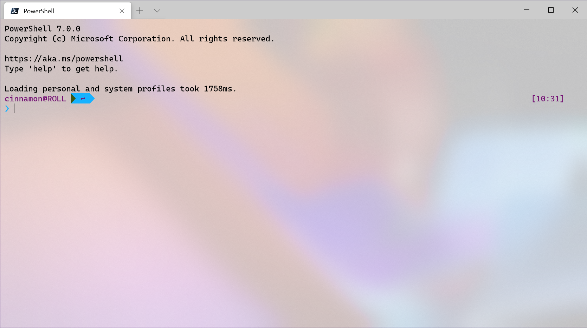
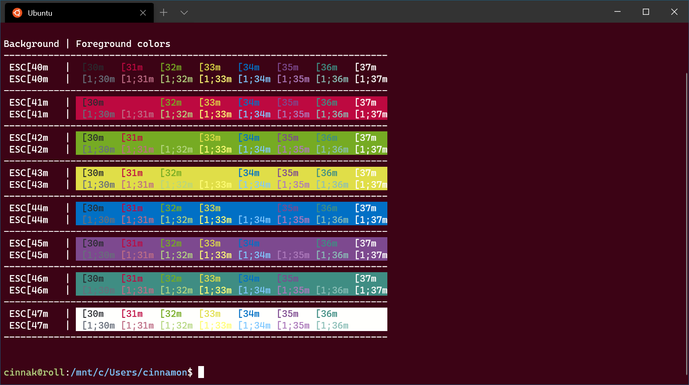
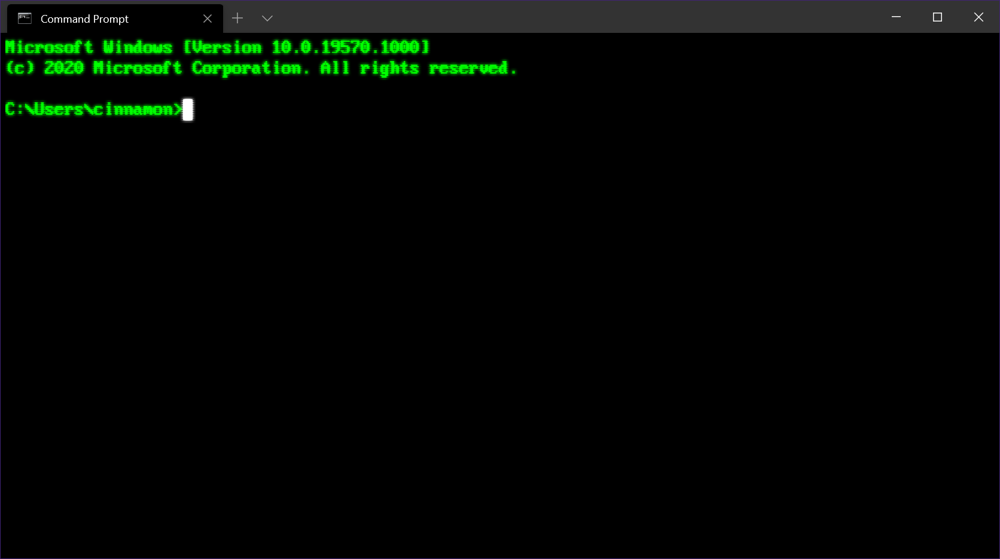

# Custom Terminal Gallery

Here are some color schemes for you to try or use as the basis of your own designs.

## Installing schemes

Copy the JSON from the **"schemes"** section into the correct section in settings.json, for example:

Before:

```json
"schemes:" [],
```

After:

```json
 "schemes": [
            {
                "name": "Retro",
                "background": "#000000",
                "black": "#00ff00",
                "blue": "#00ff00",
                "brightBlack": "#00ff00",
                "brightBlue": "#00ff00",
                "brightCyan": "#00ff00",
                "brightGreen": "#00ff00",
                "brightPurple": "#00ff00",
                "brightRed": "#00ff00",
                "brightWhite": "#00ff00",
                "brightYellow": "#00ff00",
                "cyan": "#00ff00",
                "foreground": "#00ff00",
                "green": "#00ff00",
                "purple": "#00ff00",
                "red": "#00ff00",
                "white": "#00ff00",
                "yellow": "#00ff00"
            }
        ]
```

Then add the profile-specific section, for example:

Before:

```json
{
    "guid": "{234ab24f-34dd-ff3-ade434aad345}",
    "name": "Command Prompt",
    "commandline": "cmd.exe",
    "hidden": false
}
```

After:

```json
{
    "guid": "{234ab24f-34dd-ff3-ade434aad345}",
    "name": "Command Prompt",
    "commandline": "cmd.exe",
    "hidden": false,
    "colorScheme" : "Retro",
    "colorScheme" : "Retro",
    "cursorColor" : "#FFFFFF",
    "cursorShape": "filledBox",
    "fontSize" : 16,
    "padding" : "5, 5, 5, 5",
    "tabTitle" : "Command Prompt",
    "fontFace": "PxPlus IBM VGA8",
    "experimental.retroTerminalEffect": true
}
```

## Frosted Glass



[Details](frosted-glass-theme.md)

## Powerline


[Details](powerline-in-powershell/md)

## Raspberry Ubuntu



[Details](raspberry-ubuntu.md)

## Retro Command



[Details](retro-command-prompt.md)

## Share!

Do you have a Windows Terminal scheme you would like to share? Show us on [Twitter](https://twitter.com/WindowsDocs)!