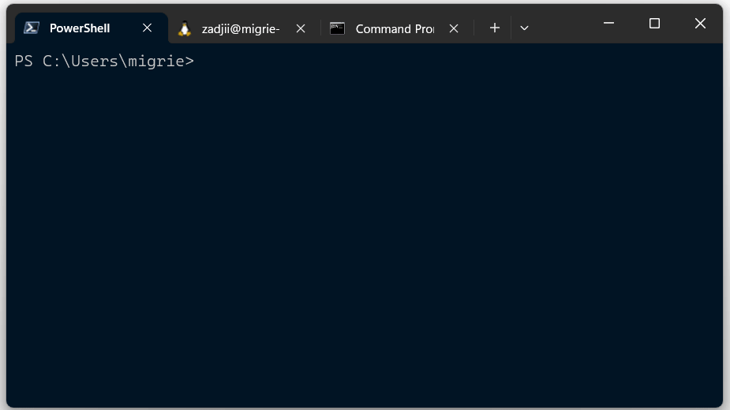
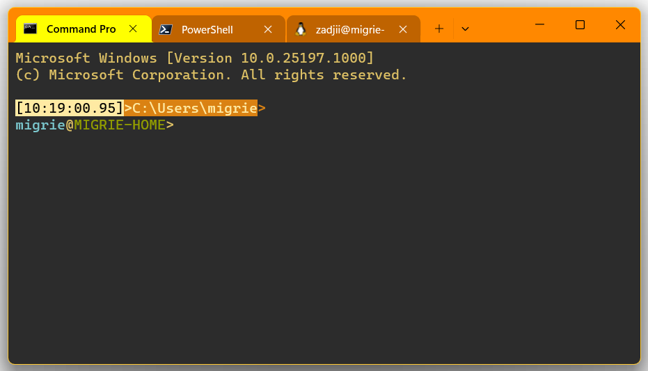

# Theme gallery ([Preview](https://aka.ms/terminal-preview))

Below are some examples of [Themes](/customize-settings/themes.md).

## Seamless



```json
{
    "name": "Seamless",
    "tab":
    {
        "background": "terminalBackground",
        "unfocusedBackground": "#FFFFFF00",
        "showCloseButton": "always"
    },
    "tabRow":
    {
        "background": "terminalBackground",
        "unfocusedBackground": "#2C2C2CFF"
    },
    "window":
    {
        "applicationTheme": "dark"
    }
},
```

## Under Construction



```json
{
    "name": "Under Contruction",
    "tab":
    {
        "background": "#FFFF00FF",
        "showCloseButton": "always",
        "unfocusedBackground": "#88440088"
    },
    "tabRow":
    {
        "background": "#FF8800FF",
        "unfocusedBackground": "#202020FF"
    },
    "window":
    {
        "applicationTheme": "light",
        "useMica": true
    }
},
```

(Color scheme is based on [Fun Forrest](https://github.com/mbadolato/iTerm2-Color-Schemes/blob/master/windowsterminal/FunForrest.json))

