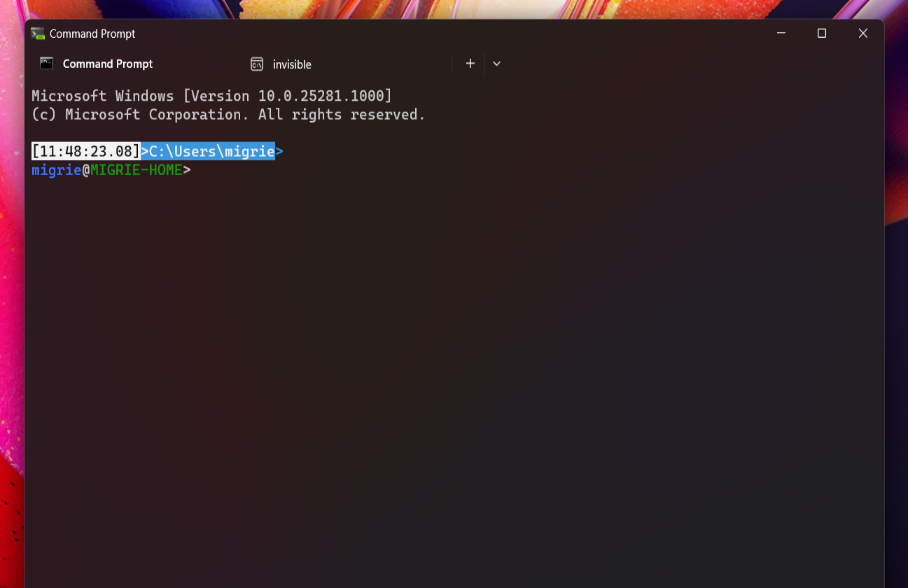

# Theme gallery ([Preview](https://aka.ms/terminal-preview))

Below are some examples of [Themes](./../customize-settings/themes.md).

## Seamless


```json
{
    "name": "Seamless",
    "tab":
    {
        "background": "terminalBackground",
        "unfocusedBackground": "#FFFFFF00",
        "showCloseButton": "always"
    },
    "tabRow":
    {
        "background": "terminalBackground",
        "unfocusedBackground": "#2C2C2CFF"
    },
    "window":
    {
        "applicationTheme": "dark"
    }
},
```

## Under Construction


```json
{
    "name": "Under Construction",
    "tab":
    {
        "background": "#FFFF00FF",
        "showCloseButton": "always",
        "unfocusedBackground": "#88440088"
    },
    "tabRow":
    {
        "background": "#FF8800FF",
        "unfocusedBackground": "#202020FF"
    },
    "window":
    {
        "applicationTheme": "light",
        "useMica": true
    }
},
```

(Color scheme is based on [Fun Forrest](https://github.com/mbadolato/iTerm2-Color-Schemes/blob/master/windowsterminal/FunForrest.json))

## Chonk



For best results, this theme is combined with the global settings `"alwaysShowTabs": true` and `"showTabsInTitlebar": false`, and a profile `opacity` of `0`. You may also want to disable the "Show accent color on title bars and windows borders" setting in the Windows settings app (under "Personalization > Colors")

```json
    "profiles": {
        "defaults": {
            "opacity": 0
        }
    },
    "alwaysShowTabs": true,
    "showTabsInTitlebar": false,
    "theme": "chonk",
    "themes": [
        {
            "name": "chonk",
            "tab":
            {
                "background": "#00000000",
                "unfocusedBackground": "#00000000",
                "showCloseButton": "hover"
            },
            "tabRow":
            {
                "background": "#00000000",
                "unfocusedBackground": "#00000000",
            },
            "window":
            {
                "applicationTheme": "dark",
                "useMica": true
            }
        }
    ]
```
