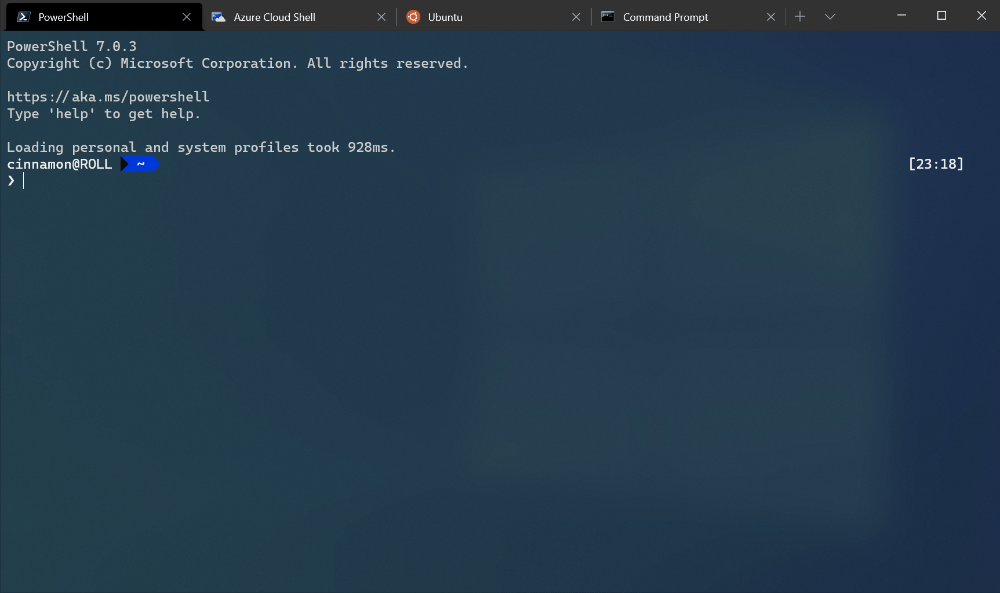
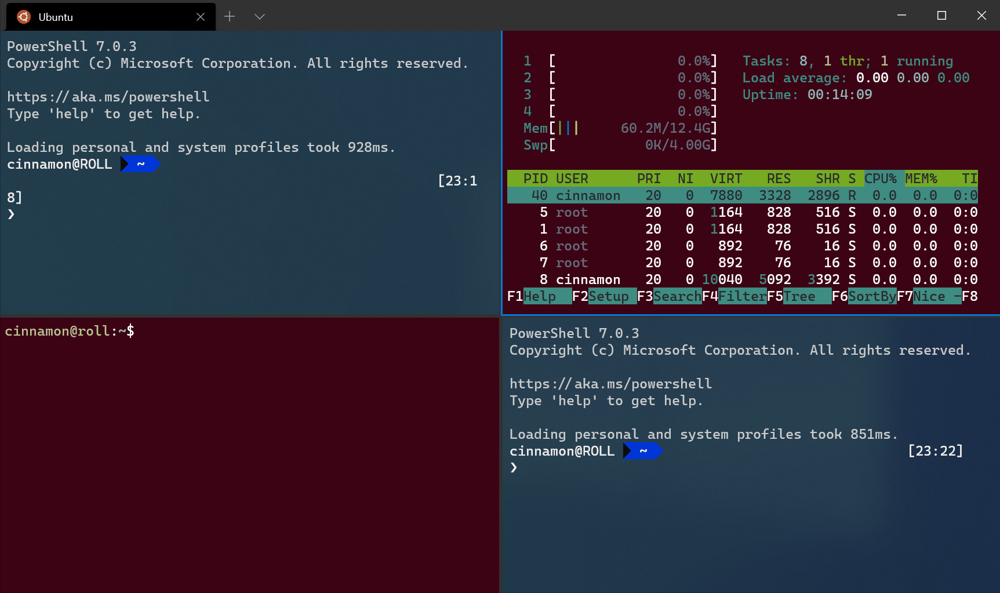
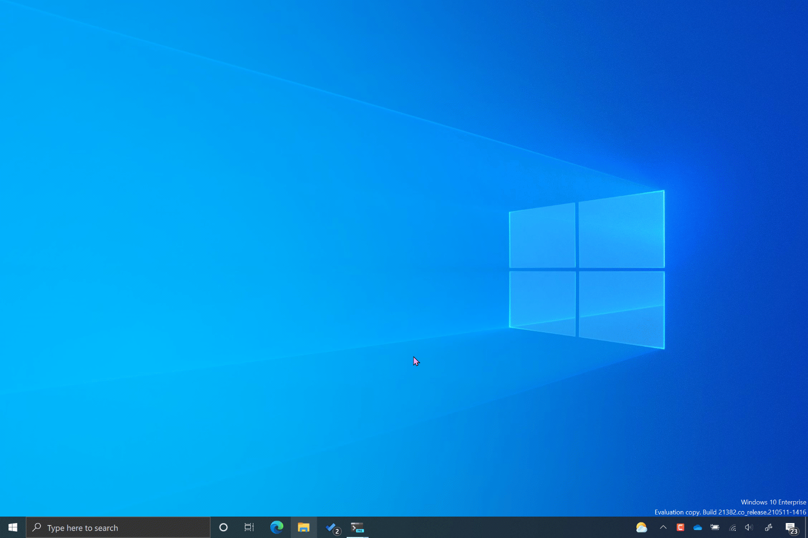

# Custom actions in Windows Terminal

> [!IMPORTANT]
> As of Windows Terminal version 1.4, the `keybindings` array has been renamed to `actions` inside the settings.json file. Support for the `keybindings` array still exists for backward compatibility, however the terminal will not automatically rename `keybindings` to `actions` inside your [settings.json file](../get-started.md#settings-json-file).

You can create custom actions inside Windows Terminal that give you control of how you interact with the terminal. These actions will automatically be added to the command palette.

## Action formats

Actions can be structured in the following formats:

### Commands without arguments

```json
{ "command": "commandName", "keys": "modifiers+key" }
```

For example, this default setting uses the shortcut key <kbd>alt+f4</kbd> to close the terminal window:

```json
{ "command": "closeWindow", "keys": "alt+f4" }
```

### Commands with arguments

```json
{ "command": { "action": "commandName", "argument": "value" }, "keys": "modifiers+key" }
```

For example, this default setting uses the shortcut key <kbd>ctrl+shift+1</kbd> to open a new tab in the terminal based on whichever profile is listed first in your dropdown menu (typically this will open the PowerShell profile):

```json
{ "command": { "action": "newTab", "index": 0 }, "keys": "ctrl+shift+1" }
```

<br />

___

## Action properties

Actions can be constructed using the following properties.

### Command

This is the command executed when the associated keys are pressed.

**Property name:** `command`

**Necessity:** Required

**Accepts:** String

### Keys

This defines the key combinations used to call the command. Keys can have any number of modifiers with one key. Accepted modifiers and keys are listed [below](#accepted-modifiers-and-keys).

If the action does not have keys, it will appear in the command palette but cannot be invoked with the keyboard.

**Property name:** `keys`

**Necessity:** Optional

**Accepts:** String or array[string]

### Action

This adds additional functionality to certain commands.

**Property name:** `action`

**Necessity:** Optional

**Accepts:** String

### Name

This sets the name that will appear in the command palette. If one isn't provided, the terminal will attempt to automatically generate a name.

**Property name:** `name`

**Necessity**: Optional

**Accepts:** String

### Icon

This sets the icon that displays within the command palette.

**Property name:** `icon`

**Necessity:** Optional

**Accepts:** File location as a string, or an emoji

<br />

___

## Accepted modifiers and keys

### Modifiers

`ctrl+`, `shift+`, `alt+`, `win+`

> [!NOTE]
> While the `Windows` key is supported as a modifier, the system reserves most `win+<key>` key bindings. If the OS has reserved that key binding, the terminal will never receive that binding.

### Modifier keys

| Type | Keys |
| ---- | ---- |
| Function and alphanumeric keys | `f1-f24`, `a-z`, `0-9` |
| Symbols | ``` ` ```, `plus`, `-`, `=`, `[`, `]`, `\`, `;`, `'`, `,`, `.`, `/` |
| Arrow keys | `down`, `left`, `right`, `up`, `pagedown`, `pageup`, `pgdn`, `pgup`, `end`, `home` |
| Action keys | `tab`, `enter`, `esc`, `escape`, `space`, `backspace`, `delete`, `insert`, `app`, `menu`  |
| Numpad keys | `numpad_0-numpad_9`, `numpad0-numpad9`, `numpad_add`, `numpad_plus`, `numpad_decimal`, `numpad_period`, `numpad_divide`, `numpad_minus`, `numpad_subtract`, `numpad_multiply` |
| Browser keys | `browser_back`, `browser_forward`, `browser_refresh`, `browser_stop`, `browser_search`, `browser_favorites`, `browser_home` |

**Note:** `=` and `plus` are equivalents. The latter must not be confused with `numpad_plus`.

___

## Application-level commands

### Quit ([Preview](https://aka.ms/terminal-preview))

This closes all open terminal windows. A confirmation dialog will appear in the current window to ensure you'd like to close all windows.

**Command name:** `quit`

**Default Binding:**

```json
{ "command": "quit" }
```

> [!IMPORTANT]
> This feature is only available in [Windows Terminal Preview](https://aka.ms/terminal-preview).

### Close window

:::row:::
:::column span="":::
This closes the current window and all tabs within it. If `confirmCloseAllTabs` is set to `true`, a confirmation dialog will appear to ensure you'd like to close all your tabs. More information on this setting can be found on the [Appearance page](./appearance.md#show-close-all-tabs-popup).

**Command name:** `closeWindow`

**Default binding:**

```json
{ "command": "closeWindow", "keys": "alt+f4" }
```

:::column-end:::
:::column span="":::


:::column-end:::
:::row-end:::

### Find

This opens the search dialog box. More information on search can be found on the [Search page](./../search.md).

**Command name:** `find`

**Default binding:**

```json
{ "command": "find", "keys": "ctrl+shift+f" }
```

### Find next/previous search match

This lets you navigate through your search matches.

**Command name:** `findMatch`

**Default bindings:**

```json
{ "command": { "action": "findMatch", "direction": "next" } },
{ "command": { "action": "findMatch", "direction": "prev" } }
```

#### Actions

| Name | Necessity | Accepts | Description |
| ---- | --------- | ------- | ----------- |
| `direction` | Required | `"next"`, `"prev"` | The direction to navigate through search results. |

### Open the dropdown

This opens the dropdown menu.

**Command name:** `openNewTabDropdown`

**Default binding:**

```json
{ "command": "openNewTabDropdown", "keys": "ctrl+shift+space" }
```

### Open settings files

This opens either the settings UI, custom settings file ([`settings.json`](../get-started.md#settings-json-file)), or default settings file (`defaults.json`), depending on the `target` field.
Without the `target` field, the custom settings file will be opened.

**Command name:** `openSettings`

**Default bindings:**

```json
{ "command": { "action": "openSettings", "target": "settingsUI" }, "keys": "ctrl+," },
{ "command": { "action": "openSettings", "target": "settingsFile" }, "keys": "ctrl+shift+," },
{ "command": { "action": "openSettings", "target": "defaultsFile" }, "keys": "ctrl+alt+," },
```

#### Actions

| Name | Necessity | Accepts | Description |
| ---- | --------- | ------- | ----------- |
| `target` | Optional | `"settingsFile"`, `"defaultsFile"`, `"settingsUI"`, `"allFiles"` | The settings file to open. |

### Open system menu

Opens the system menu at the top left corner of the window.

**Command name:** `openSystemMenu`

**Default binding:**

```json
{ "command": "openSystemMenu", "keys": "alt+space" }
```

### Toggle full screen

This allows you to switch between full screen and default window sizes.

**Command name:** `toggleFullscreen`

**Default bindings:**

```json
{ "command": "toggleFullscreen", "keys": "alt+enter" },
{ "command": "toggleFullscreen", "keys": "f11" }
```

### Toggle focus mode

This allows you to enter "focus mode", which hides the tabs and title bar.

**Command name:** `toggleFocusMode`

**Default binding:**

```json
{ "command": "toggleFocusMode" }
```

### Toggle always on top mode

This allows you toggle the "always on top" state of the window. When in "always on top" mode, the window will appear on top of all other non-topmost windows.

**Command name:** `toggleAlwaysOnTop`

**Default binding:**

```json
{ "command": "toggleAlwaysOnTop" }
```

### Send input

Send arbitrary text input to the shell.
As an example the input `"text\n"` will write "text" followed by a newline to the shell.

ANSI escape sequences may be used, but escape codes like `\x1b` must be written as `\u001b`.
For instance `"\u001b[A"` will behave as if the up arrow button had been pressed.

**Command name:** `sendInput`

**Default binding:**

_This command is not currently bound in the default settings_.

```json
{ "command": { "action": "sendInput", "input": "\u001b[A" }, "keys": "" }
```

#### Actions

| Name | Necessity | Accepts | Description |
| ---- | --------- | ------- | ----------- |
| `input` | Required | String | The text input to feed into the shell. |

<br />

___

## Tab management commands

### Close tab

This closes the tab at a given index. If no index is provided, use the focused tab's index.

**Command name:** `closeTab`

#### Actions

| Name | Necessity | Accepts | Description |
| ---- | --------- | ------- | ----------- |
| `index` | Optional | Integer | Position of the tab to close. |

### Close all other tabs

This closes all tabs except for the one at an index. If no index is provided, use the focused tab's index.

**Command name:** `closeOtherTabs`

**Default binding:**

```json
{ "command": "closeOtherTabs" }
```

#### Actions

| Name | Necessity | Accepts | Description |
| ---- | --------- | ------- | ----------- |
| `index` | Optional | Integer | Position of the tab to be kept open. |

### Close tabs after index

This closes the tabs following the tab at an index. If no index is provided, use the focused tab's index.

**Command name:** `closeTabsAfter`

**Default binding:**

```json
{ "command": "closeTabsAfter" }
```

#### Actions

| Name | Necessity | Accepts | Description |
| ---- | --------- | ------- | ----------- |
| `index` | Optional | Integer | Position of the last tab to be kept open. |

### Duplicate tab

This makes a copy of the current tab's profile and directory and opens it. This does not include modified/added ENV VARIABLES.

**Command name:** `duplicateTab`

**Default binding:**

```json
{ "command": "duplicateTab", "keys": "ctrl+shift+d" }
```

### New tab

This creates a new tab. Without any arguments, this will open the default profile in a new tab. If an action is not specified, the default profile's equivalent setting will be used.

**Command name:** `newTab`

**Default bindings:**

```json
{ "command": "newTab", "keys": "ctrl+shift+t" },
{ "command": { "action": "newTab", "index": 0 }, "keys": "ctrl+shift+1" },
{ "command": { "action": "newTab", "index": 1 }, "keys": "ctrl+shift+2" },
{ "command": { "action": "newTab", "index": 2 }, "keys": "ctrl+shift+3" },
{ "command": { "action": "newTab", "index": 3 }, "keys": "ctrl+shift+4" },
{ "command": { "action": "newTab", "index": 4 }, "keys": "ctrl+shift+5" },
{ "command": { "action": "newTab", "index": 5 }, "keys": "ctrl+shift+6" },
{ "command": { "action": "newTab", "index": 6 }, "keys": "ctrl+shift+7" },
{ "command": { "action": "newTab", "index": 7 }, "keys": "ctrl+shift+8" },
{ "command": { "action": "newTab", "index": 8 }, "keys": "ctrl+shift+9" }
```

#### Actions

| Name | Necessity | Accepts | Description |
| ---- | --------- | ------- | ----------- |
| `commandline` | Optional | Executable file name as a string | Executable run within the tab. |
| `startingDirectory` | Optional | Folder location as a string | Directory in which the tab will open. |
| `tabTitle` | Optional | String | Title of the new tab. |
| `index` | Optional | Integer | Profile that will open based on its position in the dropdown (starting at 0). |
| `profile` | Optional | Profile's name or GUID as a string | Profile that will open based on its GUID or name. |
| `colorScheme` | Optional | The name of a color scheme as a string | The scheme to use instead of the profile's set `colorScheme` |
| `suppressApplicationTitle` | Optional | `true`, `false` | When set to `false`, applications can change the tab title by sending title change messages. When set to `true`, these messages are suppressed. If not provided, the behavior is inherited from the profile's settings. In order to enter a new tab title and have that title persist, this must be set to true. |

### Open next tab

This opens the tab to the right of the current one.

**Command name:** `nextTab`

**Default binding:**

```json
{ "command": "nextTab", "keys": "ctrl+tab" }
```

#### Actions

| Name | Necessity | Accepts | Description |
| ---- | --------- | ------- | ----------- |
| `tabSwitcherMode` | Optional | `"mru"`, `"inOrder"`, `"disabled"` | Move to the next tab using `"tabSwitcherMode"`. If no mode is provided, use the globally defined one. |

### Open previous tab

This opens the tab to the left of the current one.

**Command name:** `prevTab`

**Default binding:**

```json
{ "command": "prevTab", "keys": "ctrl+shift+tab" }
```

#### Actions

| Name | Necessity | Accepts | Description |
| ---- | --------- | ------- | ----------- |
| `tabSwitcherMode` | Optional | `"mru"`, `"inOrder"`, `"disabled"` | Move to the previous tab using `"tabSwitcherMode"`. If no mode is provided, use the globally defined one. |

### Tab search

:::row:::
:::column span="":::
This opens the tab search box.

**Command name:** `tabSearch`

**Default binding:**

_This command is not currently bound in the default settings_.

```json
{"command": "tabSearch", "keys": ""}
```

:::column-end:::
:::column span="":::


:::column-end:::
:::row-end:::

### Open a specific tab

This opens a specific tab depending on the index.

**Command name:** `switchToTab`

**Default bindings:**

```json
{ "command": { "action": "switchToTab", "index": 0 }, "keys": "ctrl+alt+1" },
{ "command": { "action": "switchToTab", "index": 1 }, "keys": "ctrl+alt+2" },
{ "command": { "action": "switchToTab", "index": 2 }, "keys": "ctrl+alt+3" },
{ "command": { "action": "switchToTab", "index": 3 }, "keys": "ctrl+alt+4" },
{ "command": { "action": "switchToTab", "index": 4 }, "keys": "ctrl+alt+5" },
{ "command": { "action": "switchToTab", "index": 5 }, "keys": "ctrl+alt+6" },
{ "command": { "action": "switchToTab", "index": 6 }, "keys": "ctrl+alt+7" },
{ "command": { "action": "switchToTab", "index": 7 }, "keys": "ctrl+alt+8" },
{ "command": { "action": "switchToTab", "index": 8 }, "keys": "ctrl+alt+9" }
```

#### Actions

| Name | Necessity | Accepts | Description |
| ---- | --------- | ------- | ----------- |
| `index` | Required | Integer | Tab that will open based on its position in the tab bar (starting at 0). |

### Rename tab

This command can be used to rename a tab to a specific string.

**Command name:** `renameTab`

**Default binding:**

_This command is not currently bound in the default settings_.

```json
// Rename a tab to "Foo"
{ "command": { "action": "renameTab", "title": "Foo" }, "keys": "" }

// Reset the tab's name
{ "command": { "action": "renameTab", "title": null }, "keys": "" }
```

#### Actions

| Name | Necessity | Accepts | Description |
| ---- | --------- | ------- | ----------- |
| `title` | Optional | String | The new title to use for this tab. If omitted, this command will revert the tab title back to its original value. |

### Open tab rename text box

This command changes the tab title into a text field that lets you edit the title for the current tab. Clearing the text field will reset the tab title back to the default for the current shell instance.

**Command name:** `openTabRenamer`

**Default binding:**

```json
{ "command": "openTabRenamer" }
```

### Change tab color

This command can be used to change the color of a tab to a specific value.

**Command name:** `setTabColor`

**Default binding:**

_This command is not currently bound in the default settings_.

```json
// Change the tab's color to a bright magenta
{ "command": { "action": "setTabColor", "color": "#ff00ff" }, "keys": "" }

// Reset the tab's color
{ "command": { "action": "setTabColor", "color": null }, "keys": "" }
```

#### Actions

| Name | Necessity | Accepts | Description |
| ---- | --------- | ------- | ----------- |
| `color` | Optional | String, in hex format: `"#rgb"` or `"#rrggbb"` | The new color to use for this tab. If omitted, this command will revert the tab's color back to its original value. |

### Open tab color picker

This command can be used to open the color picker for the active tab. The color picker can be used to set a color for the tab at runtime.

**Command name:** `openTabColorPicker`

**Default binding:**

```json
{ "command": "openTabColorPicker" }
```

### Move tab

This command moves the tab "backward" and "forward", which is equivalent to "left" and "right" in left-to-right UI.

**Command name:** `moveTab`

**Default binding:**

```json
// Move tab backward (left in LTR)
{ "command": { "action": "moveTab", "direction": "backward" } }

// Move tab forward (right in LTR)
{ "command": { "action": "moveTab", "direction": "forward" } }
```

#### Actions

| Name | Necessity | Accepts | Description |
| ---- | --------- | ------- | ----------- |
| `direction` | Required | `"backward"`, `"forward"` | Direction in which the tab will move. |

<br />

___

## Window management commands

### New window

This creates a new window. Without any arguments, this will open the default profile in a new window (regardless of the setting of `windowingBehavior`). If an action is not specified, the default profile's equivalent setting will be used.

**Command name:** `newWindow`

**Default bindings:**

```json
{ "command": "newWindow", "keys": "ctrl+shift+n" },
```

#### Actions

| Name | Necessity | Accepts | Description |
| ---- | --------- | ------- | ----------- |
| `commandline` | Optional | Executable file name as a string | Executable run within the tab. |
| `startingDirectory` | Optional | Folder location as a string | Directory in which the window will open. |
| `tabTitle` | Optional | String | Title of the window tab. |
| `index` | Optional | Integer | Profile that will open based on its position in the dropdown (starting at 0). |
| `profile` | Optional | Profile's name or GUID as a string | Profile that will open based on its GUID or name. |
| `suppressApplicationTitle` | Optional | `true`, `false` | When set to `false` allows applications to change tab title by sending title change messages. When set to true `true` suppresses these messages. If not provided, the behavior is inheritted from profile settings. |

### Rename window

This command can be used to rename a window to a specific string.

**Command name:** `renameWindow`

**Default binding:**

_This command is not currently bound in the default settings_.

```json
// Rename a window to "Foo"
{ "command": { "action": "renameWindow", "name": "Foo" }, "keys": "" }

// Reset the window's name
{ "command": { "action": "renameWindow", "name": null }, "keys": "" }
```

#### Actions

| Name | Necessity | Accepts | Description |
| ---- | --------- | ------- | ----------- |
| `name` | Optional | String | The new name to use for this window. If omitted, this command will revert the window name back to its original value. |

### Open window rename dialog

This command changes displays a popup window that lets you edit the name for the current window. Clearing the text field will reset the window name.

**Command name:** `openWindowRenamer`

**Default binding:**

```json
{ "command": "openWindowRenamer" }
```

### Identify window

This pops up an overlay on the focused window that displays the window's name and index.

**Command name:** `identifyWindow`

**Default binding:**

```json
{"command": "identifyWindow", "keys": "" },
```

### Identify windows

This pops up an overlay on all windows that displays each window's name and index.

**Command name:** `identifyWindows`

**Default binding:**

_This command is not currently bound in the default settings_.

```json
{"command": "identifyWindows" },
```

<br />

___

## Pane management commands

### Close pane

This closes the active pane. If there aren't any split panes, this will close the current tab. If there is only one tab open, this will close the window.

**Command name:** `closePane`

**Default binding:**

```json
{ "command": "closePane", "keys": "ctrl+shift+w" }
```

### Move pane focus

This changes focus to a different pane depending on the direction. Setting the `direction` to `"previous"` will move focus to the most recently used pane.

**Command name:** `moveFocus`

**Default bindings:**

```json
{ "command": { "action": "moveFocus", "direction": "down" }, "keys": "alt+down" },
{ "command": { "action": "moveFocus", "direction": "left" }, "keys": "alt+left" },
{ "command": { "action": "moveFocus", "direction": "right" }, "keys": "alt+right" },
{ "command": { "action": "moveFocus", "direction": "up" }, "keys": "alt+up" },
{ "command": { "action": "moveFocus", "direction": "previous" }, "keys": "ctrl+alt+left" }
```

#### Actions

| Name | Necessity | Accepts | Description |
| ---- | --------- | ------- | ----------- |
| `direction` | Required | `"left"`, `"right"`, `"up"`, `"down"`, `"previous"` | Direction in which the focus will move. |

### Zoom a pane

:::row:::
:::column span="":::
This expands the focused pane to fill the entire contents of the window.

**Command name:** `togglePaneZoom`

**Default binding:**

```json
{ "command": "togglePaneZoom" }
```

:::column-end:::
:::column span="":::


:::column-end:::
:::row-end:::

### Resize a pane

This changes the size of the active pane.

**Command name:** `resizePane`

**Default bindings:**

```json
{ "command": { "action": "resizePane", "direction": "down" }, "keys": "alt+shift+down" },
{ "command": { "action": "resizePane", "direction": "left" }, "keys": "alt+shift+left" },
{ "command": { "action": "resizePane", "direction": "right" }, "keys": "alt+shift+right" },
{ "command": { "action": "resizePane", "direction": "up" }, "keys": "alt+shift+up" }
```

#### Actions

| Name | Necessity | Accepts | Description |
| ---- | --------- | ------- | ----------- |
| `direction` | Required | `"left"`, `"right"`, `"up"`, `"down"` | Direction in which the pane will be resized. |

### Mark a pane as read-only

You can mark a pane as read-only, which will prevent input from going into the text buffer. If you attempt to close or input text into a read-only pane, the terminal will display a popup warning instead.

**Command name:** `toggleReadOnlyMode`

**Default bindings:**

```json
{ "command": "toggleReadOnlyMode" }
```

### Split a pane

This halves the size of the active pane and opens another. Without any arguments, this will open the default profile in the new pane. If an action is not specified, the default profile's equivalent setting will be used.

**Command name:** `splitPane`

**Default bindings:**

```json
// In settings.json
{ "command": { "action": "splitPane", "split": "auto", "splitMode": "duplicate" }, "keys": "alt+shift+d" },

// In defaults.json
{ "command": { "action": "splitPane", "split": "horizontal" }, "keys": "alt+shift+-" },
{ "command": { "action": "splitPane", "split": "vertical" }, "keys": "alt+shift+plus" },
{ "command": { "action": "splitPane", "split": "up" } },
{ "command": { "action": "splitPane", "split": "right" } },
{ "command": { "action": "splitPane", "split": "down" } },
{ "command": { "action": "splitPane", "split": "left" } }
```

#### Actions

| Name | Necessity | Accepts | Description |
| ---- | --------- | ------- | ----------- |
| `split` | Required | `"vertical"`, `"horizontal"`, `"auto"`, `"up"`, `"right"`, `"down"`, `"left"` | How the pane will split. `"auto"` will split in the direction that provides the most surface area. |
| `commandline` | Optional | Executable file name as a string | Executable run within the pane. |
| `startingDirectory` | Optional | Folder location as a string | Directory in which the pane will open. |
| `tabTitle` | Optional | String | Title of the tab when the new pane is focused. |
| `index` | Optional | Integer | Profile that will open based on its position in the dropdown (starting at 0). |
| `profile` | Optional | Profile's name or GUID as a string | Profile that will open based on its GUID or name. |
| `colorScheme` | Optional | The name of a color scheme as a string | The scheme to use instead of the profile's set `colorScheme` |
| `suppressApplicationTitle` | Optional | `true`, `false` | When set to `false`, applications can change the tab title by sending title change messages. When set to `true`, these messages are suppressed. If not provided, the behavior is inherited from the profile's settings. |
| `splitMode` | Optional | `"duplicate"` | Controls how the pane splits. Only accepts `"duplicate"`, which will duplicate the focused pane's profile into a new pane. |
| `size` | Optional | Float | Specify how large the new pane should be, as a fraction of the current pane's size. `1.0` would be "all of the current pane", and `0.0` is "None of the parent". Defaults to `0.5`. |

> [!IMPORTANT]
> The `"up"`, `"right"`, `"down"`, and `"left"` options for `split` are only available in [Windows Terminal Preview](https://aka.ms/terminal-preview).

<br />

___

## Clipboard integration commands

### Copy

This copies the selected terminal content to your clipboard. If no selection exists, the key chord is sent directly to the terminal.

**Command name:** `copy`

**Default bindings:**

```json
// In settings.json
{ "command": { "action": "copy", "singleLine": false }, "keys": "ctrl+c" },

// In defaults.json
{ "command": { "action": "copy", "singleLine": false }, "keys": "ctrl+shift+c" },
{ "command": { "action": "copy", "singleLine": false }, "keys": "ctrl+insert" }
```

#### Actions

 | Name | Necessity | Accepts | Description |
 | ---- | --------- | ------- | ----------- |
 | `singleLine` | Optional | `true`, `false` | When `true`, the copied content will be copied as a single line. When `false`, newlines persist from the selected text. |
 | `copyFormatting` | Optional | `true`, `false`, `"all"`, `"none"`, `"html"`, `"rtf"` | When `true`, the color and font formatting of the selected text is also copied to your clipboard. When `false`, only plain text is copied to your clipboard. You can also specify which formats you would like to copy. When `null`, the global `"copyFormatting"` behavior is inherited. |

### Keyboard Selection ([Preview](https://aka.ms/terminal-preview))

This modifies an existing selection. If no selection exists, the key chord is sent directly to the terminal.

**Command name:** `updateSelection`

**Default bindings:**

```json
// Move by character
{ "command": {"action": "updateSelection", "direction": "left", "mode": "char" }, "keys": "shift+left" },
{ "command": {"action": "updateSelection", "direction": "right", "mode": "char" }, "keys": "shift+right" },
{ "command": {"action": "updateSelection", "direction": "up", "mode": "char" }, "keys": "shift+up" },
{ "command": {"action": "updateSelection", "direction": "down", "mode": "char" }, "keys": "shift+down" },

// Move by word
{ "command": {"action": "updateSelection", "direction": "left", "mode": "word" }, "keys": "ctrl+shift+left" },
{ "command": {"action": "updateSelection", "direction": "right", "mode": "word" }, "keys": "ctrl+shift+right" },

// Move by viewport
{ "command": {"action": "updateSelection", "direction": "left", "mode": "view" }, "keys": "shift+home" },
{ "command": {"action": "updateSelection", "direction": "right", "mode": "view" }, "keys": "shift+end" },
{ "command": {"action": "updateSelection", "direction": "up", "mode": "view" }, "keys": "shift+pgup" },
{ "command": {"action": "updateSelection", "direction": "down", "mode": "view" }, "keys": "shift+pgdn" },

// Move by buffer
{ "command": {"action": "updateSelection", "direction": "up", "mode": "buffer" }, "keys": "ctrl+shift+home" },
{ "command": {"action": "updateSelection", "direction": "down", "mode": "buffer" }, "keys": "ctrl+shift+end" },
```

#### Actions

| Name | Necessity | Accepts | Description |
| ---- | --------- | ------- | ----------- |
| `direction` | Required | `"left"`, `"right"`, `"up"`, `"down"` | Direction in which the selection endpoint will move. |
| `mode` | Required | `"char"`, `"word"`, `"view"`, `"buffer"` | Controls how much the endpoint moves by. |

> [!IMPORTANT]
> This feature is only available in [Windows Terminal Preview](https://aka.ms/terminal-preview).

### Paste

This inserts the content that was copied onto the clipboard.

**Command name:** `paste`

**Default bindings:**

```json
// In settings.json
{ "command": "paste", "keys": "ctrl+v" },

// In defaults.json
{ "command": "paste", "keys": "ctrl+shift+v" },
{ "command": "paste", "keys": "shift+insert" }
```

<br />

___

## Scrollback commands

### Scroll up

This scrolls the screen up by the number of rows defined by `"rowsToScroll"`. If `"rowsToScroll"` is not provided, it will scroll up the amount defined by the system default, which is the same amount as mouse scrolling.

**Command name:** `scrollUp`

**Default binding:**

```json
{ "command": "scrollUp", "keys": "ctrl+shift+up" }
```

#### Actions

| Name | Necessity | Accepts | Description |
| ---- | --------- | ------- | ----------- |
| `rowsToScroll` | Optional | Integer | The number of rows to scroll. |

### Scroll down

This scrolls the screen down by the number of rows defined by `"rowsToScroll"`. If `"rowsToScroll"` is not provided, it will scroll down the amount defined by the system default, which is the same amount as mouse scrolling.

**Command name:** `scrollDown`

**Default binding:**

```json
{ "command": "scrollDown", "keys": "ctrl+shift+down" }
```

#### Actions

| Name | Necessity | Accepts | Description |
| ---- | --------- | ------- | ----------- |
| `rowsToScroll` | Optional | Integer | The number of rows to scroll. |

### Scroll up a whole page

This scrolls the screen up by a whole page, which is the height of the window.

**Command name:** `scrollUpPage`

**Default binding:**

```json
{ "command": "scrollUpPage", "keys": "ctrl+shift+pgup" }
```

### Scroll down a whole page

This scrolls the screen down by a whole page, which is the height of the window.

**Command name:** `scrollDownPage`

**Default binding:**

```json
{ "command": "scrollDownPage", "keys": "ctrl+shift+pgdn" }
```

### Scroll to the earliest history

This scrolls the screen up to the top of the input buffer.

**Command name:** `scrollToTop`

**Default binding:**

```json
{ "command": "scrollToTop", "keys": "ctrl+shift+home" }
```

### Scroll to the latest history

This scrolls the screen down to the bottom of the input buffer.

**Command name:** `scrollToBottom`

**Default binding:**

```json
{ "command": "scrollToBottom", "keys": "ctrl+shift+end" }
```

<br />

___

## Visual adjustment commands

### Adjust font size

This changes the text size by a specified point amount.

**Command name:** `adjustFontSize`

**Default bindings:**

```json
{ "command": { "action": "adjustFontSize", "delta": 1 }, "keys": "ctrl+=" },
{ "command": { "action": "adjustFontSize", "delta": -1 }, "keys": "ctrl+-" },
{ "command": { "action": "adjustFontSize", "delta": 1 }, "keys": "ctrl+numpad_plus" },
{ "command": { "action": "adjustFontSize", "delta": -1 }, "keys": "ctrl+numpad_minus" },
```

#### Actions

| Name | Necessity | Accepts | Description |
| ---- | --------- | ------- | ----------- |
| `delta` | Required | Integer | Amount of size change per command invocation. |

### Reset font size

This resets the text size to the default value.

**Command name:** `resetFontSize`

**Default binding:**

```json
{ "command": "resetFontSize", "keys": "ctrl+0" }
{ "command": "resetFontSize", "keys": "ctrl+numpad_0" }
```

### Toggle pixel shader effects

This toggles any pixel shader effects enabled in the terminal. If the user specified a valid shader with `experimental.pixelShaderPath`, this action will toggle that shader on/off. This will also toggle the "retro terminal effect", which is enabled with the profile setting `experimental.retroTerminalEffect`.

**Command name:** `toggleShaderEffects`

**Default binding:**

```json
{ "command": "toggleShaderEffects" }
```

> [!CAUTION]
> The `toggleRetroEffect` action is no longer available in versions 1.6 and later. It is recommended that you use `toggleShaderEffects` instead.

### Set the color scheme

Changes the active color scheme.

**Command name:** `setColorScheme`

#### Actions

| Name | Necessity | Accepts | Description |
| ---- | --------- | ------- | ----------- |
| `colorScheme` | Required | String | The `name` of the color scheme to apply. |

**Example binding:**

```json
{ "command": { "action": "setColorScheme", "colorScheme": "Campbell" }, "keys": "" }
```

<br />

___

## Global commands

### Global summon

This is a special action that works globally in the OS, rather than only in the context of the terminal window. When pressed, this action will summon the terminal window. Which window is summoned, where the window is summoned to, and how the window behaves when summoning it, is controlled by the properties on this action.

**Notes**
* Any keys bound to `globalSummon` actions in the terminal will not work in other applications while the terminal is running - they will always focus the terminal window.

* If another running application already registered for the given `keys` using the `RegisterHotKey` API, the terminal will be unable to listen for those key strokes.

* Elevated and unelevated instances of the terminal will not be able to both register for the same keys. The same applies to both Preview and Stable versions of the terminal - the first one to be launched will always win.

* These key strokes will only work when an instance of the terminal is already running. To launch the terminal automatically on login, see [`startOnUserLogin`](./startup.md#launch-on-machine-startup).

**Command name:** `globalSummon`

**Default binding:**

_This command is not currently bound in the default settings_.

```json
{ "keys": "", "command": { "action": "globalSummon" } }
```

#### Actions

| Name | Necessity | Accepts | Description |
| ---- | --------- | ------- | ----------- |
| `desktop` | Optional | `any`, `toCurrent`, `onCurrent` | This controls how the terminal should interact with virtual desktops.<ul><li>`"any"`: Leave the window on whichever desktop it's already on - will switch to that desktop as the window is activated.</li><li>`"toCurrent"` (_default_): Move the window to the current virtual desktop.</li><li>`"onCurrent"`: Only summon the window if it's already on the current virtual desktop.</li></ul> |
| `monitor` | Optional | `any`, `toCurrent`, `toMouse` | This controls the monitor that the window will be summoned from/to.<ul><li>`"any"`: Summon the most recently used window, regardless of which monitor it's currently on.</li><li>`"toCurrent"`: Summon the most recently used window to the monitor with the current foreground window.</li><li>`"toMouse"` (_default_): Summon the most recently used window to the monitor where the mouse cursor is.</li></ul> |
| `name` | Optional | String | When omitted (_default_), use `monitor` and `desktop` to find the appropriate most-recently-used window to summon. When provided, summon the window whose name or ID matches the given `name` value. If no such window exists, then create a new window with that name. |
| `dropdownDuration` | Optional | Integer | Defaults to `0`. When provided with a positive number, "slide" the window in from the top of the screen using an animation that lasts `dropdownDuration` milliseconds. `200` is a reasonable value for this setting.  |
| `toggleVisibility` | Optional | `true`, `false` | Defaults to `true`. When `true`, pressing the assigned keys for this action will dismiss (minimize) the window when the window is currently the foreground window. When `false`, pressing the assigned keys will only ever bring the window to the foreground. |

When `name` is provided _with_ `monitor` or `desktop`, `name` behaves in the following
ways:
  * `desktop`
    - `"any"`: Go to the desktop the given window is already on.
    - `"toCurrent"`: If the window is on another virtual desktop, then move it to the currently active one.
    - `"onCurrent"`: If the window is on another virtual desktop, then move it to the currently active one.
  * `monitor`
    - `"any"`: Leave the window on the monitor it is already on.
    - `"toCurrent"`: If the window is on another monitor, then move it to the monitor with the current foreground window.
    - `"toMouse"`: If the window is on another monitor, then move it to the monitor with the mouse cursor on it.

The `desktop` and `monitor` properties can be combined in the following ways:

| Combinations | **`"desktop": "any"`** | **`"desktop": "toCurrent"`**| **`"desktop": "onCurrent"`**| Not included |
| ------------ | ---------------------- | --------------------------- | --------------------------- | ------------ |
| **`"monitor": "any"`**| Go to the desktop the window is on (leave position alone) | Move the window to this desktop (leave position alone) | If there isn't one on this desktop:<ul><li>Create a new one in the default position</li></ul>Else:<ul><li>Activate the one on this desktop (don't move it)</li></ul> | Summon the MRU window |
| **`"monitor": "toCurrent"`**| Go to the desktop the window is on, move to the monitor with the foreground window | Move the window to this desktop, move to the monitor with the foreground window | If there isn't one on this desktop:<ul><li>Create a new one</li></ul>Else:<ul><li>Activate the one on this desktop, move to the monitor with the foreground window</li></ul> | Summon the MRU window TO the monitor with the foreground window |
| **`"monitor": "toMouse"`**| Go to the desktop the window is on, move to the monitor with the mouse | Move the window to this desktop, move to the monitor with the mouse | If there isn't one on this desktop:<ul><li>Create a new one</li></ul>Else:<ul><li>Activate the one on this desktop, move to the monitor with the mouse</li></ul> | Summon the MRU window TO the monitor with the mouse |
| **Not included** | Leave where it is | Move to current desktop | On current desktop only | N/A |

#### Examples

```jsonc

// Summon the most recently used (MRU) window, to the current virtual desktop,
// to the monitor the mouse cursor is on, without an animation. If the window is
// already in the foreground, then minimize it.
{ "keys": "ctrl+1", "command": { "action": "globalSummon" } },

// Summon the MRU window, by going to the virtual desktop the window is
// currently on. Move the window to the monitor the mouse is on.
{ "keys": "ctrl+2", "command": { "action": "globalSummon", "desktop": "any" } },

// Summon the MRU window to the current desktop, leaving the position of the window untouched.
{ "keys": "ctrl+3", "command": { "action": "globalSummon", "monitor": "any" } },

// Summon the MRU window, by going to the virtual desktop the window is
// currently on, leaving the position of the window untouched.
{ "keys": "ctrl+4", "command": { "action": "globalSummon", "desktop": "any", "monitor": "any" } },

// Summon the MRU window with a dropdown duration of 200ms.
{ "keys": "ctrl+5", "command": { "action": "globalSummon", "dropdownDuration": 200 } },

// Summon the MRU window. If the window is already in the foreground, do nothing.
{ "keys": "ctrl+6", "command": { "action": "globalSummon", "toggleVisibility": false } },

// Summon the window named "_quake". If no window with that name exists, then create a new window.
{ "keys": "ctrl+7", "command": { "action": "globalSummon", "name": "_quake" } }
```

### Open the quake mode window

:::row:::
:::column span="":::
This action is a special variation of the [`globalSummon`](#global-commands) action. It specifically summons the [quake window](../tips-and-tricks.md#quake-mode). It is a shorthand for the following `globalSummon` action:

```json
{
    "keys": "win+`",
    "command": {
        "action": "globalSummon",
        "name": "_quake",
        "dropdownDuration": 200,
        "toggleVisibility": true,
        "monitor": "toMouse",
        "desktop": "toCurrent"
    }
}
```

If you'd like to change the behavior of the `quakeMode` action, we recommended creating a new `globalSummon` entry in `actions` with the settings you prefer.

**Command name:** `quakeMode`

**Default binding:**

```json
{ "keys": "win+`", "command": { "action": "quakeMode" } }
```

:::column-end:::
:::column span="":::


:::column-end:::
:::row-end:::

<br />

___

## Run multiple actions ([Preview](https://aka.ms/terminal-preview))

This action allows the user to bind multiple sequential actions to one command. 

**Command name:** `multipleActions`

#### Actions

| Name | Necessity | Accepts | Description |
| ---- | --------- | ------- | ----------- |
| `actions` | Required | Array of Actions | The list of `action` to run. |

#### Example

```jsonc
{ "name": "Create My Layout", "command": { 
    "action": "multipleActions",
    "actions": [
        // Create a new tab with 3 panes
        { "action": "newTab", "tabTitle": "Work", "colorScheme": "One Half Dark" },
        { "action": "splitPane", "split": "vertical", "profile": "Windows PowerShell", "tabTitle": "Work", "colorScheme": "Campbell Powershell", },
        { "action": "splitPane", "split": "horizontal", "profile": "Windows PowerShell", "tabTitle": "Work", "colorScheme": "Campbell Powershell", },

        // Create a second tab
        { "action": "newTab", "tabTitle": "Misc"},

        // Go back to the first tab and zoom the first pane
        { "action": "prevTab", "tabSwitcherMode": "disabled" },
        { "action": "moveFocus", "direction": "first"},
        "togglePaneZoom"
        ]
}}
```

> [!IMPORTANT]
> This feature is only available in [Windows Terminal Preview](https://aka.ms/terminal-preview).

<br />

___

## Unbind keys

This unbinds the associated keys from any command.

**Command name:** `unbound`
