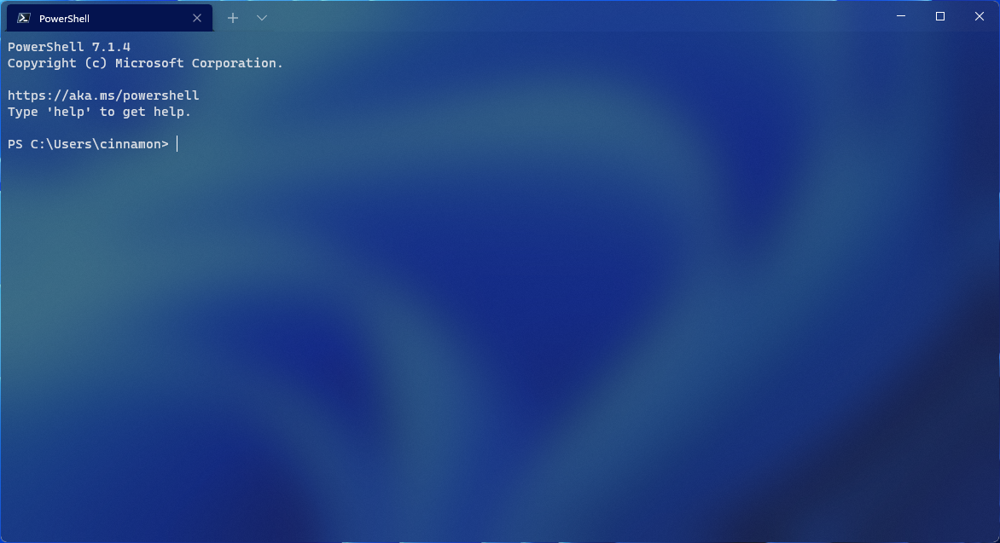

# Appearance settings in Windows Terminal

The properties listed below affect the entire terminal window, regardless of the profile settings. These should be placed at the root of your [settings.json file](../install.md#settings-json-file).

## Language

This sets an override for the application's preferred language.

**Property name:** `language`

**Necessity:** Optional

**Accepts:** A BCP-47 language tag like `"en-US"`

<br />

## Theme

This sets the theme (dark theme or light theme) of the application. `"system"` will use the same theme as Windows.

**Property name:** `theme`

**Necessity:** Optional

**Accepts:** `"system"`, `"dark"`, `"light"`, name of custom [theme](./themes.md)

**Default value:** `"system"`

<br />

___

## Always show tabs

:::row:::
:::column span="":::
When this is set to `true`, tabs are always displayed. When it's set to `false` and `showTabsInTitlebar` is set to `false`, tabs are always displayed underneath the title bar. When this is set to `false` and `showTabsInTitlebar` is set to `false`, tabs only appear after more than one tab exists, by typing <kbd>Ctrl+Shift+T</kbd> or by typing the key binding assigned to `newTab`. Note that changing this setting will require starting a new terminal instance.

> [!NOTE]
> This setting has no effect when `showTabsInTitlebar` is `true`.

**Property name:** `alwaysShowTabs`

**Necessity:** Optional

**Accepts:** `true`, `false`

**Default value:** `true`

:::column-end:::
:::column span="":::


:::column-end:::
:::row-end:::

<br />

___

## Show tabs in fullscreen

When this is set to `true`, tabs remain visible in fullscreen mode. When it's set to `false`, tabs will be hidden when entering fullscreen mode.

**Property name:** `showTabsFullscreen`

**Necessity:** Optional

**Accepts:** `true`, `false`

**Default value:** `false`

<br />

___

## Position of newly created tabs ([Preview](https://aka.ms/terminal-preview))

Specifies where new tabs appear in the tab row. When this is set to `"afterLastTab"`, new tabs appear at the end of the tab row. When it's set to `"afterCurrentTab"`, new tabs appear after the current tab.

**Property name:** `newTabPosition`

**Necessity:** Optional

**Accepts:** `"afterLastTab"`, `"afterCurrentTab"`

**Default value:** `"afterLastTab"`

<br />

___

## Hide the title bar

:::row:::
:::column span="":::
When this is set to `true`, the tabs are moved into the title bar and the title bar disappears. When it's set to `false`, the title bar sits above the tabs. Note that changing this setting will require starting a new terminal instance.

**Property name:** `showTabsInTitlebar`

**Necessity:** Optional

**Accepts:** `true`, `false`

**Default value:** `true`

:::column-end:::
:::column span="":::


:::column-end:::
:::row-end:::

<br />

___

## Show acrylic in tab row

:::row:::
:::column span="":::
When this is set to `true`, the tab row is given an acrylic background at 50% opacity. When it's set to `false`, the tab row will be opaque. Note that changing this setting will require starting a new terminal instance.

**Property name:** `useAcrylicInTabRow`

**Necessity:** Optional

**Accepts:** `true`, `false`

**Default value:** `false`

:::column-end:::
:::column span="":::


:::column-end:::
:::row-end:::

<br />

___

## Use active terminal title as application title

When this is set to `true`, the title bar displays the title of the selected tab. When it's set to `false`, title bar displays "Windows Terminal". Note that changing this setting will require starting a new terminal instance.

**Property name:** `showTerminalTitleInTitlebar`

**Necessity:** Optional

**Accepts:** `true`, `false`

**Default value:** `true`

<br />

___

## Always on top mode

When set to true, Windows Terminal windows will launch on top of all other windows on the desktop. This state can also be toggled with the `toggleAlwaysOnTop` key binding.

**Property name:** `alwaysOnTop`

**Necessity:** Optional

**Accepts:** `true, false`

**Default value:** `false`

<br />

___

## Tab width mode

:::row:::
:::column span="":::
This sets the width of the tabs. `"equal"` makes each tab the same width. `"titleLength"` sizes each tab to the length of its title. `"compact"` will shrink every inactive tab to the width of the icon, leaving the active tab more space to display its full title.

**Property name:** `tabWidthMode`

**Necessity:** Optional

**Accepts:** `"equal"`, `"titleLength"`, `"compact"`

**Default value:** `"equal"`

:::column-end:::
:::column span="":::


:::column-end:::
:::row-end:::

<br />

___

## Disable pane animations

This disables visual animations across the application when set to `true`.

**Property name:** `disableAnimations`

**Necessity:** Optional

**Accepts:** `true`, `false`

**Default value:** `false`

<br />

___

## Show close all tabs popup

:::row:::
:::column span="":::
When this is set to `true`, closing a window with multiple tabs open _will_ require confirmation. When it's set to `false`, closing a window with multiple tabs open _will not_ require confirmation.

**Property name:** `confirmCloseAllTabs`

**Necessity:** Optional

**Accepts:** `true`, `false`

**Default value:** `true`

:::column-end:::
:::column span="":::


:::column-end:::
:::row-end:::

<br />

___

## Use a background image for the entire window

When set to `true`, the background image for the currently focused profile is expanded to encompass the entire window, beneath other panes. This is an experimental feature, and its continued existence is not guaranteed.

**Property name:** `experimental.useBackgroundImageForWindow`

**Necessity:** Optional

**Accepts:** `true`, `false`

**Default value:** `false`

___

## New tab dropdown

This setting enables you to configure the list of profiles and the structure of the new tab dropdown menu. This lets you reorder profiles, nest profiles into sub-menus, hide profiles and more. The `newTabMenu` setting accepts a list of "New tab menu entries", which are described below.

An example of this setting might look like:

```json
{
    "newTabMenu": [
        { "type":"profile", "profile": "Command Prompt" },
        { "type":"profile", "profile": "Windows PowerShell", "icon": "C:\\path\\to\\icon.png" },
        { "type":"separator" },
        {
            "type":"folder",
            "name": "ssh",
            "icon": "C:\\path\\to\\icon.png",
            "entries":
            [
                { "type":"profile", "profile": "Host 1" },
                { "type":"profile", "profile": "8.8.8.8" },
                { "type":"profile", "profile": "Host 2" }
            ]
        },
        {
            "type": "folder",
            "name": "WSL",
            "entries": [ { "type": "matchProfiles", "source": "Microsoft.Terminal.Wsl" } ]
        },
        { "type": "remainingProfiles" }
    ]
}
```

**Property name:** `newTabMenu`

**Necessity:** Optional

**Accepts:** a list of new tab menu entries

**Default value:** ```[ { "type":"remainingProfiles" } ]```

### New tab menu entries

The following are different types of new tab menu entries that can be used in the `newTabMenu` setting. They are each in the form of a JSON object with a `type` property and other properties specific to that entry type. The values for the `type` property are listed below.

* [`profile`](#profile)
* [`folder`](#folder)
* [`separator`](#separator)
* [`matchProfiles`](#match-profiles)
* [`remainingProfiles`](#remaining-profiles)
* [`action`](#action)

#### Profile

This entry type represents a profile from your list of profiles. The profile can be specified by name or GUID.

```json
{ "type":"profile", "profile": "Command Prompt" }
```

##### Parameters

| Name | Necessity | Accepts | Description |
| ---- | --------- | ------- | ----------- |
| `profile` | Required | Profile's name or GUID as a string | Profile that will open based on its GUID or name. |
| `icon` | Optional | Path to an icon as a string | Path to an icon that will be displayed next to the profile name. The profile's default icon will be used if not specified. |

#### Folder

This entry type represents a nested folder in the new tab dropdown menu. Folders can be nested inside of other folders.

```json
{
    "type":"folder",
    "name": "ssh",
    "icon": "C:\\path\\to\\icon.png",
    "entries":
    [
        { "type":"profile", "profile": "Host 1" },
        { "type":"profile", "profile": "Host 2" }
    ]
}
```

##### Parameters

| Name | Necessity | Accepts | Description |
| ---- | --------- | ------- | ----------- |
| `name` | Required | Folder name as a string | Name of the folder, displayed on the menu entry. |
| `icon` | Optional | Path to an icon as a string | Path to an icon that will be displayed next to the folder name. |
| `entries` | Required | List of new tab menu entries | List of new tab menu entries that will be displayed when the folder is clicked. |
| `allowEmpty` | Optional | Boolean (defaults to `true`) | If set to `true`, the folder will be displayed even if it has no entries. If set to `false`, the folder will not be displayed if it has no entries. This can be useful with `matchProfiles` entries. |
| `inline` | Optional | Boolean (defaults to `false`) | If set to `true`, and there's only a single entry in the folder, this folder won't create a nested menu. Instead, the entry in the menu will just be the single entry in the folder. This can be useful with `matchProfiles` entries. |

#### Separator

This entry type represents a separator in the new tab dropdown menu.

```json
{ "type":"separator" }
```

#### Remaining Profiles

This entry type represents all profiles that are not already represented in the new tab dropdown menu. This is useful if you want to have a set of profiles that are always displayed at the top of the new tab dropdown menu, and then have the rest of the profiles displayed in a folder at the bottom of the new tab dropdown menu.

This will return a list of the remaining profiles, in the order they appear in the `profiles` list.

```json
{ "type": "remainingProfiles" }
```

#### Match Profiles

This entry type is similar to the remaining profiles entry. This entry will expand to a list of profiles that all match a given property. You can match based on the profiles by `name`, `commandline`, or `source`.

For example:

```json
{ "type": "matchProfiles", "source": "Microsoft.Terminal.Wsl" }
```

Will create a set of entries that are all profiles with the `source` property set to `Microsoft.Terminal.Wsl`. Note that the `source` property is set from automatically generated profiles. If you are manually creating a profile and enter a custom source property, it will not be recognized by matchProfiles and the profile will not appear in the list.

A full string comparison is done on these properties - not a regex or partial string match.

##### Parameters

| Name | Necessity | Accepts | Description |
| ---- | --------- | ------- | ----------- |
| `name` | Optional | Profile name as a string | A value to compare to the `name` of the profile. |
| `commandline` | Optional | Command line as a string | A value to compare to the `commandline` of the profile. |
| `source` | Optional | Profile source as a string | A value to compare to the `source` of the profile. |

#### Action

This entry type represents a menu entry that should execute a specific action. The text for this menu entry will be the action's label (which is either provided as the "name" in the action's definition, or the generated name if no name was provided).

For more information, see the [custom actions and keybindings](actions.md) documentation.

```json
{ "type": "action", "id": "User.MyCommand" }
```

##### Parameters

| Name | Necessity | Accepts | Description |
| ---- | --------- | ------- | ----------- |
| `id` | Required | Action ID as a string | Action that will be executed |
| `icon` | Optional | Path to an icon as a string | Path to an icon that will be displayed next to the action name. If not specified, the action's own icon will be used (if configured). |
___
