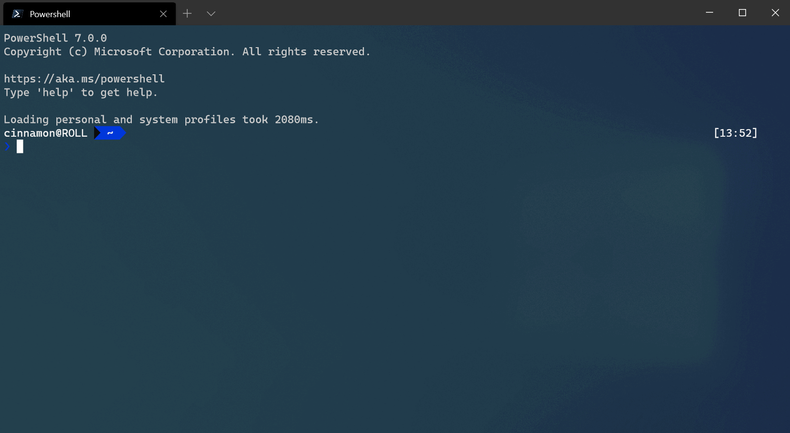
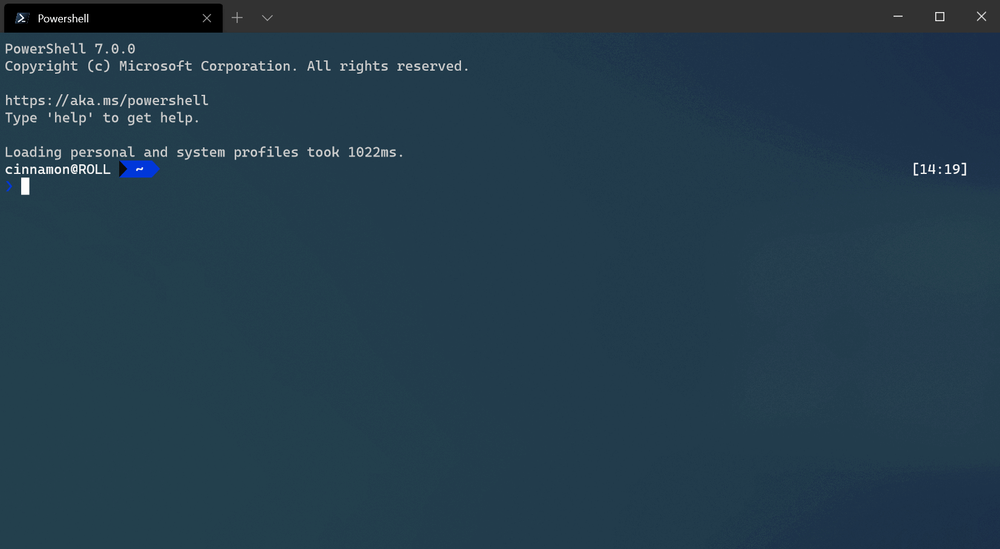
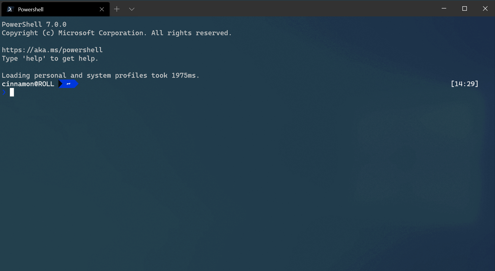
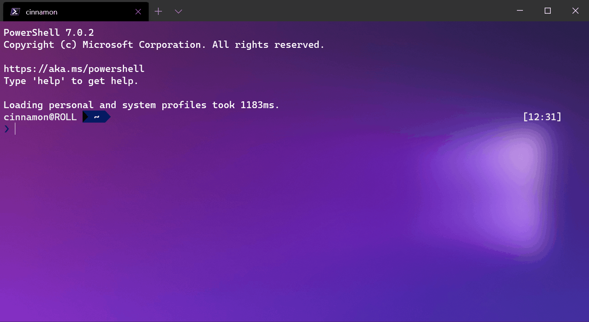

# Appearance settings in Windows Terminal

The properties listed below affect the entire terminal window, regardless of the profile settings. These should be placed at the root of your settings.json file.

> [!TIP]
> If you'd like to edit these settings using the settings UI, you will have to add the `"openSettings"` action to your `"actions"` array in order to open it with the command palette or keyboard.

```json
{ "command": { "action": "openSettings", "target": "settingsUI" }, "keys": "ctrl+shift+s" },
```

> [!IMPORTANT]
> The settings UI is only available in [Windows Terminal Preview](https://aka.ms/terminal-preview).

## Theme

:::row:::
:::column span="":::
This sets the theme of the application. `"system"` will use the same theme as Windows.

**Property name:** `theme`

**Necessity:** Optional

**Accepts:** `"system"`, `"dark"`, `"light"`

**Default value:** `"system"`

:::column-end:::
:::column span="":::

_Configuration: [Powerline in PowerShell](./../custom-terminal-gallery/powerline-in-powershell.md)_

:::column-end:::
:::row-end:::

<br />

___

## Always show tabs

:::row:::
:::column span="":::
When this is set to `true`, tabs are always displayed. When it's set to `false` and `showTabsInTitlebar` is set to `true`, tabs are always displayed underneath the title bar. When this is set to `false` and `showTabsInTitlebar` is set to `false`, tabs only appear after more than one tab exists by typing <kbd>ctrl+shift+t</kbd> or by typing the key binding assigned to `newTab`. Note that changing this setting will require starting a new terminal instance.

**Property name:** `alwaysShowTabs`

**Necessity:** Optional

**Accepts:** `true`, `false`

**Default value:** `true`

:::column-end:::
:::column span="":::


:::column-end:::
:::row-end:::

<br />

___

## Hide the title bar

:::row:::
:::column span="":::
When this is set to `true`, the tabs are moved into the title bar and the title bar disappears. When it's set to `false`, the title bar sits above the tabs. Note that changing this setting will require starting a new terminal instance.

**Property name:** `showTabsInTitlebar`

**Necessity:** Optional

**Accepts:** `true`, `false`

**Default value:** `true`

:::column-end:::
:::column span="":::


:::column-end:::
:::row-end:::

<br />

___

## Use active terminal title as application title

When this is set to `true`, the title bar displays the title of the selected tab. When it's set to `false`, title bar displays "Windows Terminal". Note that changing this setting will require starting a new terminal instance.

**Property name:** `showTerminalTitleInTitlebar`

**Necessity:** Optional

**Accepts:** `true`, `false`

**Default value:** `true`

<br />

___

## Always on top mode

When set to true, Windows Terminal windows will launch on top of all other windows on the desktop. This state can also be toggled with the `toggleAlwaysOnTop` key binding.

**Property name:** `alwaysOnTop`

**Necessity:** Optional

**Accepts:** `true, false`

**Default value:** `false`

<br />

___

## Tab width mode

:::row:::
:::column span="":::
This sets the width of the tabs. `"equal"` makes each tab the same width. `"titleLength"` sizes each tab to the length of its title. `"compact"` will shrink every inactive tab to the width of the icon, leaving the active tab more space to display its full title.

**Property name:** `tabWidthMode`

**Necessity:** Optional

**Accepts:** `"equal"`, `"titleLength"`, `"compact"`

**Default value:** `"equal"`

:::column-end:::
:::column span="":::


:::column-end:::
:::row-end:::

<br />

___

## Disable pane animations

This disables visual animations across the application when set to `true`.

**Property name:** `disableAnimations`

**Necessity:** Optional

**Accepts:** `true`, `false`

**Default value:** `false`

<br />

___

## Show close all tabs popup

:::row:::
:::column span="":::
When this is set to `true`, closing a window with multiple tabs open _will_ require confirmation. When it's set to `false`, closing a window with multiple tabs open _will not_ require confirmation.

**Property name:** `confirmCloseAllTabs`

**Necessity:** Optional

**Accepts:** `true`, `false`

**Default value:** `true`

:::column-end:::
:::column span="":::


:::column-end:::
:::row-end:::
