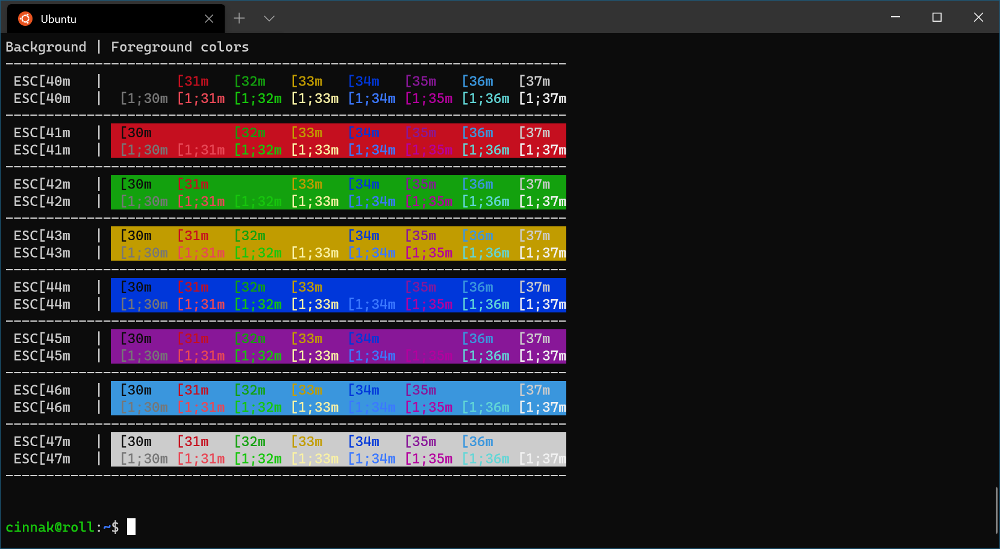
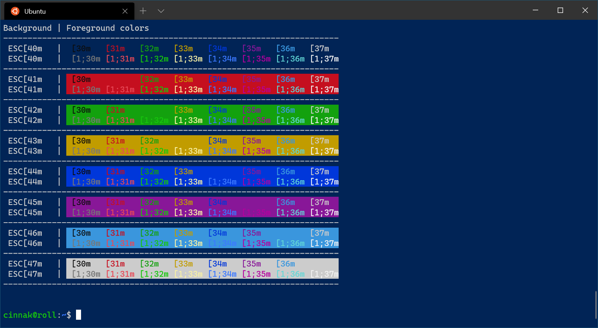
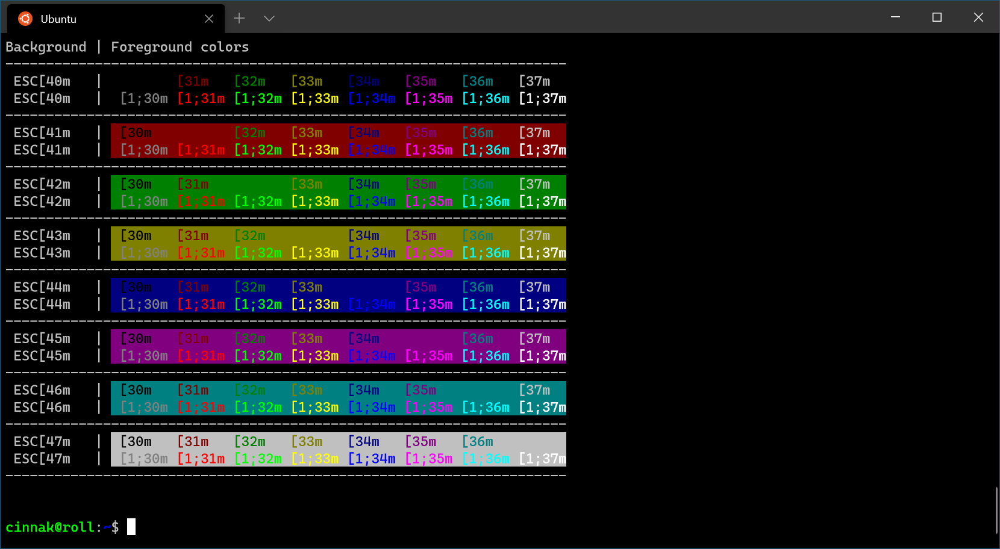
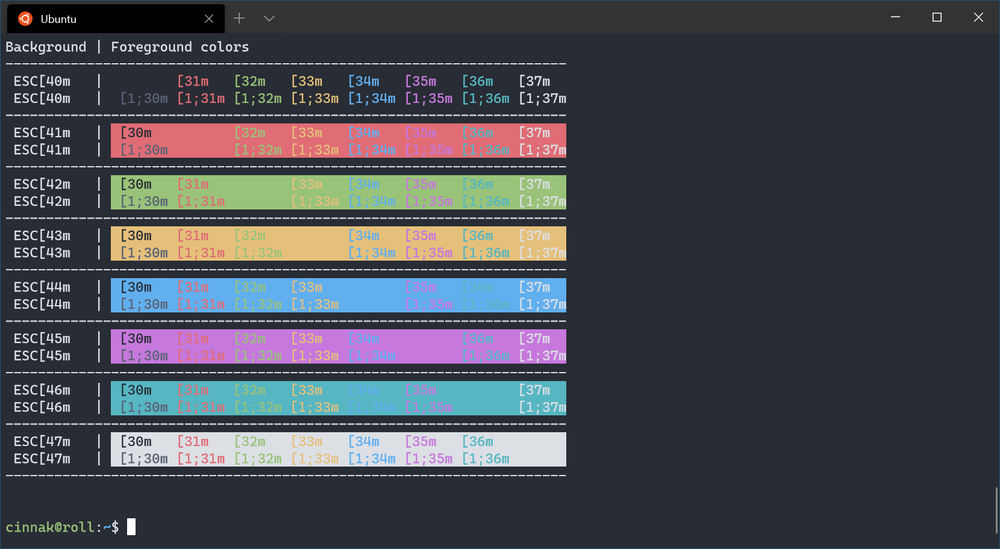
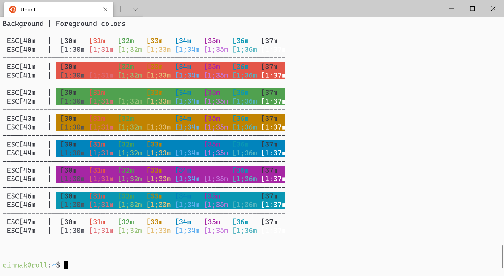
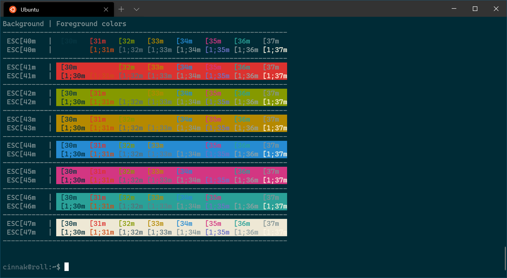
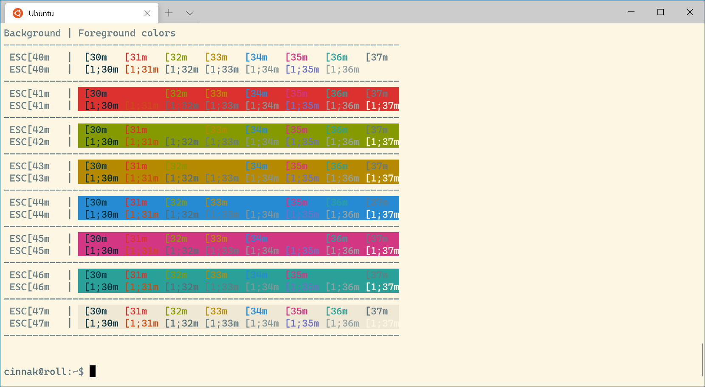
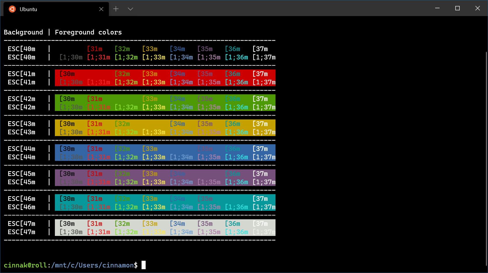
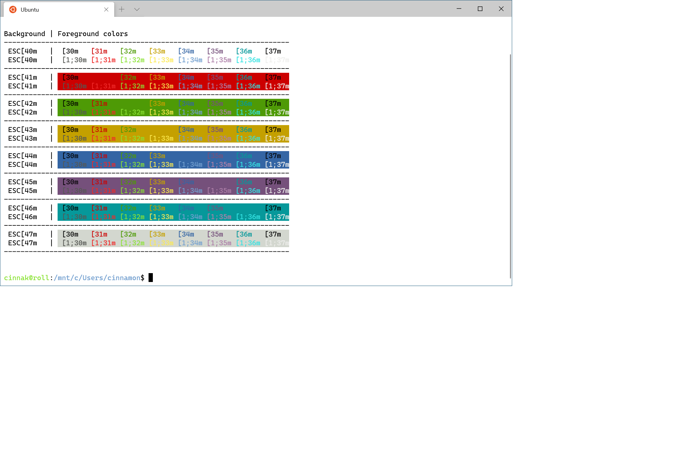

# Color schemes in Windows Terminal

## Creating your own color scheme

Color schemes can be defined in the `schemes` array of your settings.json file. They are written in the following format:

```json
{
    "name" : "Campbell",

    "cursorColor": "#FFFFFF",
    "selectionBackground": "#FFFFFF",

    "background" : "#0C0C0C",
    "foreground" : "#CCCCCC",

    "black" : "#0C0C0C",
    "blue" : "#0037DA",
    "cyan" : "#3A96DD",
    "green" : "#13A10E",
    "purple" : "#881798",
    "red" : "#C50F1F",
    "white" : "#CCCCCC",
    "yellow" : "#C19C00",
    "brightBlack" : "#767676",
    "brightBlue" : "#3B78FF",
    "brightCyan" : "#61D6D6",
    "brightGreen" : "#16C60C",
    "brightPurple" : "#B4009E",
    "brightRed" : "#E74856",
    "brightWhite" : "#F2F2F2",
    "brightYellow" : "#F9F1A5"
},
```

Every setting, aside from `name`, accepts a color as a string in hex format: `"#rgb"` or `"#rrggbb"`. The `cursorColor` and `selectionBackground` settings are optional.

<br />

___

## Included color schemes

Windows Terminal includes these color schemes inside the defaults.json file, which can be accessed by holding <kbd>alt</kbd> and selecting the settings button. If you would like to set up a color scheme inside one of your command-line profiles, add the `colorScheme` property with the color scheme's `name` as the value.

```json
"colorScheme": "COLOR SCHEME NAME"
```

### Campbell



### Campbell Powershell



### Vintage



### One Half Dark



### One Half Light



### Solarized Dark



### Solarized Light



### Tango Dark



### Tango Light


