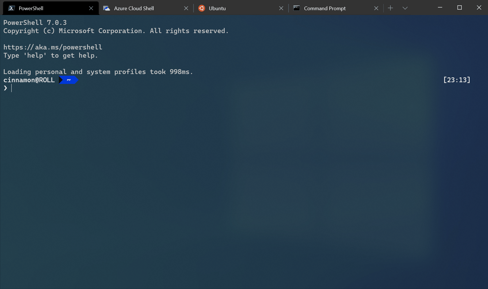

# Interaction settings in Windows Terminal

The properties listed below affect the entire terminal window, regardless of the profile settings. These should be placed at the root of your settings.json file.

> [!TIP]
> If you'd like to edit these settings using the settings UI, you will have to add the `"openSettings"` action to your `"actions"` array in order to open it with the command palette or keyboard.
</br>
```json
{ "command": { "action": "openSettings", "target": "settingsUI" }, "keys": "ctrl+shift+s" },
```
</br>
> [!IMPORTANT]
> The settings UI is only available in [Windows Terminal Preview](https://aka.ms/terminal-preview).

## Automatically copy selection to clipboard

When this is set to `true`, a selection is immediately copied to your clipboard upon creation. The right-click on your mouse will always paste in this case. When it's set to `false`, the selection persists and awaits further action. Using your mouse to right-click will copy the selection.

**Property name:** `copyOnSelect`

**Necessity:** Optional

**Accepts:** `true`, `false`

**Default value:** `false`

<br />

___

## Text format when copying

When this is set to `true`, the color and font formatting of the selected text is also copied to your clipboard. When it's set to `false`, only plain text is copied to your clipboard. You can also specify which formats you would like to copy.

**Property name:** `copyFormatting`

**Necessity:** Optional

**Accepts:** `true`, `false`, `"all"`, `"none"`, `"html"`, `"rtf"`

**Default value:** `false`

<br />

___

## Word delimiters

This determines the word delimiters used in a double-click selection. Word delimiters are characters that specify where the boundary is between two words. The most common examples are spaces, semicolons, commas, and periods.

**Property name:** `wordDelimiters`

**Necessity:** Optional

**Accepts:** Characters as a string

**Default value:** <code>&nbsp;&#x2f;&#x5c;&#x28;&#x29;&#x22;&#x27;&#x2d;&#x3a;&#x2c;&#x2e;&#x3b;&#x3c;&#x3e;&#x7e;&#x21;&#x40;&#x23;&#x24;&#x25;&#x5e;&#x26;&#x2a;&#x7c;&#x2b;&#x3d;&#x5b;&#x5d;&#x7b;&#x7d;&#x7e;&#x3f;│</code><br>_(`│` is `U+2502 BOX DRAWINGS LIGHT VERTICAL`)_

<br />

___

## Snap window resizing to character grid

:::row:::
:::column span="":::
When this is set to `true`, the window will snap to the nearest character boundary on resize. When it's set to `false`, the window will resize "smoothly".

**Property name:** `snapToGridOnResize`

**Necessity:** Optional

**Accepts:** `true`, `false`

**Default value:** `true`

:::column-end:::
:::column span="":::


:::column-end:::
:::row-end:::

<br />

___

## Tab settings

### Tab switcher interface style

:::row:::
:::column span="":::
When this is set to `true` or `"mru"`, the `nextTab` and `prevTab` commands will use the tab switcher UI, with most recently used ordering. When set to `"inOrder"`, these actions will switch tabs in their current order in the tab bar. The UI will show all the currently open tabs in a vertical list, navigable with the keyboard or mouse.

The tab switcher will open on the initial press of the actions for `nextTab` and `prevTab`, and will stay open as long as a modifier key is held down. When all modifier keys are released, the switcher will close and the highlighted tab will be focused. <kbd>tab</kbd>/<kbd>shift+tab</kbd>, the <kbd>up</kbd> and <kbd>down</kbd> arrow keys, and the `nextTab`/`prevTab` actions can be used to cycle through the switcher UI.

To disable the tab switcher, you can set this to `false` or `"disabled"`.

**Property name:** `tabSwitcherMode`

**Necessity:** Optional

**Accepts:** `true`, `false`, `"mru"`, `"inOrder"`, `"disabled"`

**Default value:** `"inOrder"`

:::column-end:::
:::column span="":::


:::column-end:::
:::row-end:::

### Enable tab switcher

When this is set to `true`, the `nextTab` and `prevTab` commands will use the tab switcher UI. The UI will show all the currently open tabs in a vertical list, navigable with the keyboard or mouse.

The tab switcher will open on the initial press of the actions for `nextTab` and `prevTab`, and will stay open as long as a modifier key is held down. When all modifier keys are released, the switcher will close and the highlighted tab will be focused. <kbd>tab</kbd>/<kbd>shift+tab</kbd>, the <kbd>up</kbd> and <kbd>down</kbd> arrow keys, and the `nextTab`/`prevTab` actions can be used to cycle through the switcher UI.

**Property name:** `useTabSwitcher`

**Necessity:** Optional

**Accepts:** `true`, `false`

**Default value:** `true`

> [!CAUTION]
> The `"useTabSwitcher"` setting is no longer available in versions 1.5 and later. It is recommended that you use the `"tabSwitcherMode"` setting instead.

<br />

___

## Paste warnings

### Warn when the text to paste is very large

When this is set to `true`, trying to paste text with more than 5 KiB of characters will display a dialog asking you whether to continue or not with the paste. When it's set to `false`, the dialog is not shown and instead the text is pasted right away. If you often right-click on the terminal by accident after having selected a lot of text, this might be useful to prevent the terminal from becoming unresponsive while the program connected to the terminal receives the clipboard's content.

**Property name:** `largePasteWarning`

**Necessity:** Optional

**Accepts:** `true`, `false`

**Default value:** `true`

### Warn when the text to paste contains multiple lines

When this is set to `true`, trying to paste text with multiple lines will display a dialog asking you whether to continue or not with the paste. When it's set to `false`, the dialog is not shown and instead the text is pasted right away. In most shells, one line corresponds to one command so if you paste text that contains the "new line" character into a shell, one or more command(s) might be executed automatically upon paste, without you having time to validate the commands. This can be useful if you often copy and paste commands from untrusted websites.

**Property name:** `multiLinePasteWarning`

**Necessity:** Optional

**Accepts:** `true`, `false`

**Default value:** `true`
