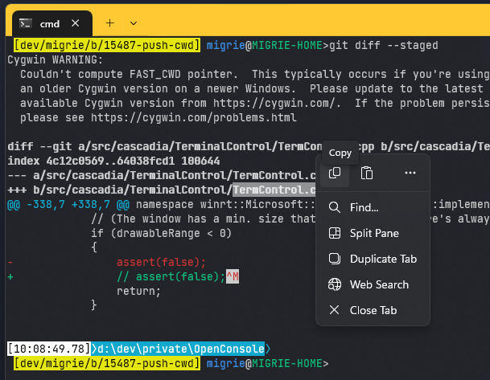

# Interaction settings in Windows Terminal

The properties listed below affect the entire terminal window, regardless of the profile settings. These should be placed at the root of your [settings.json file](../install.md#settings-json-file).

## Automatically copy selection to clipboard

When this is set to `true`, a selection is immediately copied to your clipboard upon creation. The right-click on your mouse will always paste in this case. When it's set to `false`, the selection persists and awaits further action. Using your mouse to right-click will copy the selection.

**Property name:** `copyOnSelect`

**Necessity:** Optional

**Accepts:** `true`, `false`

**Default value:** `false`

 

___

## Text format when copying

When this is set to `true`, the color and font formatting of the selected text is also copied to your clipboard. When it's set to `false`, only plain text is copied to your clipboard. You can also specify which formats you would like to copy.

**Property name:** `copyFormatting`

**Necessity:** Optional

**Accepts:** `true`, `false`, `"all"`, `"none"`, `"html"`, `"rtf"`

**Default value:** `false`

 

___

## Remove trailing white-space in rectangular selection

When this is set to `true` and you copy text in a rectangular (block) selection to the clipboard, trailing white-spaces are removed from each line. When it's set to `false`, the white-spaces are preserved, ensuring that all lines have the same length. To copy text in a rectangular (block) selection, hold down the <kbd>Alt</kbd> key, click and drag your mouse over the text area you want to select. This can be useful for selecting text columns, etc.

**Property name:** `trimBlockSelection`

**Necessity:** Optional

**Accepts:** `true`, `false`

**Default value:** `true`

 

___

## Trim trailing whitespace on paste

When enabled, the terminal will automatically trim trailing whitespace characters when pasting text to the terminal.

**Property name:** `trimPaste`

**Necessity:** Optional

**Accepts:** `true`, `false`

**Default value:** `true`

___

## Word delimiters

This determines the word delimiters used in a double-click selection. Word delimiters are characters that specify where the boundary is between two words. The most common examples are spaces, semicolons, commas, and periods.

**Property name:** `wordDelimiters`

**Necessity:** Optional

**Accepts:** Characters as a string

**Default value:**
<code>&nbsp;&#x2f;&#x5c;&#x5c;&#x28;&#x29;&#x5c;&#x22;&#x27;&#x2d;&#x3a;&#x2c;&#x2e;&#x3b;&#x3c;&#x3e;&#x7e;&#x21;&#x40;&#x23;&#x24;&#x25;&#x5e;&#x26;&#x2a;&#x7c;&#x2b;&#x3d;&#x5b;&#x5d;&#x7b;&#x7d;&#x3f;│</code>
 
_(`│` is `U+2502 BOX DRAWINGS LIGHT VERTICAL`)_

> [!IMPORTANT]
> The following characters must be escaped with a backslash : `\`, `"`

As an example, here are some sets of delimiters you can use to match the behavior of various other terminal emulators:

| Terminal       | Delimiters                                                                                                                      |
| -------------- | ------------------------------------------------------------------------------------------------------------------------------- |
| Xterm          | <code>&#x22;&#x24;&#x27;&#x28;&#x29;&#x2A;&#x3B;&#x3C;&#x3E;&#x5B;&#x5C;&#x5D;&#x5E;&#x7B;&#x7C;&#x7D;</code>                   |
| Gnome Terminal | <code>&#x21;&#x22;&#x24;&#x27;&#x28;&#x29;&#x2A;&#x3A;&#x3B;&#x3C;&#x3E;&#x5B;&#x5D;&#x5E;&#x7B;&#x7C;&#x7D;</code>             |
| Konsole        | <code>&#x21;&#x22;&#x24;&#x27;&#x28;&#x29;&#x2A;&#x2C;&#x3B;&#x3C;&#x3E;&#x5B;&#x5C;&#x5D;&#x5E;&#x7B;&#x7C;&#x7D;</code>       |
| Rxvt           | <code>&#x26;&#x28;&#x29;&#x3B;&#x3C;&#x3E;&#x7C;</code>                                                                         |
| Alacritty      | <code>&#x22;&#x27;&#x28;&#x29;&#x2C;&#x3A;&#x3C;&#x3E;&#x5B;&#x5D;&#x7B;&#x7C;&#x7D;</code>                                     |
| Kitty          | <code>&#x21;&#x22;&#x24;&#x27;&#x28;&#x29;&#x2A;&#x2C;&#x3A;&#x3B;&#x3C;&#x3E;&#x5B;&#x5C;&#x5D;&#x5E;&#x7B;&#x7C;&#x7D;</code> |

___

## Snap window resizing to character grid

:::row:::
:::column span="":::
When this is set to `true`, the window will snap to the nearest character boundary on resize. When it's set to `false`, the window will resize "smoothly".

**Property name:** `snapToGridOnResize`

**Necessity:** Optional

**Accepts:** `true`, `false`

**Default value:** `true`

:::column-end:::
:::column span="":::

:::column-end:::
:::row-end:::

 

___

## Minimize to notification area

When this is set to `true`, minimizing a window will hide it from the taskbar, making it inaccessible from that area. It will instead be accessible from terminal's notification area icon. If either this global setting or the `minimizeToNotificationArea` global setting is set to true, terminal will place an icon in the notification area.

**Property name:** `minimizeToNotificationArea`

**Necessity:** Optional

**Accepts:** `true`, `false`

**Default value:** `false`

> [!IMPORTANT]
> This setting was renamed from `"minimizeToTray"` to `"minimizeToNotificationArea"`.

 

___

## Always show notification icon

When this is set to `true`, the terminal will place its icon in the notification area. If either this global setting or the `minimizeToNotificationArea` global setting is set to true, the terminal will place an icon in the notification area. The user will also be able to utilize the `minimizeToNotificationArea` _action_.

**Property name:** `alwaysShowNotificationIcon`

**Necessity:** Optional

**Accepts:** `true`, `false`

**Default value:** `false`

> [!IMPORTANT]
> This setting was renamed from `"alwaysShowTrayIcon"` to `"alwaysShowNotificationIcon"`.

 

___

## Tab settings

### Tab switcher interface style

:::row:::
:::column span="":::
When this is set to `true` or `"mru"`, the `nextTab` and `prevTab` commands will use the tab switcher UI, with most recently used ordering. When set to `"inOrder"`, these actions will switch tabs in their current order in the tab bar. The UI will show all the currently open tabs in a vertical list, navigable with the keyboard or mouse.

The tab switcher will open on the initial press of the actions for `nextTab` and `prevTab`, and will stay open as long as a modifier key is held down. When all modifier keys are released, the switcher will close and the highlighted tab will be focused. <kbd>Tab</kbd>/<kbd>Shift+Tab</kbd>, the <kbd>Up</kbd> and <kbd>Down</kbd> arrow keys, and the `nextTab`/`prevTab` actions can be used to cycle through the switcher UI.

To disable the tab switcher, you can set this to `false` or `"disabled"`.

**Property name:** `tabSwitcherMode`

**Necessity:** Optional

**Accepts:** `true`, `false`, `"mru"`, `"inOrder"`, `"disabled"`

**Default value:** `"inOrder"`

:::column-end:::
:::column span="":::

:::column-end:::
:::row-end:::

### Enable tab switcher

When this is set to `true`, the `nextTab` and `prevTab` commands will use the tab switcher UI. The UI will show all the currently open tabs in a vertical list, navigable with the keyboard or mouse.

The tab switcher will open on the initial press of the actions for `nextTab` and `prevTab`, and will stay open as long as a modifier key is held down. When all modifier keys are released, the switcher will close and the highlighted tab will be focused. <kbd>Tab</kbd>/<kbd>Shift+Tab</kbd>, the <kbd>Up</kbd> and <kbd>Down</kbd> arrow keys, and the `nextTab`/`prevTab` actions can be used to cycle through the switcher UI.

**Property name:** `useTabSwitcher`

**Necessity:** Optional

**Accepts:** `true`, `false`

**Default value:** `true`

> [!CAUTION]
> The `"useTabSwitcher"` setting is no longer available in versions 1.5 and later. It is recommended that you use the `"tabSwitcherMode"` setting instead.

 

___

## Automatically hide on focus loss

When enabled, this allows the Terminal window to automatically be hidden as soon as the window loses focus.

**Property name:** `autoHideWindow`

**Necessity:** Optional

**Accepts:** `true`, `false`

**Default value:** `false`

 
___

## Automatically focus pane on mouse hover

When this is set to `true`, the terminal will move focus to the pane on mouse hover. When it's set to `false`, a click will be required to focus the pane using the mouse.

**Property name:** `focusFollowMouse`

**Necessity:** Optional

**Accepts:** `true`, `false`

**Default value:** `false`

 

___

## Automatically detect URLs and make them clickable

When this is set to `true`, URLs will be detected by the terminal. This will cause URLs to underline on hover and be clickable by pressing <kbd>Ctrl</kbd>. This is an experimental feature and its continued existence is not guaranteed.

**Property name:** `experimental.detectURLs`

**Necessity:** Optional

**Accepts:** `true`, `false`

**Default value:** `true`

 

___

## Paste warnings

### Warn when the text to paste is very large

When this is set to `true`, trying to paste text with more than 5 KiB of characters will display a dialog asking you whether to continue or not with the paste. When it's set to `false`, the dialog is not shown and instead the text is pasted right away. If you often right-click on the terminal by accident after having selected a lot of text, this might be useful to prevent the terminal from becoming unresponsive while the program connected to the terminal receives the clipboard's content.

**Property name:** `largePasteWarning`

**Necessity:** Optional

**Accepts:** `true`, `false`

**Default value:** `true`

### Warn when the text to paste contains multiple lines

When this is set to `true`, trying to paste text with multiple lines will display a dialog asking you whether to continue or not with the paste. When it's set to `false`, the dialog is not shown and instead the text is pasted right away. In most shells, one line corresponds to one command so if you paste text that contains the "new line" character into a shell, one or more command(s) might be executed automatically upon paste, without you having time to validate the commands. This can be useful if you often copy and paste commands from untrusted websites.

**Property name:** `multiLinePasteWarning`

**Necessity:** Optional

**Accepts:** `true`, `false`

**Default value:** `true`

 

___

## Legacy input encoding

Force the terminal to use the legacy input encoding. Specific keys in some applications may stop working when enabling this setting, but it can be useful for advanced-level scenarios when debugging input issues, especially with the [debug tap](https://github.com/microsoft/terminal/wiki/Enabling-the-debug-tap).

**Property name:** `experimental.input.forceVT`

**Necessity:** Optional

**Accepts:** `true`, `false`

**Default value:** `false`

 

___

## Context Menu

:::row:::
:::column span="":::

The context menu in the Windows Terminal is an easy way to access common actions quickly. When this is set to `true`, a right-click in the Terminal will activate the context menu. When set to `false`, a right-click will paste.

The context menu can also be opened with the `showContextMenu` action, regardless if this setting is enabled or not.

:::column-end:::
:::column span="":::

:::column-end:::
:::row-end:::

**Property name:** `experimental.rightClickContextMenu`

**Necessity:** Optional

**Accepts:** `true`, `false`

**Default value:** `false`

 

___

## Web searching

This is the default URL used when searching the web from the terminal with the `searchWeb` action (including the right-click context menu). The `%s` in this string is replaced with the selected text. The default value is `https://www.bing.com/search?q=%s`.

**Property name:** `searchWebDefaultQueryUrl`

**Necessity:** Optional

**Accepts:** URL as a string

**Default value:** `https://www.bing.com/search?q=%s`

> [!IMPORTANT]
> This feature is only available in [Windows Terminal Preview](https://aka.ms/terminal-preview).
