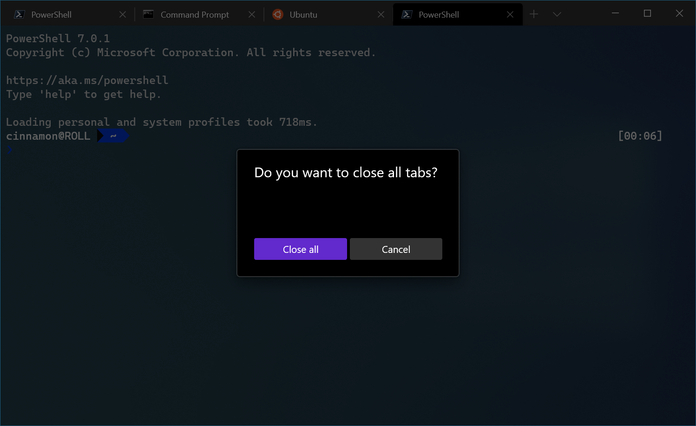

# Custom key bindings in Windows Terminal

You can create custom key bindings (keyboard shortcuts) inside Windows Terminal that give you control of how you interact with the terminal using your keyboard.

## Key binding formats

Key bindings can be structured in the following formats:

### Commands without arguments

```json
{ "command": "commandName", "keys": "modifiers+key" }
```

For example, this default setting uses the shortcut key <kbd>alt+f4</kbd> to close the terminal window:

```json
{ "command": "closeWindow", "keys": "alt+f4" }
```

### Commands with arguments

```json
{ "command": { "action": "commandName", "argument": "value" }, "keys": "modifiers+key" }
```

For example, this default setting uses the shortcut key <kbd>ctrl+shift+1</kbd> to open a new tab in the terminal based on whichever profile is listed first in your dropdown menu (typically this will open the PowerShell profile):

```json
{ "command": { "action": "newTab", "index": 0 }, "keys": "ctrl+shift+1" }
```

<br />

___

## Key binding properties

Key bindings can be constructed using the following properties.

### Command

This is the command executed when the associated keys are pressed.

**Property name:** `command`

**Necessity:** Required

**Accepts:** String

### Keys

This defines the key combinations used to call the command. Keys can have any number of modifiers with one key. Accepted modifiers and keys are listed [below](#accepted-modifiers-and-keys).

**Property name:** `keys`

**Necessity:** Required

**Accepts:** String or array[string]

### Action

This adds additional functionality to certain commands.

**Property name:** `action`

**Necessity:** Optional

**Accepts:** String

<br />

___

## Accepted modifiers and keys

### Modifiers

`ctrl+`, `shift+`, `alt+`

### Modifier keys

| Type | Keys |
| ---- | ---- |
| Function and alphanumeric keys | `f1-f24`, `a-z`, `0-9` |
| Symbols | ``` ` ```, `-`, `=`, `[`, `]`, `\`, `;`, `'`, `,`, `.`, `/` |
| Arrow keys | `down`, `left`, `right`, `up`, `pagedown`, `pageup`, `pgdn`, `pgup`, `end`, `home`, `plus` |
| Action keys | `tab`, `enter`, `esc`, `escape`, `space`, `backspace`, `delete`, `insert` |
| Numpad keys | `numpad_0-numpad_9`, `numpad0-numpad9`, `numpad_add`, `numpad_plus`, `numpad_decimal`, `numpad_period`, `numpad_divide`, `numpad_minus`, `numpad_subtract`, `numpad_multiply` |

<br />

___

## Application-level commands

### Close window

:::row:::
:::column span="":::
This closes the current window and all tabs within it. If `confirmCloseAllTabs` is set to `true`, a confirmation dialog will appear to ensure you'd like to close all your tabs. More information on this setting can be found on the [Global settings page](./global-settings.md#hide-close-all-tabs-popup).

**Command name:** `closeWindow`

**Default binding:**

```json
{ "command": "closeWindow", "keys": "alt+f4" }
```

:::column-end:::
:::column span="":::


:::column-end:::
:::row-end:::

### Find

This opens the search dialog box. More information on search can be found on the [Search page](./../search.md).

**Command name:** `find`

**Default binding:**

```json
{ "command": "find", "keys": "ctrl+shift+f" }
```

### Open the dropdown

This opens the dropdown menu.

**Command name:** `openNewTabDropdown`

**Default binding:**

```json
{ "command": "openNewTabDropdown", "keys": "ctrl+shift+space" }
```

### Open settings files

This opens either the default or custom settings files. Without the `target` field, this will open the settings.json file.

**Command name:** `openSettings`

**Default binding:**

```json
{ "command": "openSettings", "keys": "ctrl+," },
{ "command": { "action": "openSettings", "target": "defaultsFile" }, "keys": "ctrl+alt+," },
```

#### Actions

| Name | Necessity | Accepts | Description |
| ---- | --------- | ------- | ----------- |
| `target` | Optional | `"settingsFile"`, `"defaultsFile"`, `"allFiles"` | The settings file to open. |

### Toggle full screen

This allows you to switch between full screen and default window sizes.

**Command name:** `toggleFullscreen`

**Default bindings:**

```json
{ "command": "toggleFullscreen", "keys": "alt+enter" },
{ "command": "toggleFullscreen", "keys": "f11" }
```

### Toggle focus mode ([Preview](https://aka.ms/terminal-preview/))

This allows you to enter "focus mode", which hides the tabs and title bar.

**Command name:** `toggleFocusMode`

**Default bindings:**

_This command is not currently bound in the default settings_.

```json
{ "command": "toggleFocusMode", "keys": "" }
```

> [!IMPORTANT]
> This feature is only available in [Windows Terminal Preview](https://aka.ms/terminal-preview/).

### Toggle always on top mode ([Preview](https://aka.ms/terminal-preview/))

This allows you toggle the "always on top" state of the window. When in "always on top" mode, the window will appear on top of all other non-topmost windows.

**Command name:** `toggleAlwaysOnTop`

**Default bindings:**

_This command is not currently bound in the default settings_.

```json
{ "command": "toggleAlwaysOnTop", "keys": "" }
```

> [!IMPORTANT]
> This feature is only available in [Windows Terminal Preview](https://aka.ms/terminal-preview/).

<br />

___

## Tab management commands

### Close tab

This closes the current tab.

**Command name:** `closeTab`

### Duplicate tab

This makes a copy of the current tab and opens it.

**Command name:** `duplicateTab`

**Default binding:**

```json
{ "command": "duplicateTab", "keys": "ctrl+shift+d" }
```

### New tab

This creates a new tab. Without any arguments, this will open the default profile in a new tab. If an action is not specified, the default profile's equivalent setting will be used.

**Command name:** `newTab`

**Default bindings:**

```json
{ "command": "newTab", "keys": "ctrl+shift+t" },
{ "command": { "action": "newTab", "index": 0 }, "keys": "ctrl+shift+1" },
{ "command": { "action": "newTab", "index": 1 }, "keys": "ctrl+shift+2" },
{ "command": { "action": "newTab", "index": 2 }, "keys": "ctrl+shift+3" },
{ "command": { "action": "newTab", "index": 3 }, "keys": "ctrl+shift+4" },
{ "command": { "action": "newTab", "index": 4 }, "keys": "ctrl+shift+5" },
{ "command": { "action": "newTab", "index": 5 }, "keys": "ctrl+shift+6" },
{ "command": { "action": "newTab", "index": 6 }, "keys": "ctrl+shift+7" },
{ "command": { "action": "newTab", "index": 7 }, "keys": "ctrl+shift+8" },
{ "command": { "action": "newTab", "index": 8 }, "keys": "ctrl+shift+9" }
```

#### Actions

| Name | Necessity | Accepts | Description |
| ---- | --------- | ------- | ----------- |
| `commandLine` | Optional | Executable file name as a string | Executable run within the tab. |
| `startingDirectory` | Optional | Folder location as a string | Directory in which the tab will open. |
| `tabTitle` | Optional | String | Title of the new tab. |
| `index` | Optional | Integer | Profile that will open based on its position in the dropdown (starting at 0). |
| `profile` | Optional | Profile's name or GUID as a string | Profile that will open based on its GUID or name. |

### Open next tab

This opens the tab to the right of the current one.

**Command name:** `nextTab`

**Default binding:**

```json
{ "command": "nextTab", "keys": "ctrl+tab" }
```

### Open previous tab

This opens the tab to the left of the current one.

**Command name:** `prevTab`

**Default binding:**

```json
{ "command": "prevTab", "keys": "ctrl+shift+tab" }
```

### Open a specific tab

This opens a specific tab depending on the index.

**Command name:** `switchToTab`

**Default bindings:**

```json
{ "command": { "action": "switchToTab", "index": 0 }, "keys": "ctrl+alt+1" },
{ "command": { "action": "switchToTab", "index": 1 }, "keys": "ctrl+alt+2" },
{ "command": { "action": "switchToTab", "index": 2 }, "keys": "ctrl+alt+3" },
{ "command": { "action": "switchToTab", "index": 3 }, "keys": "ctrl+alt+4" },
{ "command": { "action": "switchToTab", "index": 4 }, "keys": "ctrl+alt+5" },
{ "command": { "action": "switchToTab", "index": 5 }, "keys": "ctrl+alt+6" },
{ "command": { "action": "switchToTab", "index": 6 }, "keys": "ctrl+alt+7" },
{ "command": { "action": "switchToTab", "index": 7 }, "keys": "ctrl+alt+8" },
{ "command": { "action": "switchToTab", "index": 8 }, "keys": "ctrl+alt+9" }
```

#### Actions

| Name | Necessity | Accepts | Description |
| ---- | --------- | ------- | ----------- |
| `index` | Required | Integer | Tab that will open based on its position in the tab bar (starting at 0). |


### Open the Tab Switcher

This opens the tab switcher in either anchored or unanchored mode.

**Command name:** `tabSwitcher`

**Default binding:**

_This command is not currently bound in the default settings_.

```json
{"command": "tabSwitcher", "keys": "ctrl+shift+t"}
{"command": {"action":"tabSwitcher", "anchorKey": "ctrl"}, "keys": "ctrl+tab"}
{"command": {"action":"tabSwitcher", "anchorKey": "alt"}, "keys": "alt+`"}
{"command": {"action":"tabSwitcher", "anchorKey": "shift"}, "keys": "shift+`"}
```

The tab switcher can be cycled through with the keyboard using either the up/down arrow keys and the <kbd>tab</kbd>/<kbd>shift+tab</kbd> keys.

With an `anchorKey` argument, the tab switcher will open in _anchored_ mode. This means that when the `anchorKey` is released, the tab switcher will close and the selected tab is focused. Anchored mode does not have a search bar.
Without an `anchorKey` argument, the tab switcher will open in _unanchored_ mode. It will stay open until a tab is selected or the switcher is dismissed. Unanchored mode appears with a search bar.

Please note that while <kbd>alt</kbd> and <kbd>shift</kbd> can be specified as anchor keys, certain keychord combinations with those modifiers set as anchors might result in unwanted behavior: i.e.
1. Having <kbd>alt</kbd> as an anchor will force you to use the arrow keys instead of <kbd>tab</kbd>/<kbd>shift+tab</kbd> to cycle through tabs, since <kbd>alt+tab</kbd> will be handled by Windows.
2. Having <bkd>shift(anchor)+tab</kbd> will result in the tab switcher always going backwards because <kbd>shift+tab</kbd> always goes backwards by default. Use the arrow keys to go forward.

#### Arguments

| Name | Necessity | Accepts | Description |
| ---- | --------- | ------- | ----------- |
| `anchorKey` | Optional | String - can be `ctrl`, `alt`, or `shift` | If provided, opens the tab switcher in _anchored_ mode with the given key as the anchor. If omitted, opens the tab switcher in _unanchored_ mode. |


### Rename tab ([Preview](https://aka.ms/terminal-preview/))

This command can be used to rename a tab to a specific string.

**Command name:** `renameTab`

**Default binding:**

_This command is not currently bound in the default settings_.

```json
// Rename a tab to "Foo"
{ "command": { "action": "renameTab", "title": "Foo" }, "keys": "" }

// Reset the tab's name
{ "command": { "action": "renameTab", "title": null }, "keys": "" }
```

#### Actions

| Name | Necessity | Accepts | Description |
| ---- | --------- | ------- | ----------- |
| `title` | Optional | String | The new title to use for this tab. If omitted, this command will revert the tab title back to its original value. |

> [!IMPORTANT]
> This feature is only available in [Windows Terminal Preview](https://aka.ms/terminal-preview/).

### Change tab color ([Preview](https://aka.ms/terminal-preview/))

This command can be used to change the color of a tab to a specific value.

**Command name:** `setTabColor`

**Default binding:**

_This command is not currently bound in the default settings_.

```json
// Change the tab's color to a bright magenta
{ "command": { "action": "setTabColor", "color": "#ff00ff" }, "keys": "" }

// Reset the tab's color
{ "command": { "action": "setTabColor", "color": null }, "keys": "" }
```

#### Arguments

| Name | Necessity | Accepts | Description |
| ---- | --------- | ------- | ----------- |
| `color` | Optional | String, in hex format: `"#rgb"` or `"#rrggbb"` | The new color to use for this tab. If omitted, this command will revert the tab's color back to its original value. |

> [!IMPORTANT]
> This feature is only available in [Windows Terminal Preview](https://aka.ms/terminal-preview/).

### Open tab color picker ([Preview](https://aka.ms/terminal-preview/))

This command can be used to open the color picker for the active tab. The color picker can be used to set a color for the tab at runtime.

**Command name:** `openTabColorPicker`

**Default binding:**

_This command is not currently bound in the default settings_.

```json
{ "command": "openTabColorPicker", "keys": "" }
```

> [!IMPORTANT]
> This feature is only available in [Windows Terminal Preview](https://aka.ms/terminal-preview/).

<br />

___

## Pane management commands

### Close pane

This closes the active pane. If there aren't any split panes, this will close the current tab. If there is only one tab open, this will close the window.

**Command name:** `closePane`

**Default binding:**

```json
{ "command": "closePane", "keys": "ctrl+shift+w" }
```

### Move pane focus

This changes focus to a different pane depending on the direction.

**Command name:** `moveFocus`

**Default bindings:**

```json
{ "command": { "action": "moveFocus", "direction": "down" }, "keys": "alt+down" },
{ "command": { "action": "moveFocus", "direction": "left" }, "keys": "alt+left" },
{ "command": { "action": "moveFocus", "direction": "right" }, "keys": "alt+right" },
{ "command": { "action": "moveFocus", "direction": "up" }, "keys": "alt+up" }
```

#### Actions

| Name | Necessity | Accepts | Description |
| ---- | --------- | ------- | ----------- |
| `direction` | Required | `"left"`, `"right"`, `"up"`, `"down"` | Direction in which the focus will move. |

### Resize a pane

This changes the size of the active pane.

**Command name:** `resizePane`

**Default bindings:**

```json
{ "command": { "action": "resizePane", "direction": "down" }, "keys": "alt+shift+down" },
{ "command": { "action": "resizePane", "direction": "left" }, "keys": "alt+shift+left" },
{ "command": { "action": "resizePane", "direction": "right" }, "keys": "alt+shift+right" },
{ "command": { "action": "resizePane", "direction": "up" }, "keys": "alt+shift+up" }
```

#### Actions

| Name | Necessity | Accepts | Description |
| ---- | --------- | ------- | ----------- |
| `direction` | Required | `"left"`, `"right"`, `"up"`, `"down"` | Direction in which the pane will be resized. |

### Split a pane

This halves the size of the active pane and opens another. Without any arguments, this will open the default profile in the new pane. If an action is not specified, the default profile's equivalent setting will be used.

**Command name:** `splitPane`

**Default bindings:**

```json
// In settings.json
{ "command": { "action": "splitPane", "split": "auto", "splitMode": "duplicate" }, "keys": "alt+shift+d" },

// In defaults.json
{ "command": { "action": "splitPane", "split": "horizontal"}, "keys": "alt+shift+-" },
{ "command": { "action": "splitPane", "split": "vertical"}, "keys": "alt+shift+plus" }
```

#### Actions

| Name | Necessity | Accepts | Description |
| ---- | --------- | ------- | ----------- |
| `split` | Required | `"vertical"`, `"horizontal"`, `"auto"` | How the pane will split. `"auto"` will split in the direction that provides the most surface area. |
| `commandLine` | Optional | Executable file name as a string | Executable run within the pane. |
| `startingDirectory` | Optional | Folder location as a string | Directory in which the pane will open. |
| `tabTitle` | Optional | String | Title of the tab when the new pane is focused. |
| `index` | Optional | Integer | Profile that will open based on its position in the dropdown (starting at 0). |
| `profile` | Optional | Profile's name or GUID as a string | Profile that will open based on its GUID or name. |
| `splitMode` | Optional | `"duplicate"` | Controls how the pane splits. Only accepts `"duplicate"`, which will duplicate the focused pane's profile into a new pane. |

<br />

___

## Clipboard integration commands

### Copy

This copies the selected terminal content to your clipboard.

**Command name:** `copy`

**Default bindings:**

```json
// In settings.json
{ "command": { "action": "copy", "singleLine": false }, "keys": "ctrl+c" },

// In defaults.json
{ "command": { "action": "copy", "singleLine": false }, "keys": "ctrl+shift+c" },
{ "command": { "action": "copy", "singleLine": false }, "keys": "ctrl+insert" }
```

#### Clipboard Actions

| Name | Necessity | Accepts | Description |
| ---- | --------- | ------- | ----------- |
| `singleLine` | Optional | `true`, `false` | When `true`, the copied content will be copied as a single line. When `false`, newlines persist from the selected text. |

### Paste

This inserts the content that was copied onto the clipboard.

**Command name:** `paste`

**Default bindings:**

```json
// In settings.json
{ "command": "paste", "keys": "ctrl+v" },

// In defaults.json
{ "command": "paste", "keys": "ctrl+shift+v" },
{ "command": "paste", "keys": "shift+insert" }
```

<br />

___

## Scrollback commands

### Scroll up

This scrolls the screen up.

**Command name:** `scrollUp`

**Default binding:**

```json
{ "command": "scrollUp", "keys": "ctrl+shift+up" }
```

### Scroll down

This scrolls the screen down.

**Command name:** `scrollDown`

**Default binding:**

```json
{ "command": "scrollDown", "keys": "ctrl+shift+down" }
```

### Scroll up a whole page

This scrolls the screen up by a whole page, which is the height of the window.

**Command name:** `scrollUpPage`

**Default binding:**

```json
{ "command": "scrollUpPage", "keys": "ctrl+shift+pgup" }
```

### Scroll down a whole page

This scrolls the screen down by a whole page, which is the height of the window.

**Command name:** `scrollDownPage`

**Default binding:**

```json
{ "command": "scrollDownPage", "keys": "ctrl+shift+pgdn" }
```

<br />

___

## Visual adjustment commands

### Adjust font size

This changes the text size by a specified point amount.

**Command name:** `adjustFontSize`

**Default bindings:**

```json
{ "command": { "action": "adjustFontSize", "delta": 1 }, "keys": "ctrl+=" },
{ "command": { "action": "adjustFontSize", "delta": -1 }, "keys": "ctrl+-" }
```

#### Actions

| Name | Necessity | Accepts | Description |
| ---- | --------- | ------- | ----------- |
| `delta` | Required | Integer | Amount of size change per command invocation. |

### Reset font size

This resets the text size to the default value.

**Command name:** `resetFontSize`

**Default binding:**

```json
{ "command": "resetFontSize", "keys": "ctrl+0" }
```

### Toggle retro terminal effects ([Preview](https://aka.ms/terminal-preview/))

This toggles the "retro terminal effect", which is enabled with the profile setting `experimental.retroTerminalEffect`.

**Command name:** `toggleRetroEffect`

**Default binding:**

_This command is not currently bound in the default settings_.

```json
{ "command": "toggleRetroEffect", "keys": "" }
```

> [!IMPORTANT]
> This feature is only available in [Windows Terminal Preview](https://aka.ms/terminal-preview/).

<br />

___

## Unbind keys

This unbinds the associated keys from any command.

**Command name:** `unbound`
