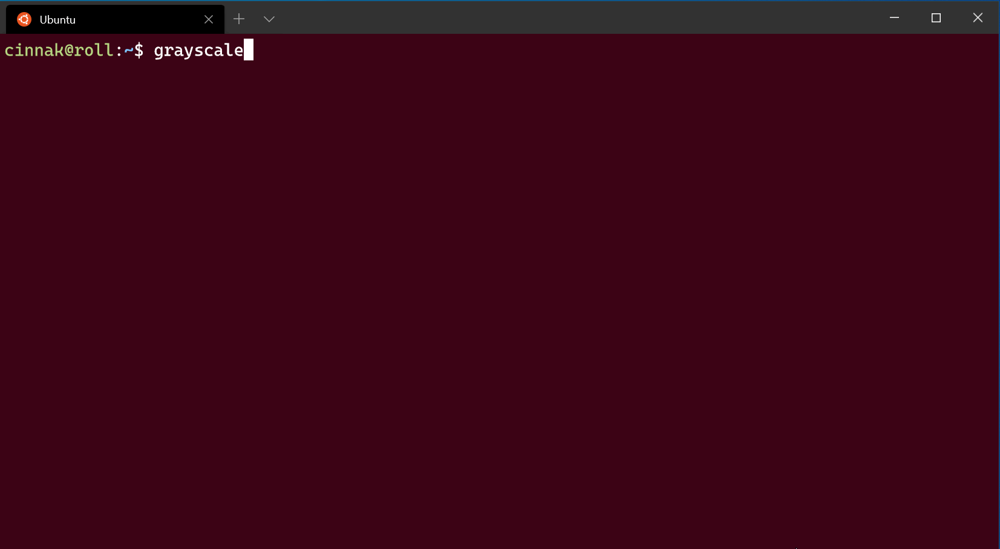

# Advanced profile settings in Windows Terminal

The settings listed below are specific to each unique profile. If you'd like a setting to apply to all of your profiles, you can add it to the `defaults` section above the list of profiles in your [settings.json file](../install.md#settings-json-file).

```json
"defaults":
{
    // SETTINGS TO APPLY TO ALL PROFILES
},
"list":
[
    // PROFILE OBJECTS
]
```

## Suppress title changes

When this is set to `true`, `tabTitle` overrides the default title of the tab and any title change messages from the application will be suppressed. If `tabTitle` isn't set, `name` will be used instead. When this is set to `false`, `tabTitle` behaves as normal.

**Property name:** `suppressApplicationTitle`

**Necessity:** Optional

**Accepts:** `true`, `false`

<br />

___

## Text antialiasing

This controls how text is antialiased in the renderer. Note that changing this setting will require starting a new terminal instance.



**Property name:** `antialiasingMode`

**Necessity:** Optional

**Accepts:** `"grayscale"`, `"cleartype"`, `"aliased"`

**Default value:** `"grayscale"`

<br />

___

## AltGr aliasing

This allows you to control if Windows Terminal will treat <kbd>ctrl+alt</kbd> as an alias for <kbd>AltGr</kbd>.

**Property name:** `altGrAliasing`

**Necessity:** Optional

**Accepts:** `true`, `false`

**Default value:** `true`

<br />

___

## Scroll to input when typing

When this is set to `true`, the window will scroll to the command input line when typing. When it's set to `false`, the window will not scroll when you start typing.

**Property name:** `snapOnInput`

**Necessity:** Optional

**Accepts:** `true`, `false`

**Default value:** `true`

<br />

___

## History size

This sets the number of lines above the ones displayed in the window you can scroll back to.

**Property name:** `historySize`

**Necessity:** Optional

**Accepts:** Integer

**Default value:** `9001`

<br />

___

## Profile termination behavior

This sets how the profile reacts to termination or failure to launch. `"graceful"` will close the profile when `exit` is typed or when the process exits normally. `"always"` will always close the profile and `"never"` will never close the profile. `true` and `false` are accepted as synonyms for `"graceful"` and `"never"`, respectively.

**Property name:** `closeOnExit`

**Necessity:** Optional

**Accepts:** `"graceful"`, `"always"`, `"never"`, `true`, `false`

**Default value:** `"graceful"`

> [!NOTE]
> In Windows Command Prompt (cmd.exe), `exit` will return the return code of the previous command. If the command you typed before `exit` resulted in an error, then `"closeOnExit": "graceful"` will still show that error code, instead of closing the tab.

<br />

___

## Bell notification style

Controls what happens when the application emits a BEL character. When set to `"all"`, the terminal will play a sound and flash the taskbar icon. When the terminal is not in focus, only the taskbar icon will flash.

**Property name:** `bellStyle`

**Necessity:** Optional

**Accepts:** `"all"`, `"audible"`, `"window"`, `"taskbar"`, `"none"`

**Default value:** `"audible"`

<br />

___

## Bell sound

When `bellStyle` is set to `"all"` or `"audible"`, this allows you to choose the audio file for the bell. If you have an array of sounds set, the terminal will pick one at random.

**Property name:** `bellSound`

**Necessity:** Optional

**Accepts:** File location as a string or an array of file locations as strings

___

## Scroll marks ([Preview](https://aka.ms/terminal-preview))

The following settings modify how scroll marks behave in Windows Terminal.

### Experimental automatically add scroll marks ([Preview](https://aka.ms/terminal-preview))

Automatically marks prompts when set to `true`. This is an experimental feature, and its continued existence is not guaranteed.

**Property name:** `experimental.autoMarkPrompts`

**Necessity:** Optional

**Accepts:** `true`, `false`

> [!IMPORTANT]
> This feature is only available in [Windows Terminal Preview](https://aka.ms/terminal-preview).

### Experimental show marks on scrollbar ([Preview](https://aka.ms/terminal-preview))

Displays marks on the scrollbar when set to `true`. This is an experimental feature, and its continued existence is not guaranteed.

**Property name:** `experimental.showMarksOnScrollbar`

**Necessity:** Optional

**Accepts:** `true`, `false`

> [!IMPORTANT]
> This feature is only available in [Windows Terminal Preview](https://aka.ms/terminal-preview).

___

## Experimental text rendering engine

Enables use of the experimental text rendering engine for the profile. This is an experimental feature and its continued existence is not guaranteed. A new instance of the profile needs to be opened in order for this setting to take effect.

**Property name:** `experimental.useAtlasEngine`

**Necessity:** Optional

**Accepts:** `true`, `false`

**Default value:** `false`

<br />

___

## VT passthrough mode

When set to true, directs the PTY for this connection to use pass-through mode instead of the original Conhost PTY simulation engine. This is an experimental feature, and its continued existence is not guaranteed.

**Property name:** `experimental.connection.passthroughMode`

**Necessity:** Optional

**Accepts:** `true`, `false`

**Default value:** `false`

<br />

___

## Unique identifier

Profiles can use a GUID as a unique identifier. To make a profile your default profile, it needs a GUID for the `defaultProfile` global setting.

**Property name:** `guid`

**Necessity:** Required

**Accepts:** GUID as a string in registry format: `"{00000000-0000-0000-0000-000000000000}"`

> [!TIP]
> You can run `[guid]::NewGuid()` in PowerShell to generate a GUID for your custom profile. You can also use the [online GUID generator](https://www.guidgenerator.com/) or for other command lines, use the [UUID generator](https://github.com/uuidjs/uuid).

___

## Source

This stores the name of the profile generator that originated the profile. _There are no discoverable values for this field._ For additional information on dynamic profiles, visit the [Dynamic profiles page](./../dynamic-profiles.md).

**Property name:** `source`

**Necessity:** Optional

**Accepts:** String

> [!NOTE]
> This field should be omitted when declaring a custom profile. It is used by Terminal to connect automatically generated profiles to your settings file.
