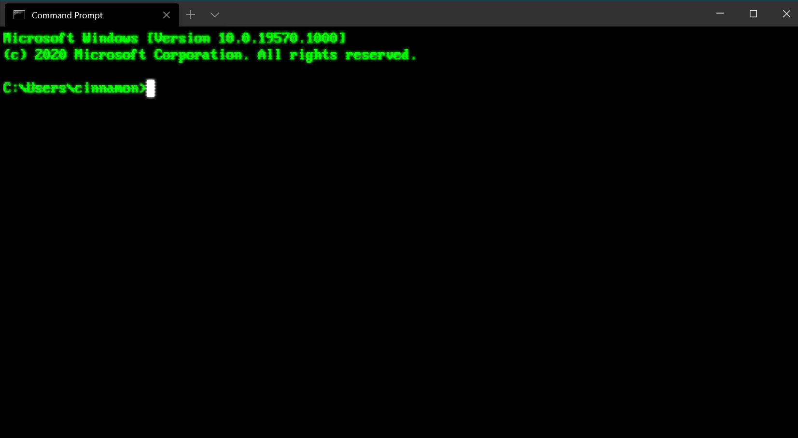
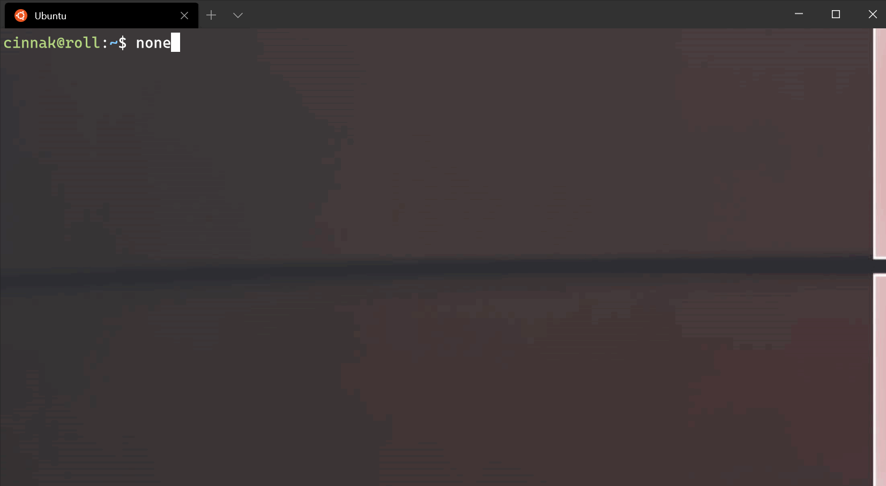
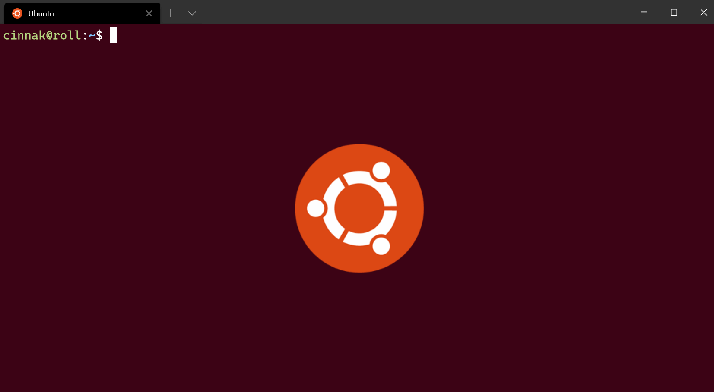
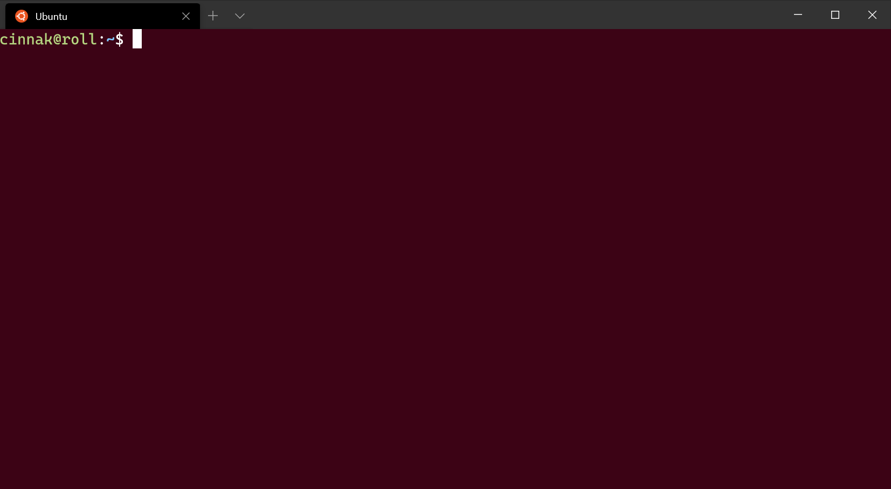

# Appearance profile settings in Windows Terminal

The settings listed below affect the visual settings of each profile separately. If you'd like a setting to apply to all of your profiles, you can add it to the `defaults` section above the list of profiles in your [settings.json file](../install.md#settings-json-file).

```json
"defaults":
{
    // SETTINGS TO APPLY TO ALL PROFILES
},
"list":
[
    // PROFILE OBJECTS
]
```

## Text

### Color scheme

This is the name of the color scheme used in the profile. Color schemes are defined in the `schemes` object. More detailed information can be found on the [Color schemes page](./color-schemes.md).

In addition to a single color scheme name, this property can accept a pair of color scheme names as follows:

```json
"colorScheme":
{
    "light": "One Half Light",
    "dark": "One Half Dark",
},
```

When specified in this manner, the Terminal will automatically switch between the two given color schemes depending on the theme of the application. The Terminal will follow the [`theme.applicationTheme`](./themes.md#application-theme) property of the Terminal's selected theme. If that `applicationTheme` is set to `system`, then this will instead use the color scheme matching the OS theme.

**Property name:** `colorScheme`

**Necessity:** Optional

**Accepts:** Name of color scheme as a string, or an object with a `light` and `dark` property

**Default value:** `"Campbell"`

### Font

This is the structure within which the other font settings must be defined. An example of what this could look like in the JSON file is shown below.

**Property name:** `font`

**Necessity:** Optional

### Font face

This is the name of the font face used in the profile. The terminal will try to fallback to Consolas if this can't be found or is invalid. To learn about the other variants of the default font, Cascadia Mono, visit the [Cascadia Code page](./../cascadia-code.md).

**Property name:** `face` (defined within the `font` object)

**Necessity:** Optional

**Accepts:** Font name as a string

**Default value:** `"Cascadia Mono"`

### Font size

This sets the profile's font size in points.

**Property name:** `size` (defined within the `font` object)

**Necessity:** Optional

**Accepts:** Integer

**Default value:** `12`

### Font weight

This sets the weight (lightness or heaviness of the strokes) for the profile's font.

**Property name:** `weight` (defined within the `font` object)

**Necessity:** Optional

**Accepts:** `"normal"`, `"thin"`, `"extra-light"`, `"light"`, `"semi-light"`, `"medium"`, `"semi-bold"`, `"bold"`, `"extra-bold"`, `"black"`, `"extra-black"`, or an integer corresponding to the numeric representation of the OpenType font weight

**Default value:** `"normal"`

### Font example

```json
"font": {
    "face": "Cascadia Mono",
    "size": 12,
    "weight": "normal"
}
```

> [!IMPORTANT]
> This `font` object is only available in Windows Terminal version 1.10+. Prior to that version, you should use the `fontFace`, `fontSize`, and `fontWeight` properties separately, like so:
> ```json
> "fontFace": "Cascadia Mono",
> "fontSize": 12,
> "fontWeight": "normal"
> ```

### Font features

This sets the [OpenType font features](/typography/opentype/spec/featurelist) for the given font.

**Property name:** `features` (defined within the `font` object)

**Necessity:** Optional

**Accepts:** Feature properties in the format of: `"string": integer`

**Example:**

```jsonc
// Enables ss01 and disables ligatures
"font": {
    "face": "Cascadia Code",
    "features": {
        "ss01": 1,
        "liga": 0
    }
}
```

### Font axes

This sets the [OpenType font axes](/typography/opentype/spec/dvaraxisreg) for the given font.

**Property name:** `axes` (defined within the `font` object)

**Necessity:** Optional

**Accepts:** Axis properties in the format of: `"string": integer`

**Example:**

```jsonc
// Sets the font to italic
"font": {
    "face": "Cascadia Code",
    "axes": {
        "ital": 1
    }
}
```

### Intense text formatting

This controls how "intense" text is formatted in the terminal. "Intense" text is text formatted with the escape sequence `\x1b[1m`.

**Property name:** `intenseTextStyle`

**Necessity:** Optional

**Accepts:** `"none"`, `"bold"`, `"bright"`, `"all"`

* `"all"`: render intense text as both **bold** and bright
* `"bold"`: render intense text as **bold**, but not bright
* `"bright"`: render intense text bright, but not bold
* `"none"`: the terminal won't do anything special for intense text

**Default value:** `"bright"`

## Retro terminal effects

:::row:::
:::column span="":::
When this is set to `true`, the terminal will emulate a classic CRT display with scan lines and blurry text edges. This is an experimental feature and its continued existence is not guaranteed.

If `experimental.pixelShaderPath` is set, it will override this setting.

**Property name:** `experimental.retroTerminalEffect`

**Necessity:** Optional

**Accepts:** `true`, `false`

**Default value:** `false`

:::column-end:::
:::column span="":::

_Configuration: [Retro Command Prompt](./../custom-terminal-gallery/retro-command-prompt.md)_

:::column-end:::
:::row-end:::

<br />

___

## Cursor

### Cursor shape

This sets the cursor shape for the profile. The possible cursors are as follows: `"bar"` ( &#x2503; ), `"vintage"` ( &#x2583; ), `"underscore"` ( &#x2581; ), `"filledBox"` ( &#x2588; ), `"emptyBox"` ( &#x25AF; ), `"doubleUnderscore"` ( &#x2017; )

**Property name:** `cursorShape`

**Necessity:** Optional

**Accepts:** `"bar"`, `"vintage"`, `"underscore"`, `"filledBox"`, `"emptyBox"`, `"doubleUnderscore"`

**Default value:** `"bar"`

### Cursor height

This sets the percentage height of the cursor starting from the bottom. This will only work when `cursorShape` is set to `"vintage"`.

**Property name:** `cursorHeight`

**Necessity:** Optional

**Accepts:** Integer from 1-100

<br />

___

## Background images and icons

Windows Terminal enables you to specify custom background images and icons using the settings UI menu or settings.json file for each of your command line profiles, allowing you to configure/brand/style each of your profiles independently from one another. To do so, specify your preferred `backgroundImage`, position it using `backgroundImageAlignment`, set its opacity with `backgroundImageOpacity`, and/or specify how your image will fill the available space using `backgroundImageStretchMode`.

For example:

```json
    "backgroundImage": "C:\\Users\\username\\OneDrive\\WindowsTerminal\\bg-ubuntu-256.png",
    "backgroundImageAlignment": "bottomRight",
    "backgroundImageOpacity": 0.1,
    "backgroundImageStretchMode": "none"
```

You can easily roam your collection of images and icons across all your machines by storing your icons and images in OneDrive (as shown above).

### Background image path

This sets the file location of the image to draw over the window background. The background image can be a .jpg, .png, or .gif file. `"desktopWallpaper"` will set the background image to the desktop's wallpaper.

**Property name:** `backgroundImage`

**Necessity:** Optional

**Accepts:** File location as a string or `"desktopWallpaper"`

It is recommended that custom images and icons are stored in system-provided folders and referred to using the correct [URI schemes](/windows/uwp/app-resources/uri-schemes). URI schemes provide a way to reference files independent of their physical paths (which may change in the future). The most useful URI schemes to remember when customizing background images and icons are:

| URI scheme | Corresponding physical path | Use / description |
| --- | --- | --- |
| `ms-appdata:///Local/` | `%localappdata%\Packages\Microsoft.WindowsTerminal_8wekyb3d8bbwe\LocalState\` | Per-machine files |
| `ms-appdata:///Roaming/` | `%localappdata%\Packages\Microsoft.WindowsTerminal_8wekyb3d8bbwe\RoamingState\` | Common files |

> [!WARNING]
> Do not rely on file references using the ms-appx URI scheme (i.e. icons). These files are considered an internal implementation detail and may change name/location or may be omitted in the future.

### Icons

Windows Terminal displays icons for each profile which the terminal generates for any built-in shells, for example: PowerShell Core, PowerShell, and any installed Linux/WSL distributions. Each profile refers to a stock icon via the ms-appx URI scheme. You can refer to you own custom icons by entering a path in your [settings.json file](../install.md#settings-json-file):

```json
    "icon" : "C:\\Users\\username\\OneDrive\\WindowsTerminal\\icon-ubuntu-32.png",
```

Icons should be sized to 32x32px in an appropriate raster image format (e.g. .PNG, .GIF, or .ICO) to avoid having to scale your icons during runtime (causing a noticeable delay and loss of quality).

If no icon is specified for a command line you've installed, Windows Terminal will default to this glyph from the [Segoe Fluent](/windows/apps/design/style/segoe-fluent-icons-font) font:

Glyph	| Unicode point | Description
--|--|--
 | e756 | CommandPrompt

### Background image stretch mode

:::row:::
:::column span="":::
This sets how the background image is resized to fill the window.

**Property name:** `backgroundImageStretchMode`

**Necessity:** Optional

**Accepts:** `"none"`, `"fill"`, `"uniform"`, `"uniformToFill"`

**Default value:** `"uniformToFill"`

:::column-end:::
:::column span="":::

_[Background image source](https://wallpaperhub.app/wallpapers/6287)_

:::column-end:::
:::row-end:::

### Background image alignment

:::row:::
:::column span="":::
This sets how the background image aligns to the boundaries of the window.

**Property name:** `backgroundImageAlignment`

**Necessity:** Optional

**Accepts:** `"center"`, `"left"`, `"top"`, `"right"`, `"bottom"`, `"topLeft"`, `"topRight"`, `"bottomLeft"`, `"bottomRight"`

**Default value:** `"center"`

:::column-end:::
:::column span="":::

_[Background image source](https://design.ubuntu.com/brand/ubuntu-logo/)_

:::column-end:::
:::row-end:::

### Background image opacity

:::row:::
:::column span="":::
This sets the transparency of the background image.

:::column-end:::
:::row-end:::

**Property name:** `backgroundImageOpacity`

**Necessity:** Optional

**Accepts:** Number as a floating point value from 0-1

**Default value:** `1.0`

<br />

___

## Transparency

### Opacity

:::row:::
:::column span="":::

This sets the transparency of the window for the profile. This accepts an integer value from 0-100, representing a "percent opaque". `100` is "fully opaque", `50` is semi-transparent, and `0` is fully transparent.

When `useAcrylic` is set to `true`, the window will use the acrylic material to create a blurred background for the terminal. When `useAcrylic` is set to false, the terminal will use an unblurred opacity.

Users can choose different opacity values for focused and unfocused windows allowing for customization.

**Property name:** `opacity`

**Necessity:** Optional

**Accepts:** Number as an integer value from 0-100

**Default value:** `100` 

:::column-end:::
:::column span="":::

:::column-end:::
:::row-end:::

> [!IMPORTANT]
> Prior to Windows Terminal version 1.12, this setting was `acrylicOpacity`, was a float that accepted 0.0-1.0 which defaulted to 0.5, and the opacity would only apply if `useAcrylic` was set to true. On 1.12+, `acrylicOpacity` will gracefully continue to work as the equivalent `opacity` value.

> [!IMPORTANT]
> Unblurred opacity (`"useAcrylic": false`) only works on Windows 11.

> [!IMPORTANT]
> When Mica is enabled in the [theme settings](./themes.md#mica), Mica will appear underneath the Terminal contents when the `opacity` of the Terminal is set to a value <100.

### Enable acrylic

:::row:::
:::column span="":::
When this is set to `true`, the window will have an acrylic background. When it's set to `false`, the window will have a plain, untextured background. Depending on the `Enable Unfocused Acrylic` global setting the transparency applies to unfocused windows as well as focused windows when set to `true` or only applies to focused windows when set to `false`.

**Property name:** `useAcrylic`

**Necessity:** Optional

**Accepts:** `true`, `false`

**Default value:** `false`

:::column-end:::
:::column span="":::


:::column-end:::
:::row-end:::

<br />

___

## Window

### Padding

:::row:::
:::column span="":::
This sets the padding around the text within the window. This will accept three different formats: `"#"` and `#` set the same padding for all sides, `"#, #"` sets the same padding for left-right and top-bottom, and `"#, #, #, #"` sets the padding individually for left, top, right, and bottom.

**Property name:** `padding`

**Necessity:** Optional

**Accepts:** Values as a string in the following formats: `"#"`, `"#, #"`, `"#, #, #, #"` or value as an integer: `#`

**Default value:** `"8, 8, 8, 8"`

:::column-end:::
:::column span="":::


:::column-end:::
:::row-end:::

### Scrollbar visibility

This sets the visibility of the scrollbar.

**Property name:** `scrollbarState`

**Necessity:** Optional

**Accepts:** `"visible"`, `"hidden"`, (Beginning in release 1.17, `"always"` will be included)

<br />

___

## Color settings

### Tab color

This sets the color of the profile's tab. Using the tab color picker will override this color.

**Property name:** `tabColor`

**Necessity:** Optional

**Accepts:** Color as a string in hex format: `"#rgb"` or `"#rrggbb"`

### Foreground color

This changes the foreground color of the profile. This overrides `foreground` set in the color scheme if `colorScheme` is set.

**Property name:** `foreground`

**Necessity:** Optional

**Accepts:** Color as a string in hex format: `"#rgb"` or `"#rrggbb"`

### Background color

This changes the background color of the profile with this setting. This overrides `background` set in the color scheme if `colorScheme` is set.

**Property name:** `background`

**Necessity:** Optional

**Accepts:** Color as a string in hex format: `"#rgb"` or `"#rrggbb"`

### Selection background color

This sets the background color of a selection within the profile. This will override the `selectionBackground` set in the color scheme if `colorScheme` is set.

**Property name:** `selectionBackground`

**Necessity:** Optional

**Accepts:** Color as a string in hex format: `"#rgb"` or `"#rrggbb"`

### Adjust indistinguishable colors

This setting adjusts the foreground color to make it more visible, based on the background color. When set to `always`, the colors will always be adjusted. When set to `indexed`, the colors will only be adjusted if those colors are part of the color scheme. When set to `never`, the colors will never be adjusted.

**Property name:** `adjustIndistinguishableColors`

**Necessity:** Optional

**Accepts:** `always`, `indexed`, `never`

### Cursor color

This sets the cursor color of the profile. This will override the `cursorColor` set in the color scheme if `colorScheme` is set.

**Property name:** `cursorColor`

**Necessity:** Optional

**Accepts:** Color as a string in hex format: `"#rgb"` or `"#rrggbb"`

<br />

___

## Unfocused appearance settings

An object you can add to a profile that applies settings to the profile when it is unfocused. This setting only accepts appearance settings.

**Property name:** `unfocusedAppearance`

**Necessity:** Optional

**Accepts:** `backgroundImage`, `backgroundImageAlignment`, `backgroundImageOpacity`, `backgroundImageStretchMode`, `cursorHeight`, `cursorShape`, `cursorColor`, `colorScheme`, `foreground`, `background`, `opacity`, `selectionBackground`, `useAcrylic`, `experimental.retroTerminalEffect`, `experimental.pixelShaderPath`

**Example:**
```json
// Sets the profile's background image opacity to 0.3 when it is unfocused
"unfocusedAppearance":
{
    "backgroundImageOpacity": 0.3
},
```

<br />

___

## Pixel shader effects

This setting allows a user to specify the path to a custom pixel shader to use with the terminal content. This is an experimental feature and its continued existence is not guaranteed. For more details on authoring custom pixel shaders for the terminal, see [this documentation](https://github.com/microsoft/terminal/blob/main/samples/PixelShaders/README.md).

If set, this will override the `experimental.retroTerminalEffect` setting.

**Property name:** `experimental.pixelShaderPath`

**Necessity:** Optional

**Accepts:** A path to an `.hlsl` shader file, as a string
