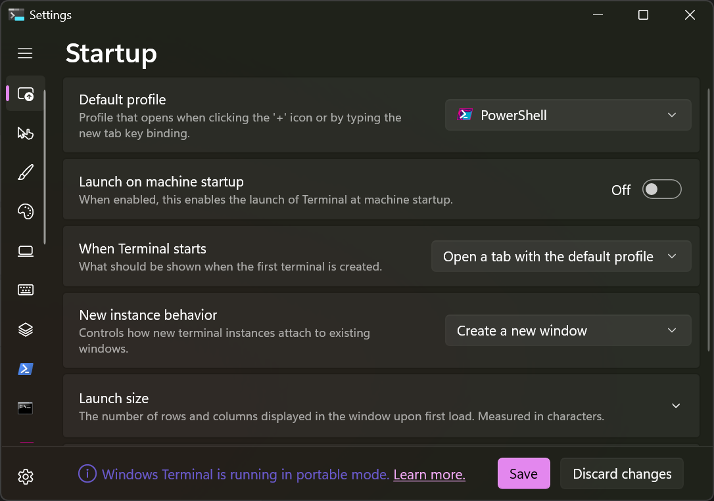

# Windows Terminal distribution types

## System Requirements

Windows Terminal requires **Windows 10 version 2004 (build 19041) or later**. The following table shows which Windows versions are supported:

| Operating System | Version | Build Number | Supported |
|------------------|---------|--------------|-----------|
| **Windows 11** | All versions | 22000+ | ✅ Yes |
| **Windows 10** | Version 2004 (May 2020 Update) and later | 19041+ | ✅ Yes |
| **Windows 10** | Version 1909 and earlier | 18363 and earlier | ❌ No |
| **Windows Server 2022** | All versions | 20348+ | ✅ Yes |
| **Windows Server 2019** | All versions | 17763 | ❌ No |
| **Windows Server 2016** | All versions | 14393 | ❌ No |

### Why these requirements?

Windows Terminal uses modern Windows platform APIs and UI frameworks (including the Universal Windows Platform and Windows UI Library) that were introduced and stabilized in Windows 10 version 2004. These APIs are essential for Terminal's features, including:

- Modern UI rendering and theming
- GPU-accelerated text rendering
- Advanced input handling
- Multi-window and tab management

**Windows Server 2016 and 2019** are based on older Windows 10 builds (14393 and 17763, respectively) that don't include these required platform features. If you're using these Windows Server versions, consider using the traditional console host (`conhost.exe`) or upgrading to Windows Server 2022.

---

## Distribution formats

Windows Terminal is available through [GitHub releases] in several formats:

- Packaged, or "MSIX bundle"
    - This distribution is the oldest and best-supported version of Windows Terminal.
    - You can install the packaged distribution by using the `.msixbundle` file on the [GitHub releases] page or
      through the Microsoft Store ([Stable](https://aka.ms/terminal), [Preview](https://aka.ms/terminal-preview)).
    - Installation through the MSIX bundle might need network access to download dependency packages from the Store.
    - When you install Windows Terminal through the MSIX bundle, it automatically updates through the Store.
- Preinstallation Kit
    - A [preinstallation kit] is available for system integrators and OEMs who want to preinstall Windows Terminal
      on a Windows image.
    - For more information, see the [DISM documentation on preinstallation]. If you don't plan to
      preinstall Windows Terminal, use the Packaged distribution.
    - When you install Windows Terminal through the preinstallation kit, it automatically updates through the Store.
- Unpackaged, or "ZIP" (new in 1.17 stable)
    - This distribution method wasn't officially supported until stable channel version 1.17.
    - The unpackaged distribution doesn't receive automatic updates, so you control when new
      versions are installed.
- Portable
    - A variant of the unpackaged distribution, where Terminal stores its settings in a nearby directory.
    - [Learn more about configuring Portable mode.](#windows-terminal-portable)

## Distribution feature comparison

|                                            | Packaged                 | Preinstallation Kit | Unpackaged       | Portable                      |
| ------------------------------------------ | ------------------------ | ------------------- | ---------------- | ----------------------------- |
| **Automatic updates**                      | ✅                       | ✅                  | ❌               | ❌                            |
| **Automatic architecture selection**       | ✅                       | ✅                  | ❌               | ❌                            |
| **Can be set as your default terminal**    | ✅                       | ✅                  | ❌               | ❌                            |
| **"Open in Terminal" context menu**        | ✅                       | ✅                  | ❌               | ❌                            |
| **Automatic start on sign-in option**      | ✅                       | ✅                  | _manual_         | _manual_                      |
| **Double-click installation**              | ✅                       | ❌                  | ❌               | ❌                            |
| **Installation on non-networked machines** | ❌                       | ✅                  | ✅               | ✅                            |
| **Preinstallation in a Windows image**     | ❌                       | ✅                  | _as plain files_ | _as plain files_              |
| **User-controlled installation path**      | ❌                       | ❌                  | ✅               | ✅                            |
| **Double-click activatable**               | ❌                       | ❌                  | ✅               | ✅                            |
| **Settings storage location**              | User folder, per package | (same as packaged)  | `%LOCALAPPDATA%` | Next to `WindowsTerminal.exe` |

## Windows Terminal Portable

Windows Terminal supports deployment in ["Portable mode"]. Portable mode ensures
that Windows Terminal saves all data it creates and maintains next to the application, so you can more easily
move it across different environments.

The unpackaged "ZIP" distribution supports portable mode.

This officially supported mode of execution stores Windows Terminal settings in a `settings` folder next
to `WindowsTerminal.exe`.

The packaged or preinstallation kit distributions of Windows Terminal don't support portable mode.

Portable mode runs only on Windows 10 version 2004 (10.019041) or higher. 

### Why use Portable mode?

The unpackaged and portable mode distributions of Windows Terminal let you use Terminal without installing it
globally. For example, use portable mode on systems where you don't have permission to install MSIX packages or download software from the
Microsoft Store.

Portable mode lets you carry around or archive a preconfigured installation of Windows Terminal and run it from
a network share, cloud drive, or USB flash drive. This self-contained installation doesn't interfere with
other installed distributions of Windows Terminal.

### Enabling portable mode

You need to enable portable mode manually. After you unzip the Windows Terminal download, create a file named `.portable` next to `WindowsTerminal.exe`.

> [!NOTE]
> Windows Terminal doesn't automatically reload its settings when you create the portable mode marker file.
> This change takes effect only after you relaunch Terminal.

Windows Terminal automatically creates a directory named `settings` where it stores both settings and runtime
state such as window layouts.

### Disabling portable mode

You can restore the portable mode unpackaged installation to its original configuration, where settings are stored in
`%LOCALAPPDATA%\Microsoft\Windows Terminal`, by removing the `.portable` marker file from the directory containing
`WindowsTerminal.exe`.

If you want to reenable portable mode, create a new `.portable` marker file next to `WindowsTerminal.exe`.

### Upgrading a portable mode installation

You can upgrade a portable mode installation of Windows Terminal by moving the `.portable` marker file and the
`settings` directory to a newly extracted unpackaged version of Windows Terminal.

### Portable mode FAQs

#### Why don't ms-appdata URLs work in Portable mode?
Before portable mode, a common practice to reference images in `settings.json` was to use `ms-appdata:///Local`. 

Portable mode offers a self-contained Terminal installation, where user data and application data are stored in the same place. Because there's no separate user data folder, references to such folder (for example, with `ms-appdata`) don't work.

To refer to paths relative to the application install directory, use an `ms-appx:` URL.

To refer to paths relative to the settings directory, use the environment variable `%WT_SETTINGS_DIR%`.

["Portable mode"]: https://en.wikipedia.org/wiki/Portable_application
[GitHub releases]: https://github.com/microsoft/terminal/releases
[preinstallation kit]: /windows/msix/desktop/deploy-preinstalled-apps
[DISM documentation on preinstallation]: /windows-hardware/manufacture/desktop/preinstall-apps-using-dism
