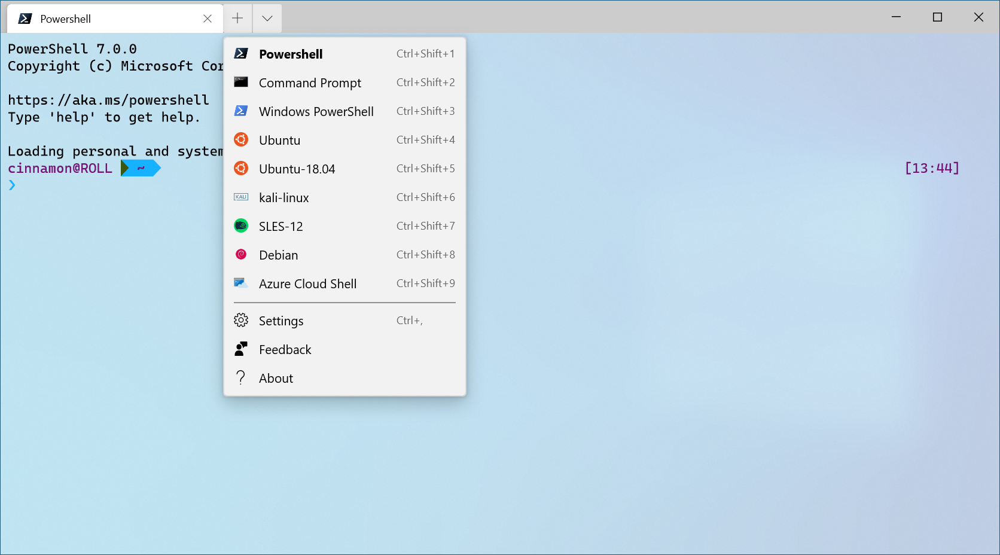

# Dynamic profiles in Windows Terminal

Windows Terminal will automatically create Windows Subsystem for Linux (WSL) and PowerShell profiles for you if you have these shells installed on your machine. This makes it easier for you to have all of your shells included in the terminal without having to locate their executable files. These profiles are generated with the `source` property, which tells the terminal where to locate the proper executable.

Upon installing the terminal, it will set PowerShell as your default profile. To learn how to change your default profile, visit the [Startup page](./customize-settings/startup.md).


_Configuration: [Light Theme](./custom-terminal-gallery/frosted-glass-theme.md)_

## Installing a new shell after installing Windows Terminal

Regardless of whether a new shell is installed before or after your terminal installation, the terminal will create a new profile for the newly installed shell.

## Hide a profile

To hide a profile from your terminal dropdown menu, add the `hidden` property to the profile object in your [settings.json file](./get-started.md#settings-json-file) and set it to `true`.

```json
"hidden": true[]
```

If you delete a dynamically-created profile, the terminal will automatically regenerate the profile and replace it in your [settings.json file](./get-started.md#settings-json-file).

## Prevent a profile from being generated

To prevent a dynamic profile from being generated, you can add the profile generator to the `disabledProfileSources` array in your global settings. More information on this setting can be found on the [Global settings page](./customize-settings/startup.md#disable-dynamic-profiles).

```json
"disabledProfileSources": ["Windows.Terminal.Wsl", "Windows.Terminal.Azure", "Windows.Terminal.PowershellCore"]
```

## Add a third party profile

If a 3rd party command line tool does not have a profile auto-generated into your [settings.json file](./get-started.md#settings-json-file), you can add it manually. Below are profiles for a few common 3rd party tools for your reference.

### Anaconda

Assuming that you've installed Anaconda into `%USERPROFILE%\Anaconda3`:

```json
{
    "commandline": "cmd.exe /k \"%USERPROFILE%\\Anaconda3\\Scripts\\activate.bat %USERPROFILE%\\Anaconda3\"",
    "icon": "%USERPROFILE%\\Anaconda3\\Menu\\anaconda-navigator.ico",
    "name": "Anaconda3",
    "startingDirectory": "%USERPROFILE%"
}
```

### cmder

Assuming that you've installed cmder into `%CMDER_ROOT%`:

```json
{
    "commandline": "cmd.exe /k \"%CMDER_ROOT%\\vendor\\init.bat\"",
    "name": "cmder",
    "icon": "%CMDER_ROOT%\\icons\\cmder.ico",
    "startingDirectory": "%USERPROFILE%"
}
```

### Cygwin

Assuming that you've installed Cygwin into `C:\Cygwin`:

```json
{
    "name": "Cygwin",
    "commandline": "C:\\Cygwin\\bin\\bash --login -i",
    "icon": "C:\\Cygwin\\Cygwin.ico",
    "startingDirectory": "C:\\Cygwin\\bin"
}
```

> ![NOTE]
> The starting directory of Cygwin is set in order for the path
to work. The default directory opened when starting Cygwin will be `$HOME` because
of the `--login` flag.

### Far Manager

Assuming that you've installed Far into `c:\Program Files\Far Manager`:

```json
{
    "name": "Far",
    "commandline": "\"c:\\program files\\far manager\\far.exe\"",
    "startingDirectory": "%USERPROFILE%",
    "useAcrylic": false
},
```

### Git Bash

Assuming that you've installed Git Bash into `C:\\Program Files\\Git`:

```json
{
    "name": "Git Bash",
    "commandline": "C:\\Program Files\\Git\\bin\\bash.exe -li",
    "icon": "C:\\Program Files\\Git\\mingw64\\share\\git\\git-for-windows.ico",
    "startingDirectory": "%USERPROFILE%"
}
````

### Git Bash (WOW64)

Assuming that you've installed Git Bash into `C:\\Program Files (x86)\\Git`:

```json
{
    "name": "Git Bash",
    "commandline": "%ProgramFiles(x86)%\\Git\\bin\\bash.exe -li",
    "icon": "%ProgramFiles(x86)%\\Git\\mingw32\\share\\git\\git-for-windows.ico",
    "startingDirectory": "%USERPROFILE%"
}
```

### MSYS2

Assuming that you've installed MSYS2 into `C:\\msys64`:

```json
{
    "name": "MSYS2",
    "commandline": "C:\\msys64\\msys2_shell.cmd -defterm -no-start -mingw64",
    "icon": "C:\\msys64\\msys2.ico",
    "startingDirectory": "C:\\msys64\\home\\user"
}
```

For more details, see the Terminals section of the [MSYS2 documentation](https://www.msys2.org/docs/terminals/#windows-terminal).

### Developer Command Prompt for Visual Studio

Assuming that you've installed [Visual Studio 2019 Professional](https://visualstudio.microsoft.com/downloads/):

```json
{
    "name": "Developer Command Prompt for VS 2019",
    "commandline": "cmd.exe /k \"C:/Program Files (x86)/Microsoft Visual Studio/2019/Professional/Common7/Tools/VsDevCmd.bat\"",
    "startingDirectory": "%USERPROFILE%"
}
```
