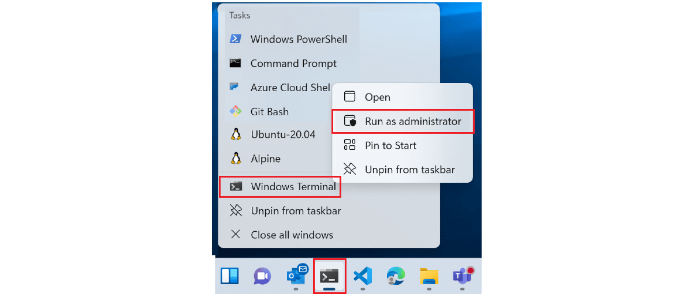

# Windows Terminal FAQs

Find answers to some of the most frequently asked questions about Windows Terminal.

## How do I run a shell in Windows Terminal in administrator mode?

To run Windows Terminal with elevated administrator permission (admin mode), right-click on the Windows Terminal icon, then again on the Windows Terminal title that displays, then select "Run as administrator".



Alternatively, you can open the Windows Quick Access menu using the shortcut, ⊞ Windows key + X, and then selecting Windows Terminal (Admin).

## Is it possible to mix admin and non-admin tabs in a Windows Terminal window?

No, mixing administrator-level permission tabbed shells with those that do not have elevated administrator permission is not supported due to security concerns.

## Can I use Windows Terminal as the integrated terminal in VSCode?

No, Visual Studio Code is xtermjs and written in TypeScript while Windows Terminal is native code.

## How can I manually add a shell?

In your [settings.json file](./install.md#settings-json-file), you can create or modify profiles that run any command-line executable. In the settings.json file, set "commandline" to whatever you want. For example, powershell --> "pwsh.exe".

## What is the difference between Windows Terminal and Windows Terminal (Preview)?

Windows Terminal is [open-source](https://github.com/microsoft/terminal) and under active development. The recommended way to [install](./install.md) is via the Microsoft Store, which will provide automatic updates whenever they are released. [Windows Terminal](https://www.microsoft.com/en-us/p/windows-terminal/9n0dx20hk701?rtc=1&activetab=pivot:overviewtab) stable public release receives frequent updates, but the development team has also provided the [Windows Terminal Preview](https://www.microsoft.com/en-us/p/windows-terminal-preview/9n8g5rfz9xk3?rtc=1&activetab=pivot:overviewtab) release for those interested in trying the latest features as they are developed.

## What alternative ways are there to install Windows Terminal?

While we recommend installing Windows Terminal [using the Microsoft Store](https://www.microsoft.com/en-us/p/windows-terminal/9n0dx20hk701?rtc=1&activetab=pivot:overviewtab), you can also install using [Windows Package Manager](https://github.com/Microsoft/terminal#via-windows-package-manager-cli-aka-winget), [GitHub](https://github.com/Microsoft/terminal#via-github), [Chocolatey](https://github.com/Microsoft/terminal#via-chocolatey-unofficial), or [Scoop](https://github.com/Microsoft/terminal#via-scoop-unofficial).

## Is it possible to initialize Windows Terminal profile with a batch file?

Yes. You first need to go to the [Profiles](./customize-settings/profile-general.md) section of your [settings.json file](./install.md#settings-json-file). Using the [`"commandline":` property](./customize-settings/profile-general.md#command-line), you can specify any batch file, command, ssh connection, or executable that you want to run as a profile in Windows Terminal. You just need to enter the path to the file that you want to run.

For example:

```json
{
"commandline": "%USERPROFILE%/OneDrive/demo.bat",
"name": "Batch Profile"
}
```

<!-- In progress

## What sort of features have open-source community contributors added to Windows Terminal?

https://channel9.msdn.com/Blogs/One-Dev-Minute/What-kinds-of-features-have-community-members-made--One-Dev-Question

## To contribute or file requests

Visit the [Windows Terminal open source repo on GitHub](https://github.com/microsoft/terminal).

## What shells does Windows Terminal support?

https://channel9.msdn.com/Blogs/One-Dev-Minute/What-shells-does-Terminal-support--One-Dev-Question

## What is conhost.exe?

https://github.com/Microsoft/terminal#the-windows-console-host

## Is saving a terminal session, a status bar, or settings sync on the development roadmap?

## What is being planned for Windows Terminal? Is there a development roadmap or feature request list that I can contribute to?

https://github.com/microsoft/terminal/blob/main/doc/terminal-v2-roadmap.md

## If you get several shells arranged just the way you like in a Windows Terminal session and want to save that configuration, similar to how one would save a tmux or vim session...

## Is there a way to sync your terminal settings across devices?

## Can we expect a status bar on the bottom of Windows Terminal? 

-->
