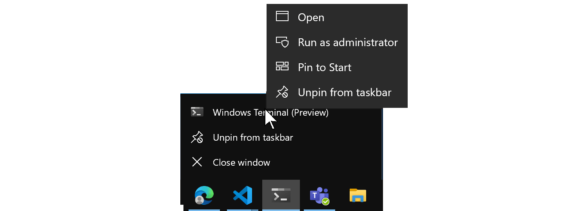

# Windows Terminal FAQs

This guide addresses some of the frequently asked questions about Windows Terminal.

## Will the Terminal Preview be available via winget?

To-do

## Is it possible to pass commands, such as initializing a profile with a bat file, to a terminal instance?

To-do

## Is saving a terminal session, a status bar, or settings sync on the development roadmap?

Is there a dev roadmap or feature request list we can link to?
If you get several shells arranged just the way you like in a Windows Terminal session and want to save that configuration, similar to how one would save a tmux or vim session...
How about if you want to sync your terminal settings across devices?
can we expect a status bar on the bottom of Windows Terminal?

## How can I run a shell in "admin" mode inside Windows Terminal?

To run Windows Terminal with elevated administrator permission, right-click on the Windows Terminal icon, then again on the Windows Terminal title that displays, then select "Run as administrator".

## Is it possible to mix admin and non-admin tabs in a Windows Terminal window?

No, mixing tab shell's that have elevated administrator permissions with tabs containing shell's that do not have elevated admin permission is not supported due to security concerns.

## Is there anyway to use Terminal as the integrated terminal in VSCode?

No, VSCode is xtermjs and written in TypeScript while this is native code.

## Is there any way to make the terminal show up in the Control + X quick-link menu in Windows and to give it a keyboard shortcut to open?

There is an app execution alias to launch the Windows Terminal: wt.exe. We recommend using: Windows Key + R (to open the Run menu), then entering "wt".

There are also some [totally unsupported hacks to add Windows Terminal to the Win+X shortcut menu](https://www.hanselman.com/blog/TotallyUnsupportedHacksAddWindowsTerminalToTheWinXShortcutMenu.aspx).

## How can I manually add a shell?

In your settings.json, you can create or modify profiles that run any command-line executable. In the settings.json file, set "commandline" to whatever you want. For example, powershell --> "pwsh.exe".

## To contribute or file requests

Visit the [Windows Terminal open source repo on GitHub](https://github.com/microsoft/terminal).
