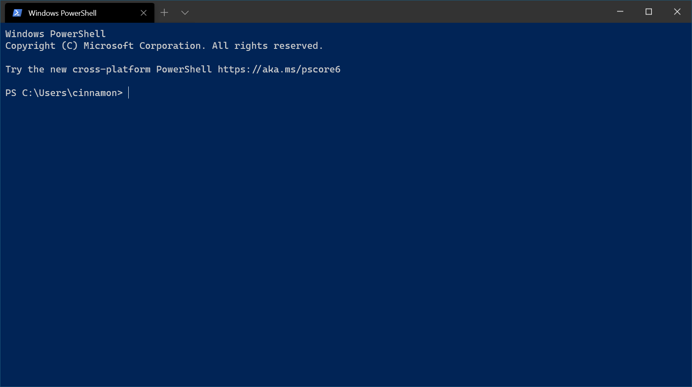

# Install and set up Windows Terminal

## Installation

You can install Windows Terminal from the [Microsoft Store](https://aka.ms/terminal).

If you don't have access to the Microsoft Store, the builds are published on the [GitHub releases page](https://github.com/microsoft/terminal/releases). If you install from GitHub, the terminal will not automatically update with new versions.

## First run

After installation, when you open the terminal, it will start with PowerShell as the default profile in the open tab.

### Dynamic profiles

The terminal will automatically create profiles for you if you have WSL distros or multiple versions of PowerShell installed. Learn more about dynamic profiles on the [Dynamic profiles page](./dynamic-profiles.md).

## Open a new tab

You can open a new tab of the default profile by pressing <kbd>ctrl+shift+t</kbd> or by selecting the + (plus) button. To open a different profile, select the ˅ (arrow) next to the + button to open the dropdown menu. From there, you can select which profile to open.

## Open a new pane

You can run multiple shells side-by-side using panes. To open a pane, you can use <kbd>alt+shift+plus</kbd> for a vertical pane or <kbd>alt+shift+minus</kbd> for a horizontal one. You can also use <kbd>alt+shift+d</kbd> to open a duplicate pane of your focused profile. Learn more about panes on the [Panes page](./panes.md).

## Configuration

To customize the settings of your Windows Terminal, select **Settings** in the dropdown menu. This will open the `settings.json` file in your default text editor. (The default text editor is defined in your [Windows settings](ms-settings:defaultapps).)

The terminal supports customization of [global properties](./customize-settings/global-settings.md) that affect the whole application, [profile properties](./customize-settings/profile-settings.md) that affect the settings of each profile, and [key bindings](./customize-settings/key-bindings.md) that allow you to interact with the terminal using your keyboard.

## Command line arguments

You can launch the terminal in a specific configuration using command-line arguments. These arguments let you open the terminal with specific tabs and panes with custom profile settings. Learn more about command-line arguments on the [Command line arguments page](./command-line-arguments.md).

## Troubleshooting

If you encounter any difficulties using the terminal, reference the [Troubleshooting page](./troubleshooting.md). If you find any bugs or have a feature request, you can select the feedback link in the **About** menu of the terminal to go to the [GitHub page](https://github.com/microsoft/terminal) where you can file a new issue.
