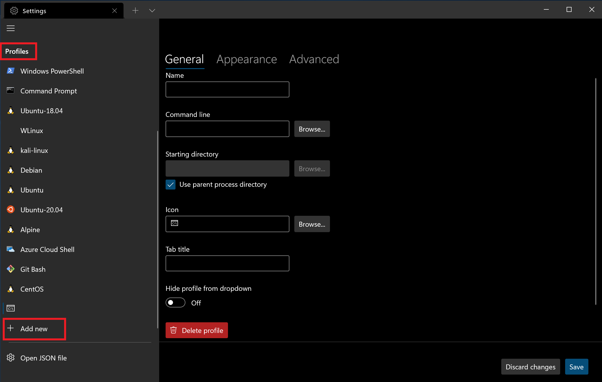

# Install and set up Windows Terminal

## Install

> [!div class="nextstepaction"]
> [Install Windows Terminal](https://aka.ms/terminal)

To try the latest preview features, you may also want to [install Windows Terminal Preview](https://www.microsoft.com/p/windows-terminal-preview/9n8g5rfz9xk3#activetab=pivot:overviewtab).

> [!NOTE]
> If you don't have access to the Microsoft Store, the builds are published on the **[GitHub releases page](https://github.com/microsoft/terminal/releases)**. If you install from GitHub, Windows Terminal will not automatically update with new versions. For additional installation options using a package manager (winget, chocolatey, scoop), see the **[Windows Terminal product repo](https://github.com/microsoft/terminal#other-install-methods)**.

## Set your default terminal application ([Preview](https://aka.ms/terminal-preview))

To open any command line application with Windows Terminal, set it as your default terminal application.

1. Open Windows Terminal and go to the **Settings** UI window.
2. Select **Startup** and choose "Windows Terminal" as the **Default terminal application** setting.

> [!IMPORTANT]
> This feature is only available in [Windows Terminal Preview](https://aka.ms/terminal-preview).

## Set your default terminal profile

After installation, when you open Windows Terminal, it will start with the [PowerShell](/powershell) command line as the default profile in the open tab.

To change the default profile:

1. Open Windows Terminal and go to the **Settings** UI window.
2. Select **Startup** and choose the **Default profile** that you prefer.

You can also [set your default profile in the Settings.json file](./customize-settings/startup.md#default-profile) associated with Windows Terminal if you prefer.

## Add new profiles

Windows Terminal will automatically create profiles for you if you have WSL distributions or multiple versions of PowerShell installed.

Your command line profiles will be listed in the Settings UI, in addition to the option to **+ Add new** profiles.

Learn more about dynamic profiles on the [Dynamic profiles page](./dynamic-profiles.md).

## Open a new tab

You can open a new tab of the default profile by pressing <kbd>Ctrl</kbd>+<kbd>Shift</kbd>+<kbd>T</kbd> or by selecting the + (plus) button. To open a different profile, select the ˅ (arrow) next to the + button to open the dropdown menu. From there, you can select which profile to open.

## Invoke the command palette

You can invoke most features of Windows Terminal through the [command palette](./command-palette.md). The default key combination to invoke it is <kbd>Ctrl</kbd>+<kbd>Shift</kbd>+<kbd>P</kbd>.

## Open a new pane

You can run multiple shells side-by-side using panes. To open a pane, you can use <kbd>Alt</kbd>+<kbd>Shift</kbd>+<kbd>+</kbd> for a vertical pane or <kbd>Alt</kbd>+<kbd>Shift</kbd>+<kbd>-</kbd> for a horizontal one. You can also use <kbd>Alt</kbd>+<kbd>Shift</kbd>+<kbd>D</kbd> to open a duplicate pane of your focused profile. Learn more about panes on the [Panes page](./panes.md).

## Configuration

To customize the settings of your Windows Terminal, select **Settings** in the dropdown menu. This will open the settings UI to configure your settings. You can learn how to open the settings UI on the [Actions page](./customize-settings/actions.md#application-level-commands).

> [!TIP]
> If you prefer to configure your settings by edit file, click the "setting" icon, This will open the `settings.json` file in your default text editor. (The default text editor is defined in your [Windows settings](ms-settings:defaultapps).)
> The terminal supports customization of global properties that affect the whole application, [profile properties](./customize-settings/profile-general.md) that affect the settings of each profile, and [actions](./customize-settings/actions.md) that allow you to interact with the terminal using your keyboard or the command palette.

## Command line arguments

You can launch the terminal in a specific configuration using command line arguments. These arguments let you open the terminal with specific tabs and panes with custom profile settings. Learn more about command line arguments on the [Command line arguments page](./command-line-arguments.md).

## Troubleshooting

If you encounter any difficulties using the terminal, reference the [Troubleshooting page](./troubleshooting.md). If you find any bugs or have a feature request, you can select the feedback link in the **About** menu of the terminal to go to the [GitHub page](https://github.com/microsoft/terminal) where you can file a new issue.
