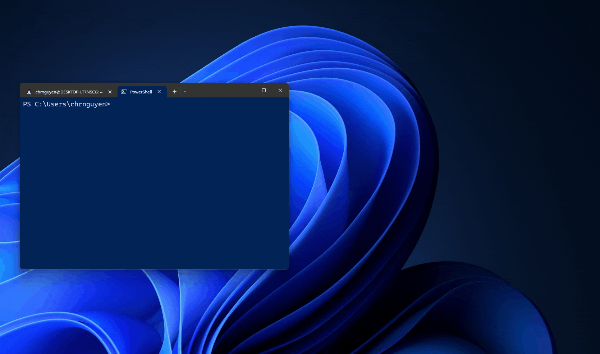
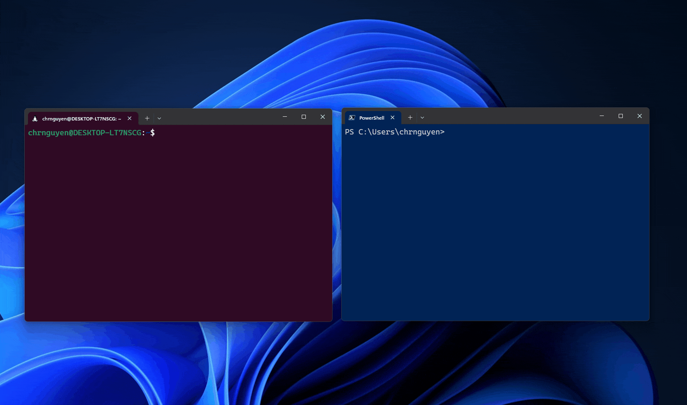

# What is Windows Terminal?

Windows Terminal is a modern host application for the command-line shells you already love, like Command Prompt, PowerShell, and bash (via Windows Subsystem for Linux (WSL)). Its main features include multiple tabs, panes, Unicode and UTF-8 character support, a GPU accelerated text rendering engine, and the ability to create your own themes and customize text, colors, backgrounds, and shortcuts.

> [!div class="nextstepaction"]
> [Install Windows Terminal](https://aka.ms/terminal)

> [!NOTE]
> For more general info, check out Scott Hanselman's article: [What's the difference between a console, a terminal, and a shell?](https://www.hanselman.com/blog/WhatsTheDifferenceBetweenAConsoleATerminalAndAShell.aspx) or Rich Turner's video [What is a command-line shell?](https://channel9.msdn.com/Blogs/One-Dev-Minute/What-is-a-command-line-shell--One-Dev-Question).

## Multiple profiles supporting a variety of command line applications

Any application that has a command line interface can be run inside Windows Terminal. This includes everything from PowerShell and Command Prompt to Azure Cloud Shell and any WSL distribution such as Ubuntu or Oh-My-Zsh.

## Tab tearout ([Preview](https://aka.ms/terminal-preview))

You can tear out tabs in Windows Terminal and create new windows.



You can also drag and drop tabs into existing windows.



## Customized schemes and configurations

You can configure your Windows Terminal to have a variety of color schemes and settings. To learn how to customize your prompt with cool themes, see [Tutorial: Set up a custom prompt for PowerShell or WSL with Oh My Posh](./tutorials/custom-prompt-setup.md) To learn how to make your own color scheme, visit the [Color schemes page](./customize-settings/color-schemes.md).

## Custom actions

There are a variety of custom commands you can use in Windows Terminal to have it feel more natural to you. If you don't like a particular keyboard shortcut, you can change it to whatever you prefer.

For example, the default shortcut to copy text from the command line is <kbd>Ctrl+Shift+C</kbd>. You can change this to <kbd>Ctrl+1</kbd> or whatever you prefer. To open a new tab, the default shortcut is <kbd>Ctrl+Shift+T</kbd>, but maybe you want to change this to <kbd>Ctrl+2</kbd>. The default shortcut to flip between the tabs you have open is <kbd>Ctrl+Tab</kbd>, this could be changed to <kbd>Ctrl+-</kbd> and used to create a new tab instead.

You can learn about customizing shortcuts on the [Actions page](./customize-settings/actions.md).

## Unicode and UTF-8 character support

Windows Terminal can display Unicode and UTF-8 characters such as emoji and characters from a variety of languages.

## GPU accelerated text rendering

Windows Terminal uses the GPU to render its text, thus providing improved performance over the default Windows command line experience.

## Background image support

You can have background images and gifs inside your Windows Terminal window. Information on how to add background images to your profile can be found on the [Profile - Appearance page](./customize-settings/profile-appearance.md#background-images-and-icons).

## Command line arguments

You can set Windows Terminal to launch in a specific configuration using command line arguments. You can specify which profile to open in a new tab, which folder directory should be selected, open the terminal with split window panes, and choose which tab should be in focus.

For example, to open Windows Terminal from PowerShell with three panes, with the left pane running a Command Prompt profile and the right pane split between your PowerShell and your default profile running WSL, enter:

```powershell
wt -p "Command Prompt" `; split-pane -p "Windows PowerShell" `; split-pane -H wsl.exe
```

Learn how to set up command-line arguments on the [Command line arguments page](./command-line-arguments.md).
