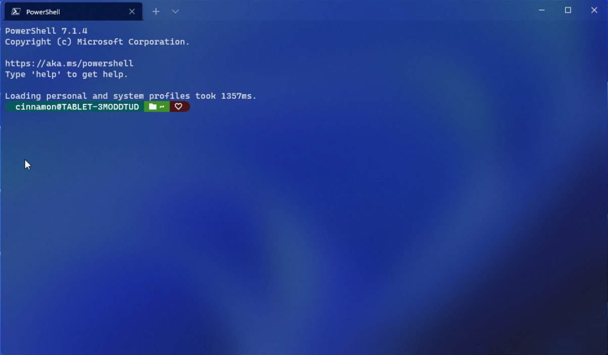

# Panes in Windows Terminal

Panes give you the ability to run multiple command-line applications next to each other within the same tab. This minimizes the need to switch between tabs and lets you see multiple prompts at once.

## Creating a new pane

### Using the keyboard

You can either create a new vertical or horizontal pane in Windows Terminal. Splitting vertically will open a new pane to the right of the focused pane and splitting horizontally will open a new pane below the focused pane. To create a new vertical pane of your default profile, you can press the <kbd>Alt</kbd>+<kbd>Shift</kbd>+plus key combination. For a horizontal pane of your default profile, you can use <kbd>Alt</kbd>+<kbd>Shift</kbd>+<kbd>-</kbd>.


_Configuration: [Raspberry Ubuntu](./custom-terminal-gallery/raspberry-ubuntu.md)_

If you would like to change these key bindings, you can create new ones using the `splitPane` action and `vertical`, `horizontal`, or `auto` values for the `split` property in your profiles.json file. The `auto` method will choose the direction that gives you the squarest panes. To learn more about key bindings, visit the [Actions page](./customize-settings/actions.md).

```json
{ "command": { "action": "splitPane", "split": "vertical" }, "keys": "alt+shift+plus" },
{ "command": { "action": "splitPane", "split": "horizontal" }, "keys": "alt+shift+-" },
{ "command": { "action": "splitPane", "split": "auto" }, "keys": "alt+shift+d" }
```

### Using the new tab button and dropdown menu

If you'd like to open a new pane of your default profile, you can hold the <kbd>alt</kbd> key and click the new tab button. If you'd like to open a new pane through the dropdown menu, you can hold <kbd>alt</kbd> and click on your desired profile. Both of these options will `auto` split the active window or pane into a new pane of the selected profile. The `auto` split mode splits in the direction that has the longest edge to create a pane.


### Using the tab context menu

If you'd like to open a new pane of a profile that is already open in your terminal, you can right click on the tab and click Split Tab. This will duplicate the focused pane in the current tab.



## Switching between panes

The terminal allows you to navigate between panes by using the keyboard. If you hold the <kbd>Alt</kbd> key, you can use your arrow keys to move your focus between panes. You can identify which pane is in focus by the accent color border surrounding it. Note that this accent color is set in your Windows color settings.


You can customize this by adding key bindings for the `moveFocus` command and setting the `direction` to either `down`, `left`, `right`, or `up`. Additionally, `direction` can be `previous` for the last used pane, `previousInOrder` or `nextInOrder` for navigation by tree order, or `first` for the first pane.

```json
{ "command": { "action": "moveFocus", "direction": "down" }, "keys": "alt+down" },
{ "command": { "action": "moveFocus", "direction": "left" }, "keys": "alt+left" },
{ "command": { "action": "moveFocus", "direction": "right" }, "keys": "alt+right" },
{ "command": { "action": "moveFocus", "direction": "up" }, "keys": "alt+up" },
{ "command": { "action": "moveFocus", "direction": "previous" } },
{ "command": { "action": "moveFocus", "direction": "previousInOrder" } },
{ "command": { "action": "moveFocus", "direction": "nextInOrder" } },
{ "command": { "action": "moveFocus", "direction": "first" } }
```

> [!IMPORTANT]
> The `previousInOrder`, and `nextInOrder`, and `first` directions are only available in [Windows Terminal Preview](https://aka.ms/terminal-preview).

## Swapping panes

Once two panes have been created, you can swap their positions in the terminal.

The `swapPane` command can be customized using the same navigation `direction`s as `moveFocus`. These commands will swap the positions of the currently focused pane and its neighbor according to `direction`.

```json
{ "command": { "action": "swapPane", "direction": "down" } },
{ "command": { "action": "swapPane", "direction": "left" } },
{ "command": { "action": "swapPane", "direction": "right" } },
{ "command": { "action": "swapPane", "direction": "up" } },
{ "command": { "action": "swapPane", "direction": "previous" } },
{ "command": { "action": "swapPane", "direction": "previousInOrder" } },
{ "command": { "action": "swapPane", "direction": "nextInOrder" } },
{ "command": { "action": "swapPane", "direction": "first" } }
```

## Moving panes

Panes can also be moved between tabs, creating a new tab if one with the target index does not exist.

The key bindings for the `movePane` command can be customized for moving panes to (zero-indexed) tabs according to their order.

```json
{ "command": { "action": "movePane", "index": 0 } },
{ "command": { "action": "movePane", "index": 1 } },
{ "command": { "action": "movePane", "index": 2 } },
{ "command": { "action": "movePane", "index": 3 } },
{ "command": { "action": "movePane", "index": 4 } },
{ "command": { "action": "movePane", "index": 5 } },
{ "command": { "action": "movePane", "index": 6 } },
{ "command": { "action": "movePane", "index": 7 } },
{ "command": { "action": "movePane", "index": 8 } }
```

## Changing split orientation

After two panes on a tab have been created, the split orientation of those panes can be switched between `vertical` and `horizontal` with the `toggleSplitOrientation` command.

```json
{ "command": "toggleSplitOrientation" }
```

## Resizing a pane

You can adjust the size of your panes by holding <kbd>Alt</kbd>+<kbd>Shift</kbd> and using your arrow keys to resize the focused pane.


To customize this key binding, you can add new ones using the `resizePane` action and setting the `direction` to either `down`, `left`, `right`, or `up`.

```json
{ "command": { "action": "resizePane", "direction": "down" }, "keys": "alt+shift+down" },
{ "command": { "action": "resizePane", "direction": "left" }, "keys": "alt+shift+left" },
{ "command": { "action": "resizePane", "direction": "right" }, "keys": "alt+shift+right" },
{ "command": { "action": "resizePane", "direction": "up" }, "keys": "alt+shift+up" }
```

## Closing a pane

You can close the focused pane by typing <kbd>Ctrl</kbd>+<kbd>Shift</kbd>+<kbd>W</kbd>. If you only have one pane, <kbd>Ctrl</kbd>+<kbd>Shift</kbd>+<kbd>W</kbd> will close the tab. As always, closing the last tab will close the window.


You can change which keys close the pane by adding a key binding that uses the `closePane` command.

```json
{ "command": "closePane", "keys": "ctrl+shift+w" }
```

## Zooming a pane

You can zoom the focused pane to fill the entire contents of the window.


This can be done by using the `togglePaneZoom` command.

```json
{ "command": "togglePaneZoom" }
```

> [!NOTE]
> The `togglePaneZoom` action is not bound to any keys by default, but it can be accessed through the [command palette](./command-palette.md), which is bound to <kbd>Ctrl</kbd>+<kbd>Shift</kbd>+<kbd>P</kbd> by default.

## Marking a pane as read-only

You can mark a pane as read-only, which will prevent input from going into the text buffer. If you attempt to close or input text into a read-only pane, the terminal will display a popup warning instead.

You can toggle read-only mode on a pane with the `toggleReadOnlyMode` command.

```json
{ "command": "toggleReadOnlyMode" }
```

## Customizing panes using key bindings

You can customize what opens inside a new pane depending on your custom key bindings.

### Duplicating a pane

The terminal allows you to duplicate the focused pane's profile into another pane.


This can be done by adding the `splitMode` property with `duplicate` as the value to a `splitPane` key binding.

```json
{ "command": { "action": "splitPane", "split": "auto", "splitMode": "duplicate" }, "keys": "alt+shift+d" }
```

### New terminal arguments

When opening a new pane or tab with a key binding, you can specify which profile is used by including the profile's name, guid, or index. If none are specified, the default profile is used. This can be done by adding `profile` or `index` as an argument to a `splitPane` or `newTab` key binding. Note that indexing starts at 0.

```json
{ "command": { "action": "splitPane", "split": "vertical", "profile": "profile1" }, "keys": "ctrl+a" },
{ "command": { "action": "splitPane", "split": "vertical", "profile": "{00000000-0000-0000-0000-000000000000}" }, "keys": "ctrl+b" },
{ "command": { "action": "newTab", "index": 0 }, "keys": "ctrl+c" }
```

Additionally, you can override certain aspects of the profile such as the profile's command line executable, starting directory, or tab title. This can be accomplished by adding `commandline`, `startingDirectory`, and/or `tabTitle` to a `splitPane` or `newTab` key binding.

```json
{ "command": { "action": "splitPane", "split": "auto", "profile": "profile1", "commandline": "foo.exe" }, "keys": "ctrl+a" },
{ "command": { "action": "newTab", "profile": "{00000000-0000-0000-0000-000000000000}", "startingDirectory": "C:\\foo" }, "keys": "ctrl+b" },
{ "command": { "action": "newTab", "index": 0, "tabTitle": "bar", "startingDirectory": "C:\\foo", "commandline": "foo.exe" }, "keys": "ctrl+c" }
```
