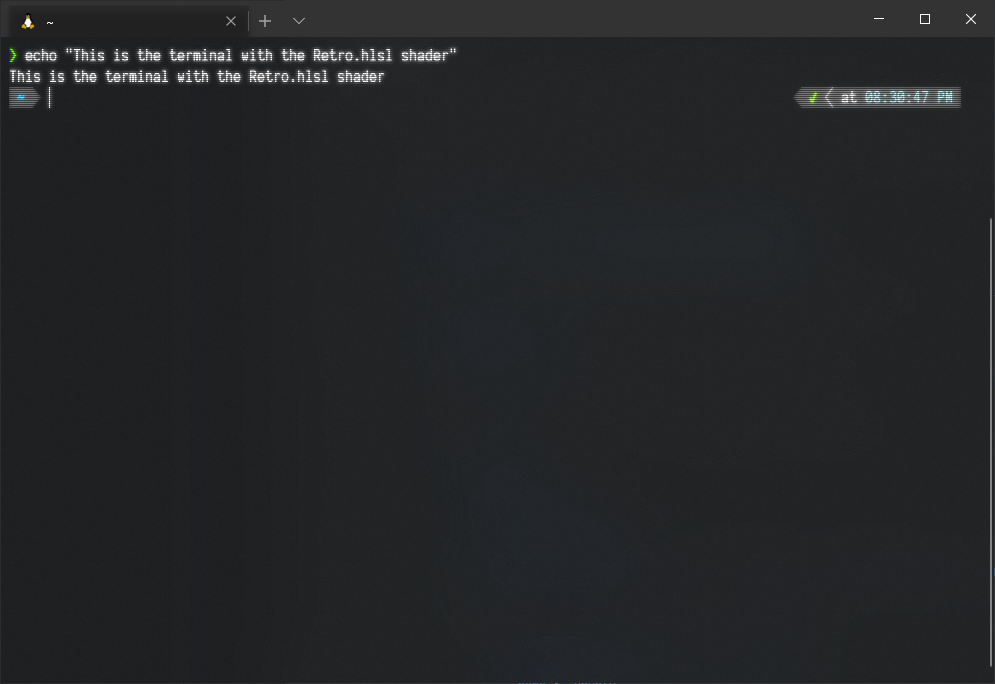

# Windows Terminal sample code

Explore some of the sample code hosted on the Windows Terminal repo, including [Pixel Shader .hlsl samples](#pixel-shaders), an [EchoCon ConPTY sample Win32 pseudo console](#echocon-conpty-sample-app), a [GUIConsole sample WPF console targeting .NET](#guiconsole-sample-app), a [MiniTerm sample using basic PTY API calls](#miniterm-sample-app), and a [ReadConsoleInputStream demo](#readconsoleinputstream-demo) for monitoring of console events while streaming character input.

## Pixel Shaders

Because GPUs provide so much computing power, you can do great things with pixel shaders, such as real-time fractal zoom, ray tracers, and image processing.

Windows Terminal allows users to provide a pixel shader, applied to the terminal by adding the `experimental.pixelShaderPath` property to a profile in your settings.json file. Pixel shaders are written in a language called [HLSL](https://github.com/microsoft/terminal/tree/main/samples/PixelShaders#hlsl), a C-like language with some restrictions.

Try one of several Pixel Shader .hlsl samples provided in the Windows Terminal repo: [Pixel Shaders](https://github.com/microsoft/terminal/tree/main/samples/PixelShaders).

## EchoCon ConPTY sample app

This sample application illustrates how to use the Win32 Pseudo Console (ConPTY) by:

1. Creating an input and an output pipe
1. Calling CreatePseudoConsole() to create a ConPTY instance attached to the other end of the pipes
1. Spawning an instance of ping.exe connected to the ConPTY
1. Running a thread that listens for output from ping.exe, writing received text to the Console

Visit the Windows Terminal repo to find this sample: [EchoCon ConPTY Sample App](https://github.com/microsoft/terminal/tree/main/samples/ConPTY/EchoCon).

## GUIConsole sample app

This sample application provides an example skeleton of a custom [WPF](/dotnet/desktop/wpf/overview/) console.

Within this sample, you find:

- GUIConsole.WPF: a WPF application, targeting .NET 4.6.1, that creates a single WPF window which acts as the console and keeps the underlying console visible.

- GUIConsole.ConPTY: a .NET Standard 2.0 library that handles the creation of the console and enables pseudoconsole behavior. The Terminal.cs file contains the publicly visible pieces that the WPF application interacts with. Terminal.cs exposes two things that allow reading from, and writing to, the console:

  - `ConsoleOutStream`: a FileStream hooked up to the pseudoconsole's output pipe. This stream outputs VT100.
  - `WriteToPseudoConsole`(string input): a method that takes the given string and writes it to the pseudoconsole via its input pipe. This method accepts VT100.

Visit the Windows Terminal repo to find this sample: [GUIConsole](https://github.com/microsoft/terminal/tree/main/samples/ConPTY/GUIConsole).

## MiniTerm sample app

This experimental terminal demonstrates basic API calls (not intended for "real-world" usage) using [PTY APIs](/windows/console/creating-a-pseudoconsole-session) from Microsoft. It's written in C# and heavily based on the native code examples.

Visit the Windows Terminal repo to find this sample: [MiniTerm](https://github.com/microsoft/terminal/tree/main/samples/ConPTY/MiniTerm).

## ReadConsoleInputStream Demo

This demo shows asynchronous monitoring of console events, like mouse, menu, focus, and buffer or viewport resize, while simultaneously streaming the character input view from the console. This feature is particularly useful when working with VT100 streams and ConPTY.

Visit the Windows Terminal repo to find this demo: [ReadConsoleInputStream Demo](https://github.com/microsoft/terminal/tree/main/samples/ReadConsoleInputStream).
