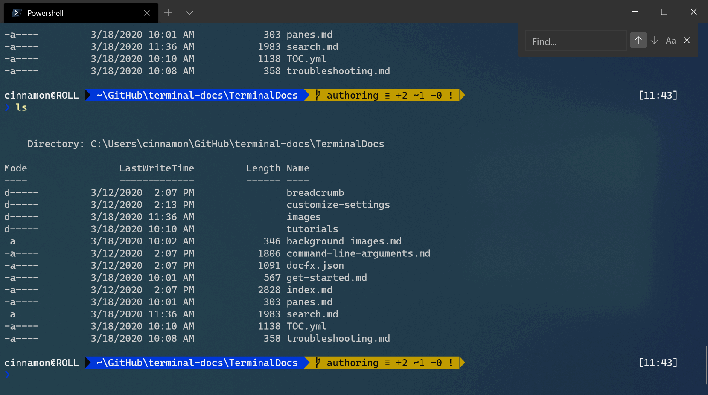
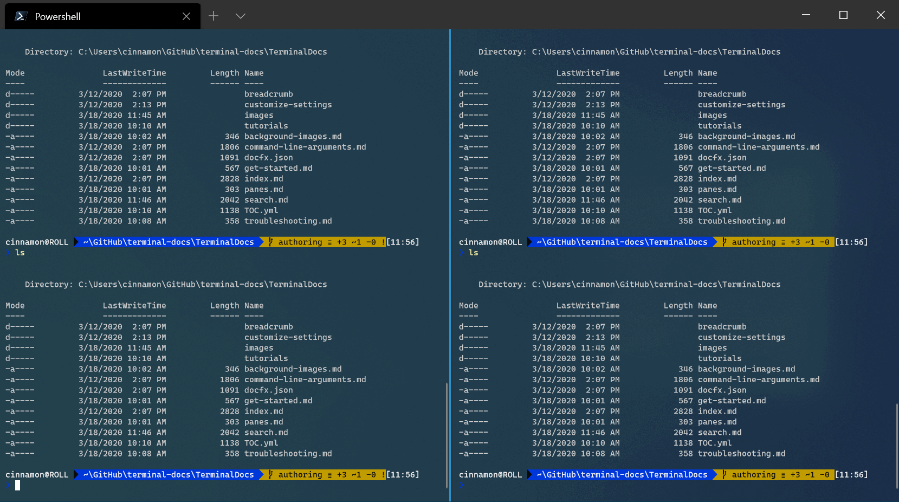

# How to search in Windows Terminal

The Windows Terminal comes with a search feature that allows you to look through the text buffer for a specific keyword. This is useful when trying to find a command you had run before or for a specific file name.

## Using search

By default, you can open the search dialog by typing `ctrl+shift+f`. Once opened, you can type the keyword you're looking for into the text box and hit `enter` to search.


_Configuration: [Powerline in PowerShell](./custom-terminal-gallery/powerline-in-powershell.md)_

## Directional search

The Terminal will default to searching from the bottom to the top of the text buffer. You can change the search direction by selecting one of the arrows in the search dialog.


## Case match search

If you'd like to narrow down your search results, you can add case matching as an option in your search. You can enable case matching by selecting the case match button, and the results that appear will only match the keyword entered with its specific letter casing.



## Searching within panes

The search dialog works with [panes](./panes.md) as well. When focused on a pane, you can open the search dialog and it will appear on the upper-right of that pane. Then any keyword you enter will only show results found within that pane.



## Customize the search key binding

You can open the search dialog with any key binding you feel comfortable with. This can be done by changing the key binding in your settings.json file that uses the `find` command. By default, this command is bound to `ctrl+shift+f`. The below key binding will bind `find` to `ctrl+f`, so when typing `ctrl+f`, the search dialog will open.

```json
{ "command": "find", "keys": "ctrl+f" }
```

To learn more about key bindings, visit the [key bindings page](./customize-settings/key-bindings.md).
