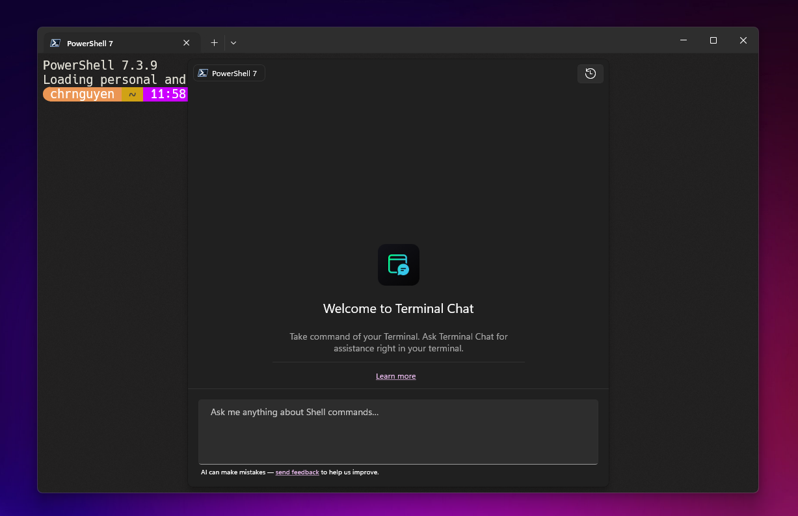
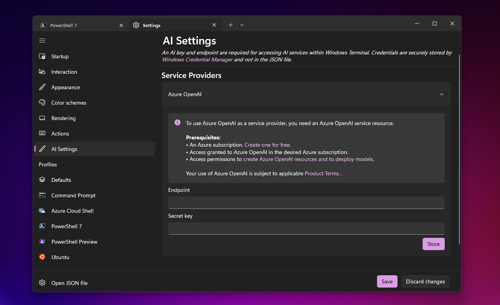
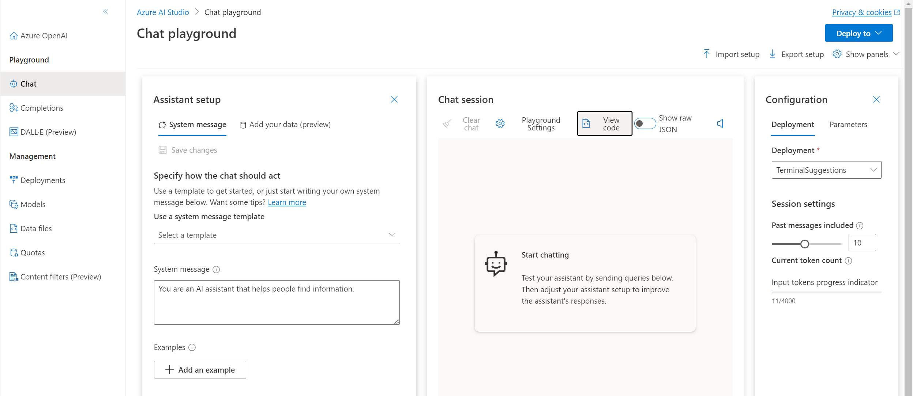
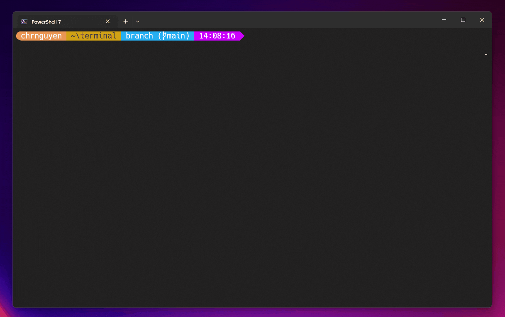
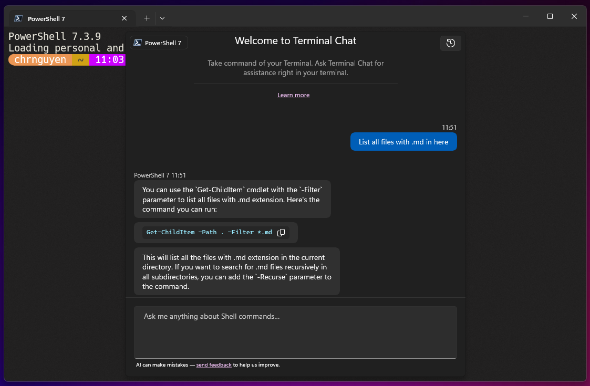
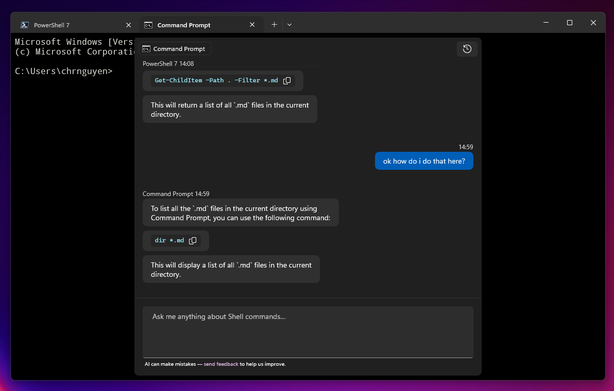
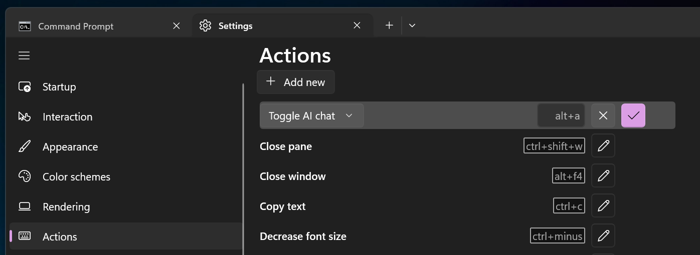
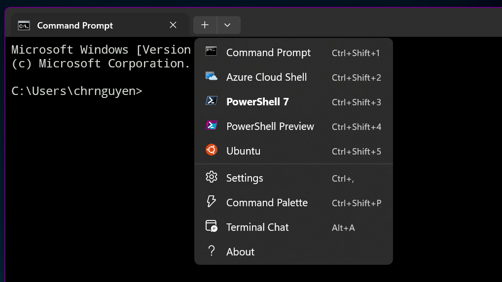

# Terminal Chat in Windows Terminal Canary
Terminal Chat is a feature in [Windows Terminal Canary](https://github.com/microsoft/terminal#installing-windows-terminal-canary) that allows the user to leverage an AI service to get suggestions within the context of their terminal. 

Windows Terminal Canary only communicates with an AI service when the user sends a message. The chat history and name of the user’s active shell is also appended to the message that is sent to the AI service. The chat history is not saved by Windows Terminal Canary after their terminal session is over.

For now, this feature is only available in Windows Terminal Canary and supports [Azure OpenAI Service](https://azure.microsoft.com/products/ai-services/openai-service). This feature does not ship with its own large-language model. 

> [!NOTE]
> Terminal Chat is only available on [Windows Terminal Canary](https://github.com/microsoft/terminal#installing-windows-terminal-canary).

 

## Setting up Terminal Chat
 To use Terminal Chat, you will need to add an Azure OpenAI Service endpoint and key to the AI Settings of Windows Terminal Canary. To get an Azure OpenAI Service endpoint and key, you will need to create and deploy an Azure OpenAI Service resource.

 

 ### Creating and Deploying an Azure OpenAI Service resource

 To create and deploy an Azure OpenAI Service resource, please follow the official Azure OpenAI documentation on [creating and deploying an Azure OpenAI Service resource](https://learn.microsoft.com/azure/ai-services/openai/how-to/create-resource).

In that documentation, you will learn how to:

1. [Create a resource](https://learn.microsoft.com/azure/ai-services/openai/how-to/create-resource?pivots=web-portal#create-a-resource)

2. [Deploy a model](https://learn.microsoft.com/azure/ai-services/openai/how-to/create-resource?pivots=web-portal#deploy-a-model)

You will need to use a `gpt-35-turbo` model (or equivalent) with your deployment.

After creating a resource and deploying a model, you can find your Azure OpenAI Service endpoint and key by navigating to the **Chat** playground in Azure OpenAI Studio and selecting **View code** in the Chat session section.

 

The **View code** pop-up dialog will show you a valid Azure OpenAI Service endpoint and key that you can use for Terminal Chat.

### Saving and Storing your AI Settings
After entering your AI service endpoint and key in AI Settings, select **Store** and **Save** to store and save those values. 

This will allow you to use Terminal Chat with the AI service affiliated with your service endpoint.

## Using Terminal Chat

Terminal Chat allows the user to chat with an AI service to get intelligent suggestions (such as looking up a command or explaining an error message) while staying in the context of their terminal.

Clicking on the chat bubble will place the suggestion on the input line of the terminal. This will not run the suggestion automatically. 

## Tips & Tricks

### Terminal-specific context

Terminal Chat takes the name of the active shell and sends that name as additional context to the AI service to get suggestions that are more tailored towards the active shell. 

This means that Terminal Chat can identify whether a user's active shell is Command Prompt or PowerShell for example. 

### Assigning a keybinding to Terminal Chat

Terminal Chat can be set as a keybinding Action. 

This can be done in **Actions** in the **Settings** UI. Add a new keybinding Action by selecting **+ Add new** and then picking **Toggle AI chat** from the dropdown to add a new keybinding Action for the Terminal Chat feature. 

The new keybinding will also be reflected in the dropdown menu after these changes are saved. 

