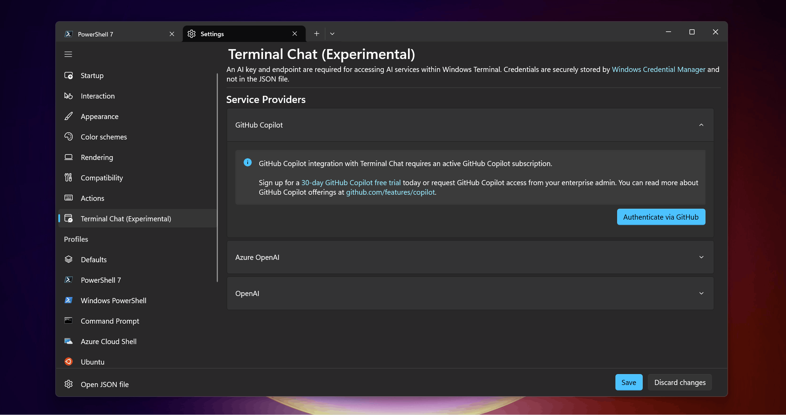
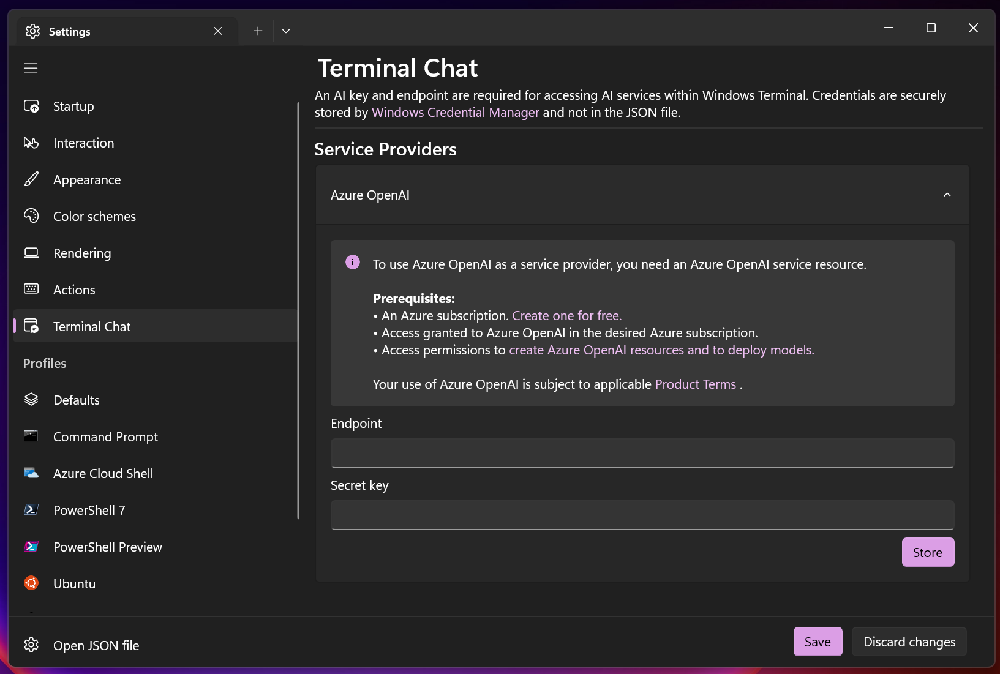

# Terminal Chat (Experimental)

Terminal Chat is an experimental feature that integrates [Windows Terminal Canary](https://github.com/microsoft/terminal#installing-windows-terminal-canary) with your preferred AI service.

When you connect Terminal Chat to your AI service provider (GitHub Copilot, Azure OpenAI, or OpenAI), you can ask questions specific to the shell you're using (PowerShell, CMD, WSL Ubuntu, Azure Cloud Shell, and more) while staying in the context of your terminal.

Terminal Chat can:

- Provide command syntax and descriptions
- Explain command line error messages
- Send code suggestions to command-line text editors

Terminal Chat doesn't include its own large-language model. For now, this experimental feature is only available in [Windows Terminal Canary](https://github.com/microsoft/terminal#installing-windows-terminal-canary) and supports [GitHub Copilot](https://go.microsoft.com/fwlink/?linkid=2294410), [Azure OpenAI Service](https://azure.microsoft.com/products/ai-services/openai-service), and [OpenAI](https://openai.com/).

Terminal Chat only communicates with your selected AI service when you enter a message in the chat. The chat history and name of the user's active shell are also appended to the message that's sent to the AI service. Windows Terminal doesn't save the chat history after the terminal session ends.

 

## Prerequisites

- This experimental feature is only available in [Windows Terminal Canary](https://github.com/microsoft/terminal#installing-windows-terminal-canary).

- An AI service provider subscription is required. GitHub Copilot, Azure OpenAI, and OpenAI are currently supported.

## Set up a service provider in Terminal Chat

To use Terminal Chat, you need to connect GitHub Copilot or add an Azure OpenAI or OpenAI endpoint to your Terminal Chat settings. 

1. Open Windows Terminal and select **Settings** from the drop-down menu on the far-right of the top menu bar.

1. Select the **Terminal Chat (Experimental)** tab to display the service provider configuration settings.

1. Select a **Service Provider**. To use Terminal Chat, you need a subscription to one of the following AI service providers. You need to set up and authenticate the AI service in the service provider settings. See the following steps to activate your preferred AI service provider.

### AI service providers

**[GitHub Copilot](https://go.microsoft.com/fwlink/?linkid=2293915)**: Under Service Providers, select **GitHub Copilot** and **Authenticate via GitHub** to sign in to GitHub. Check **Set as active provider** to set GitHub Copilot as your active service provider.

To connect GitHub Copilot with Terminal Chat, you must have an active subscription for GitHub Copilot in your personal account, or you need to be assigned a seat by your organization. You can sign up for a [GitHub Copilot free trial](https://go.microsoft.com/fwlink/?linkid=2293915) in your personal account to evaluate GitHub Copilot.

> [!NOTE]
> If you have access to GitHub Copilot via your organization, you can't use GitHub Copilot if your organization owner disables GitHub Copilot in the CLI. See "[Managing policies for Copilot in your organization](https://docs.github.com/copilot/managing-copilot/managing-github-copilot-in-your-organization/setting-policies-for-copilot-in-your-organization/managing-policies-for-copilot-in-your-organization)."

For more information on how to use GitHub Copilot responsibly with Windows Terminal, see ["Responsible use of GitHub Copilot in Windows Terminal"](https://docs.github.com/en/copilot/responsible-use-of-github-copilot-features/responsible-use-of-github-copilot-in-windows-terminal).

**[Azure OpenAI](/azure/ai-services/openai/overview)**: Under Service Providers, select **Azure OpenAI**, enter an endpoint URL and key, select **Store** and **Save**.

To get an Azure OpenAI Service endpoint and key, you need to create and deploy an Azure OpenAI Service resource.

- [Create and deploy an Azure OpenAI Service resource](/azure/ai-services/openai/how-to/create-resource)

You need to use a `gpt-35-turbo` model and ensure that the [jailbreak content filter](/azure/ai-services/openai/how-to/content-filters) is enabled for your deployment.

After creating a resource and deploying a model, you can find your Endpoint and API key by navigating to the **Chat** playground in Azure OpenAI Studio and selecting **View code** in the Chat session section. The pop-up dialog provides an endpoint URL and key that you can use in the Terminal Chat Service Provider settings.

**[OpenAI](https://openai.com/)**: Under Service Providers, select **OpenAI**, enter an endpoint URL and key, select **Store** and **Save**.

To get an OpenAI endpoint and key, refer to the OpenAI documentation.

- [Developer quickstart: Create and export an API key](https://platform.openai.com/docs/quickstart/step-2-setup-your-api-key?desktop-os=windows)

OpenAI is provided by a third party and not Microsoft. When you send a message in Terminal Chat, your Terminal Chat history per session and the name of your active shell profile is sent to the third-party AI service for use by OpenAI. Your use of OpenAI is governed by the relevant third-party terms, conditions, and privacy statement. 

## Examples for using Terminal Chat

The following examples demonstrate a few ways that you might consider using Terminal Chat.

- **Command suggestions**: Ask for a command that you want to use. Terminal Chat adds the name of the active shell to the prompt after it is sent. For example, if you're using PowerShell and ask "How do I make a new directory?", the response might be `md`. If you're using an Ubuntu (Linux) command line with WSL, the response might be `mkdir`.
Clicking on the suggestion copies it to the input line of the terminal. This action doesn't run the suggestion automatically. 

- **Translate commands**: Use Terminal Chat to "translate" commands. For example, ask "What's `touch` in PowerShell?" or "How do I `touch` in PowerShell?" to get the suggestion of `New-Item`, a PowerShell command that's equivalent to the Linux and Unix-based `touch` command for creating a new file.

- **Explain an error**: If you receive an unfamiliar error response in your command line, copy and paste it into Terminal Chat and ask for an explanation of the error code and how to fix it. For example, "How do I fix `Error: getaddrinfo ENOTFOUND`?"

- **Send code suggestions to command-line text editors**: If you're using a command-line text editor in WSL (like `nano` or `vi`), you can ask Terminal Chat to generate code and send the code suggestion to the editor by selecting the "Copy" button.

- **Find and describe PowerShell cmdlets**: A [cmdlet](/powershell/module/microsoft.powershell.management/) (pronounced command-let) is a lightweight script command used to perform a specific function in PowerShell. Terminal Chat can help you find cmdlets that might be useful and explain what tasks they accomplish. For example, "Find a cmdlet to show a list of active processes" results in `Get-Process`. Or "Explain the `Get-ChildItem` cmdlet" describes that the cmdlet is used to retrieve a list of items within a specified location.

### Terminal-specific context

Terminal Chat takes the name of the active shell and sends that name as additional context to the AI service to get suggestions that are more tailored towards the active shell. 

This feature means that Terminal Chat can identify whether a user's active shell is Command Prompt or PowerShell. 

### Assign a keybinding to Terminal Chat

Set Terminal Chat as a keybinding in the **Actions** tab of Windows Terminal **Settings**. Add a new keybinding by selecting **+ Add new**, then select **Toggle Terminal Chat** from the dropdown to add a new keybinding Action for the Terminal Chat feature.

The new keybinding also appears in the dropdown menu after you save these changes.

### Group Policy

You can disable Language Models and AI Services that Terminal Chat uses through the **Enabled Language Models/AI Providers** policy. 
You can also disable the Terminal Chat feature with the same policy.
For more information, see the [Group Policies page](./group-policy.md).
