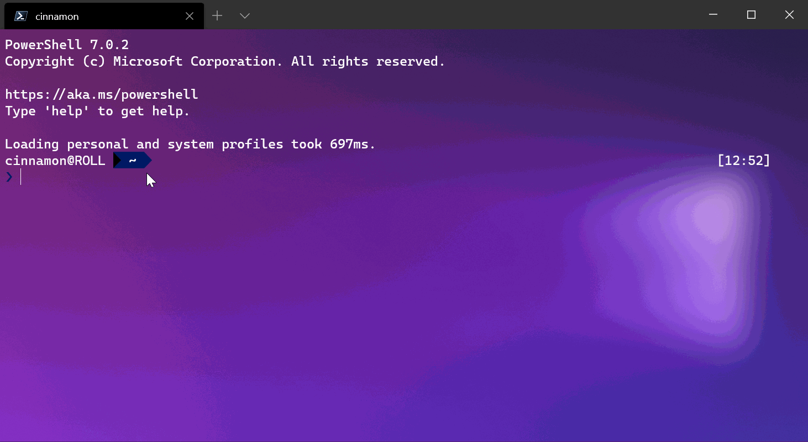
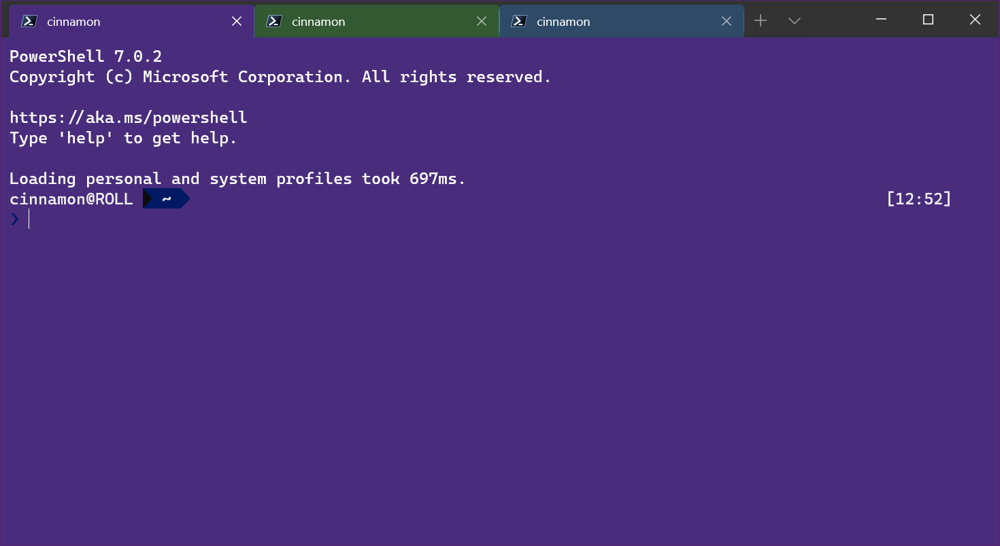

# Windows Terminal tips and tricks

## On first launch

When you first install Windows Terminal, you see a Windows PowerShell prompt. Windows Terminal includes Windows PowerShell, Command Prompt, and Azure Cloud Shell profiles by default.

If you install any [Windows Subsystem for Linux (WSL)](/windows/wsl) distributions, the terminal automatically creates profiles for those distributions. If you install additional WSL distributions after installing terminal, the profiles for those distributions automatically appear on your next terminal launch. These profiles use the Linux Tux image as their icon.

> [!NOTE]
> You can change the icon of each WSL distribution if desired. Specific distribution icons don't come shipped inside the terminal but you can download and assign them using the terminal settings.

## View default settings

Windows Terminal comes with a large set of default settings, including [color schemes](./customize-settings/color-schemes.md) and [keyboard shortcuts](./customize-settings/actions.md) (now called "Custom actions"). To view the default settings file, hold <kbd>Alt</kbd> and select the Settings button inside the dropdown menu.

## Default profile settings

Windows Terminal enables you to apply a setting to every profile without having to duplicate the setting for each profile entry. Add a setting inside the "defaults" array inside the [profiles](./customize-settings/profile-general.md) object. Learn more about [General profile settings](./customize-settings/profile-general.md), [Appearance profile settings](./customize-settings/profile-appearance.md), and [Advanced profile settings](./customize-settings/profile-advanced.md).

```json
"profiles":
    {
        "defaults":
        {
            // Put settings here that you want to apply to all profiles.
            "fontFace": "Cascadia Code"
        },
        "list":
        []
    }
```

## Rename a tab

You can rename a tab for that terminal session by right-clicking on a tab and selecting **Rename Tab**. Selecting this option in the context menu changes your tab title into a text field, where you can then edit the title. To set the tab title for that profile for every terminal instance, see the [Tab title tutorial](./tutorials/tab-title.md).



## Color a tab

To color a tab for a terminal session, right-click on the tab and select **Color**.... Choose a color from the predefined list or select **Custom...** to pick any color using the color picker or the RGB/HSV or hex fields.



> [!TIP]
> Use the hex field to set your tab to the same color as your background color for a seamless look.

Set the `tabColor` as part of a profile. See [Profile - Appearance: Tab color](./customize-settings/profile-appearance.md#tab-color). For example:

```json
 {
            "guid": "{1234abc-abcd-1234-12ab-1234abc}",
            "name": "Windows PowerShell",
            "background": "#012456",
            "tabColor": "#012456",
        },
```

You can't set the `tabColor` as part of a color scheme. Additionally, while you can [set the tab title from the commandline](./tutorials/tab-title.md) with escape sequences, you currently can't set the tab color in this way.

## Mouse interaction

You can interact with Windows Terminal in several ways by using a mouse.

### Zoom with the mouse

You can zoom the text window of Windows Terminal (making the text size larger or smaller) by holding <kbd>Ctrl</kbd> and scrolling. The zoom persists for that terminal session. To change your font size, see the [Profile - Appearance page](./customize-settings/profile-appearance.md#text).

### Adjust background opacity with the mouse

You can adjust the opacity of the background by holding <kbd>Ctrl+Shift</kbd> and scrolling. The opacity persists for that terminal session. To change your acrylic opacity for a profile, see the [Profile - Appearance page](./customize-settings/profile-appearance.md#transparency).

> [!NOTE]
> In Windows Terminal version 1.12, changing the background opacity with the mouse wheel uses vintage-style opacity by default, unless you set `useAcrylic` to true in your settings. In earlier versions, the terminal always used acrylic for transparency.

### Open a hyperlink

You can open a hyperlink from inside Windows Terminal with your mouse by using <kbd>Ctrl</kbd> + click.

### Drag and drop file or folder to open

You can drag and drop a file or folder over the **New Tab** button to open your default profile with that file or folder. By default, this action opens a new tab. Hold <kbd>Alt</kbd> to open a new pane in your current tab, or hold <kbd>Shift</kbd> to open a new window.


### Copy and paste

You can right-click with your mouse to copy and paste text within Windows Terminal by using your clipboard storage.

Windows Terminal also includes a **[copyOnSelect](./customize-settings/interaction.md#automatically-copy-selection-to-clipboard)** setting that you can set to `true` to immediately copy any text you select with your mouse to your clipboard. The right-click on your mouse always pastes in this case.

### Virtual Terminal and WSL mouse support

Windows Terminal supports mouse input in Windows Subsystem for Linux (WSL) applications, as well as Windows applications that use virtual terminal (VT) input. This support means applications such as [tmux](https://github.com/tmux/tmux/wiki) and [Midnight Commander](https://www.linuxhelp.com/how-to-install-midnight-commander-in-linux) recognize when you select items in the Terminal window. If an application is in mouse mode, hold down <kbd>Shift</kbd> to make a selection instead of sending VT input.

## Send input commands with a key binding

Windows Terminal gives you the ability to send input to your shell with a key binding. Use the following structure inside the `"actions"` array of your settings.json file.

```json
{ "command": {"action": "sendInput", "input": ""}, "keys": "" }
```

You can also add a `"name": ""` value if desired.

### Clear your screen

Sending input to the shell with a keyboard shortcut is useful for commands you run often. One example is clearing your screen:

```json
{ "command": {"action": "sendInput", "input": "clear\r"}, "keys": "alt+k", "name": "clear terminal" }
```

### Navigate to parent directory

Navigating to the parent directory with a key binding is also helpful.

```json
{ "command": {"action": "sendInput", "input": "cd ..\r"}, "keys": "ctrl+up" }
```

You can use this functionality to run builds or test scripts.

## Focus mode

"Focus mode" hides the title bar and tabs normally located at the top of Windows Terminal. You can focus only on the terminal content. It's similar to ["Zen mode"](https://code.visualstudio.com/docs/getstarted/tips-and-tricks#_zen-mode) in Visual Studio Code.

To enter focus mode, open the [command palette](./command-palette.md) with `Ctrl` + `Shift` + `p`, enter "focus mode", and select "Toggle focus mode." To exit focus mode, repeat these same steps.

To set focus mode to launch every time you start Windows Terminal, open the **Settings** (`Ctrl` + `,`) and select the **Startup** tab. Under **Launch mode**, select **Focus** (or **Maximized focus**, which is focus mode with your terminal window maximized). Select **Save** before exiting. The next time you launch the Windows Terminal, it opens in focus mode. To stop Windows Terminal from launching in focus mode, follow these same steps, but select **Default** from the list of **Launch mode** options.

To add a shortcut key (or keybinding) for entering focus mode, open the  `settings.json` file (`Ctrl` + `Shift` + `,`). Inside your `settings.json` file, find the [`"actions":`](./customize-settings/actions.md) section and add the following command:

```json
{ "command": "toggleFocusMode", "keys": "ctrl+f12" }
```

Replace "ctrl+f12" with the shortcut or keybinding of your choice, but don't repeat any existing keybindings from the Actions list. You can also see a list of Actions with associated keybindings, and **+ Add new** bindings, in the **Actions** tab of the Windows Terminal **Settings** dashboard. Remember to **Save** after making any changes. You can now toggle focus mode by using the "action" shortcut key that you created. (In the case of our example, `Ctrl` + `F12`).

To learn more about this command, see [`toggleFocusMode`](/windows/terminal/customize-settings/actions#toggle-focus-mode).

## Quake mode

"Quake mode" is a special mode the terminal enters when naming a window `_quake`. When a window is in quake mode:

* The terminal automatically snaps to the top half of the monitor.

* You can't resize the window horizontally or from the top. You can only resize it on the bottom.

* The window automatically enters focus mode (note that you can have multiple tabs in focus mode).

* When you set [`windowingBehavior`](./customize-settings/startup.md#new-instance-behavior) to `"useExisting"` or `"useAnyExisting"`, the settings ignore the existence of the `_quake` window.

* When minimized, the window hides from the taskbar and from <kbd>Alt+Tab</kbd>.

* Only one window can be the quake mode window at a time.

You can create the quake mode window by binding the `quakeMode` action or by manually running the command line:

```console
wt -w _quake
```

> [!NOTE]
> If you don't bind a [`quakeMode`](./customize-settings/actions.md#global-commands) action and minimize the quake window, you need to go into Task Manager to exit that terminal window!

## Split panes shortcuts

Use panes to keep related tasks visible (logs, editor, shell) without switching tabs. You can split the current pane horizontally or vertically, duplicate the current environment, move focus, and resize panes.

Common key bindings to add to the `"actions"` array in `settings.json`:

```json
{ "command": { "action": "splitPane", "split": "auto" }, "keys": "alt+shift+d", "name": "Split (auto)" },
{ "command": { "action": "splitPane", "split": "vertical" }, "keys": "alt+shift+v" },
{ "command": { "action": "splitPane", "split": "horizontal" }, "keys": "alt+shift+h" },
{ "command": { "action": "duplicatePane" }, "keys": "alt+shift+u", "name": "Duplicate pane" },
{ "command": { "action": "moveFocus", "direction": "left" }, "keys": "alt+left" },
{ "command": { "action": "moveFocus", "direction": "right" }, "keys": "alt+right" },
{ "command": { "action": "moveFocus", "direction": "up" }, "keys": "alt+up" },
{ "command": { "action": "moveFocus", "direction": "down" }, "keys": "alt+down" },
{ "command": { "action": "resizePane", "direction": "left" }, "keys": "alt+shift+left" },
{ "command": { "action": "resizePane", "direction": "right" }, "keys": "alt+shift+right" },
{ "command": { "action": "resizePane", "direction": "up" }, "keys": "alt+shift+up" },
{ "command": { "action": "resizePane", "direction": "down" }, "keys": "alt+shift+down" }
```

`splitPane` with `"split": "auto"` chooses orientation based on available space. `duplicatePane` creates a new pane with identical profile and working directory. See more in [Panes](./panes.md).

## Launch multiple panes and tabs at startup

You can open a pre-arranged workspace from a single `wt` command. Separate commands with `;` and use `sp` (or `split-pane`) to create panes.

```console
wt -p "Windows PowerShell" ; sp -p "Command Prompt" ; new-tab -p "Ubuntu" ; sp -H -p "Ubuntu" ; focus-tab -t 0
```

Tips:

* Add `-d .` (or a path) after `-p` to start in a specific directory.
* Use `--title` to set initial tab titles.
* Chain `new-tab`, `split-pane`, and `focus-tab` to land focus exactly where you want.

## Search inside scrollback

Use the built-in search (`Ctrl+Shift+F`) to find text across the full scrollback buffer, not just visible lines. Toggle case sensitivity or regex from the search UI.

Enhancement tip: Increase the number of lines retained so search covers more history by adjusting `"historySize"` (default is often 9000). Example top-level setting:

```json
"historySize": 20000
```

If you want search to also include prior sessions, consider logging output to files and using external search utilities. Learn more in [Search](./search.md).

## Modular settings with JSON fragments

Keep large configurations maintainable by splitting them into multiple files and importing them. Create separate files (for example `my-actions.json`, `my-themes.json`) and reference them with `"import"`.

```json
{
    "$schema": "https://aka.ms/terminal-profiles-schema",
    "import": ["my-actions.json", "my-themes.json"],
    "profiles": { "list": [] }
}
```

Each fragment file can contain a subset of settings (like `"actions"`, `"themes"`). See [JSON fragment extensions](./json-fragment-extensions.md) for details.

## Manage dynamic profiles

Windows Terminal auto-generates profiles for sources like PowerShell, Azure, and WSL. Hide sources you don't use to simplify the profile list.

```json
"disabledProfileSources": ["Azure", "PowerShell"]
```

Add this at the top level of `settings.json`. See [Dynamic profiles](./dynamic-profiles.md) for available source names.

## Environment variables per profile

Set context-specific environment variables without affecting the whole system. Add an `"environment"` object inside a profile.

```json
{
    "name": "Dev PowerShell",
    "commandline": "pwsh.exe",
    "environment": {
        "NODE_ENV": "development",
        "DEBUG": "1"
    }
}
```

Combine this with different `"startingDirectory"` values (for example a repo root) to create purpose-built shells.

## Retro terminal effect and theming

For a nostalgic look, enable the retro CRT shader along with acrylic transparency and a matching `tabColor`.

```json
{
    "name": "Retro Prompt",
    "background": "#101010",
    "useAcrylic": true,
    "acrylicOpacity": 0.8,
    "tabColor": "#101010",
    "experimental.retroTerminalEffect": true
}
```

Pair with a monochrome color scheme or the built-in "Vintage" scheme for best results.

## Shell integration and smart tab titles

Customize your shell prompt so Windows Terminal (and your tab titles) reflect the current directory, git branch, or virtual environment. See the [Custom prompt setup tutorial](./tutorials/custom-prompt-setup.md).

You can also bind a key to refresh a tab title manually via an escape sequence using `sendInput`. Example (PowerShell clearing and forcing a prompt redraw):

```json
{ "command": { "action": "sendInput", "input": "clear\r" }, "keys": "ctrl+alt+0", "name": "Refresh title" }
```

For more complex progress indicators and dynamic glyphs, explore [Progress bar sequences](./tutorials/progress-bar-sequences.md) and install a font variant with Powerline glyphs (like Cascadia Code PL).
