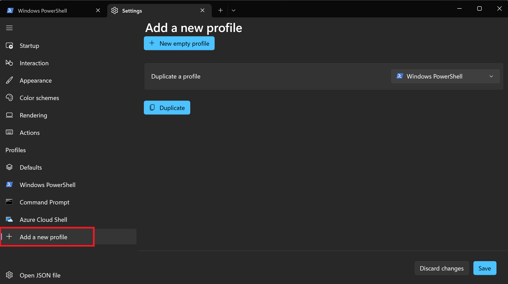
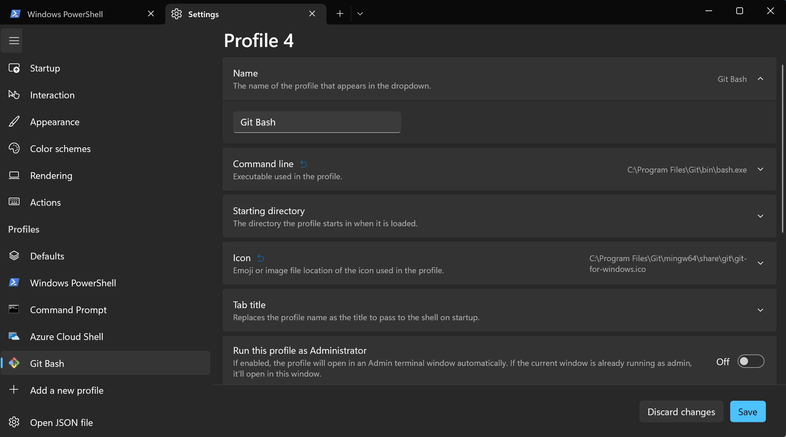
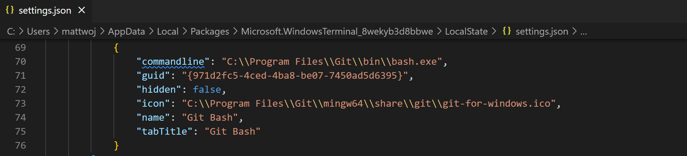

# Tutorial: Add a command line profile for Git Bash

In this tutorial, we will cover the steps for adding a new command line profile, using Git Bash as our example, so that it can be accessed using the tabs inside Windows Terminal.

Any shell prompt (command line interface) can be added as a profile to Windows Terminal and customized to suit your preferences using the Settings dashboard in Windows Terminal.

## Add a new profile

The **Settings** dashboard can be accessed via the dropdown menu carrot in the Windows Terminal title bar or with the shortcut, `Ctrl` + `,`. These settings correspond to the `settings.json` configuration file used by Windows Terminal, which can be accessed from the **Open JSON file** tab in the left column of the Settings dashboard or with the shortcut, `Ctrl` + `Shift` + `,`. Just above the **Open JSON file** tab, at the bottom of the list of command line profiles that are already installed in Windows Terminal, is the **+ Add a new profile** tab. Select this tab.

### New empty profile

Select **+ New empty profile**. This will open a template interface to help you create a new command line profile that corresponds to the `settings.json` file for your Windows Terminal.

You will need to enter the following information to set up your new profile:

**Name**: The name of the profile that appears in the dropdown.

**[Command line](../customize-settings/profile-general.md#command-line)**: The directory path associated with executable (.exe) for the shell prompt (command line interface) that you are adding.

**[Starting directory](../customize-settings/profile-general.md#starting-directory)**: The directory that the profile starts in when loaded.

**[Icon](../customize-settings/profile-general.md#icon)**: The directory path for the image file (or emoji) that you would like to use for your profile icon.

**[Tab title](../customize-settings/profile-general.md#tab-title)**: The title passed on startup to display in the Windows Terminal tab.

Additional settings include the option to always [start the profile in Administrator mode](../customize-settings/profile-general.md#automatically-run-as-administrator), [hide the profile from the dropdown list](../customize-settings/profile-general.md##hide-profile-from-dropdown), [customize the profile appearance](../customize-settings/appearance.md), and [advanced features](../customize-settings/profile-advanced.md) (such as changing the bell notification style associated when the profile emits a BEL character between an audible sound, a window flash, or a taskbar flash).

## Add Git Bash profile

To add [Git Bash](https://gitforwindows.org/), the Bash emulator that is included when installing Git for Windows, you will first need to find the directory containing your Git installation. This is most likely in your `C:\Program Files\Git` directory, but the path may vary depending on your settings during installation.

**Name**: You can name your Git Bash profile whatever you prefer.

**Command line**: Select the dropdown and then **Browse** to locate the `bash.exe` file in your Git directory. There are various versions of Git command line executable included with Git for Windows. You will need to find the `bash.exe` executable file located in the `/bin/` directory. If you used default path settings for your Git installation, the path is likely: `C:\Program Files\Git\bin\bash.exe`.

**Starting directory**: You can set the starting directory to whatever you prefer or leave the "Use parent process directory" box checked.

**Icon**: There is likely a Git icon included in your installation found in the `mingw64` directory at `C:\Program Files\Git\mingw64\share\git\git-for-windows.ico`. Use **Browse** to navigate to the directory and select the .ico file.

**Tab title**: You can set the tab title for your Git Bash profile to whatever you prefer.

The process of adding this Git Bash profile can be followed for whatever shell prompt (command line interface) you would like included in your Windows Terminal.

## JSON settings

Once you have added a new profile and selected **Save**, the profile will also appear in the profiles list of your `settings.json` file, along with a uniquely assigned GUID number.

## Customize your profile prompt

To learn how to customize the prompt for your new profile, see the [Set up a custom prompt tutorial](./custom-prompt-setup.md).
