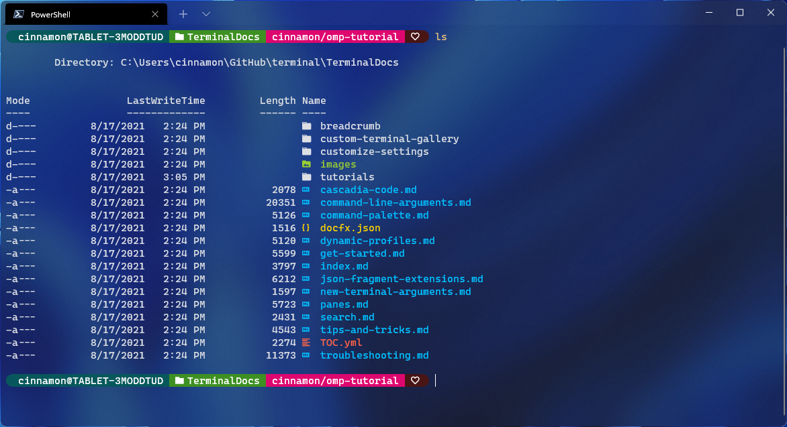
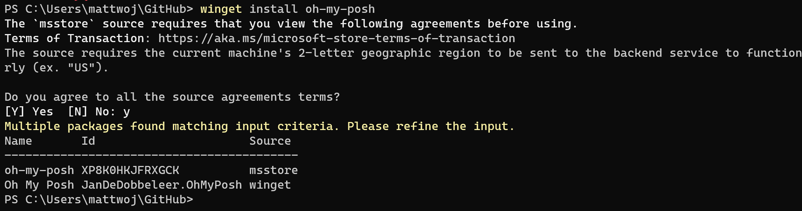

# Tutorial: Set up a custom prompt for PowerShell or WSL with Oh My Posh

This tutorial provides some resources and direction to help you customize your command prompt for PowerShell or Windows Subsystem for Linux (WSL) using [Oh My Posh](https://ohmyposh.dev). Oh My Posh provides theme capabilities for a fully customized command prompt experience providing Git status color-coding and prompts.

In this tutorial, you learn how to:

> [!div class="checklist"]
>
> * [Install a Nerd Font](#install-a-nerd-font)
> * [Customize your PowerShell prompt with Oh My Posh](#customize-your-powershell-prompt-with-oh-my-posh)
> * [Customize your WSL prompt with Oh My Posh](#customize-your-wsl-prompt-with-oh-my-posh)
> * [Use Terminal-Icons to add missing folder or file icons](#use-terminal-icons-to-add-missing-folder-or-file-icons)



## Install a Nerd Font

Customized command prompts often use glyphs (a graphic symbol) in order to style the prompt. If your font does not include the appropriate glyphs, you may see several Unicode replacement characters '&#x25AF;' throughout your prompt. In order to see all of the glyphs in your terminal, we recommend installing a [Nerd Font](https://www.nerdfonts.com/font-downloads).

If you'd like a font that looks like Cascadia Code, the Caskaydia Cove Nerd Font was built from the Cascadia Code repository by a community member.)

After downloading, you will need to unzip and install the font on your system. ([How to add a new font to Windows](https://support.microsoft.com/en-us/office/add-a-font-b7c5f17c-4426-4b53-967f-455339c564c1)).

To set a Nerd Font for use with Oh My Posh and Terminal Icons, open the Windows Terminal settings UI by selecting **Settings** (Ctrl+,) from your Windows Terminal dropdown menu. Select the profile where you wish to apply the font, PowerShell for example, and then the **Appearance** tab. In the **Font face** drop-down menu, select *CaskaydiaCove Nerd Font* or whichever Nerd font you would like to use with your customized prompt.

> [!NOTE]
> If you want to use a terminal font that does not support glyph icons, such as [Cascadia Code PL](https://github.com/microsoft/cascadia-code/releases), you may consider using an Oh My Posh theme that contains the `minimal` function, indicating that additional icons aren't required.

## Customize your PowerShell prompt with Oh My Posh

Oh My Posh enables you to use a full color set to define and render your terminal prompt, including the ability to use built-in themes or create your own custom theme.

### Install Oh My Posh for PowerShell

To customize your PowerShell prompt, you can install Oh My Posh using [winget](/windows/package-manager/winget). Enter the command:

```powershell
winget install oh-my-posh
```

This will install:

- `oh-my-posh.exe`: The Windows executable
- `themes`: The latest [Oh My Posh themes](https://ohmyposh.dev/docs/themes)

You will need to agree to the source terms and may run into the instance that more than one package is available. In this case, select package ID that you wish to use and re-enter the command: `winget install <package ID>`.



To use the Microsoft Store version of Oh My Posh, which will automatically update when new versions are available, use the command:

```powershell
winget install XP8K0HKJFRXGCK
```

Enter `oh-my-posh --version` to confirm the version number of your Oh My Posh installation. To ensure you have the latest updates, you can use the following command: `winget upgrade oh-my-posh`.

> [!NOTE]
> If you want to install the newest version of Oh My Posh in PowerShell, you may want to first remove the OMP module's cached files and uninstall the old module. There are instructions on how to do this in the [Oh My Posh docs](https://ohmyposh.dev/docs/migrating#migration-steps). 
> If you are more familiar with the [Scoop](https://scoop.sh/) installer or a manual installation method that allows automation, these can also be used for installing on Windows, just follow the instructions in the [Oh My Posh docs](https://ohmyposh.dev/docs/installation/windows).

### Choose and apply a PowerShell prompt theme

You may browse the full list of themes on the [Oh My Posh themes page](https://ohmyposh.dev/docs/themes).

Choose a theme and update your PowerShell profile with this command. (You can replace `notepad` with the text editor of your choice.)

```powershell
notepad $PROFILE
```

Add the following to the end of your PowerShell profile file to set the `paradox` theme. (Replace `paradox` with the theme of your choice.)

```powershell
oh-my-posh init pwsh --config "$env:POSH_THEMES_PATH\paradox.omp.json" | Invoke-Expression
```

Now, each new PowerShell instance will start by importing Oh My Posh and setting your command line theme.

> [!NOTE]
> This is not your Windows Terminal profile. Your PowerShell profile is a script that runs every time PowerShell starts. [Learn more about PowerShell profiles](/powershell/module/microsoft.powershell.core/about/about_profiles).

> [!TIP]
> Oh My Posh can be configured to restore the current working directory by enabling `osc99` in the General Settings. See the [Oh My Posh docs](https://ohmyposh.dev/docs/configuration/overview#general-settings).  

## Customize your WSL prompt with Oh My Posh

Oh My Posh now allows you to customize WSL prompts, just like you would a PowerShell prompt using [built-in themes](https://ohmyposh.dev/docs/themes).

### Install Oh My Posh for WSL

We recommend installing Oh My Posh for WSL, whether using Bash, Zsh, or something else, by following the [Linux install guide in the Oh My Posh docs](https://ohmyposh.dev/docs/installation/linux).

Currently the recommended path for customizing WSL prompts with Oh My Posh uses the [Homebrew package manager](https://brew.sh/) for installation. (Homebrew works with WSL now!) When installing Homebrew for Linux, be sure to follow [Next steps](https://docs.brew.sh/Homebrew-on-Linux#install) instructions to add Homebrew to your PATH and to your bash shell profile script.

Homebrew will install:

- `oh-my-posh` - Executable, added to /usr/local/bin
- `themes` - The latest Oh My Posh themes

### Choose and apply a WSL prompt theme

The Oh My Posh themes will be found in the oh-my-posh directory as JSON files. You can find it by entering `cd $(brew --prefix oh-my-posh)`, then just `cd themes` and `ls` for the list. For Ubuntu-20.04 running via WSL, the path is likely to be something like: `\\wsl.localhost\Ubuntu-20.04\home\linuxbrew\.linuxbrew\Cellar\oh-my-posh\6.34.1\themes`. You can also view what the themes look like in the Oh My Posh docs: [Themes](https://ohmyposh.dev/docs/themes).

To use a theme, copy it from the `themes` folder to your `$Home` folder, then add this line to the bottom of the `.profile` file found in your `$Home` folder:

```bash
eval "$(oh-my-posh --init --shell bash --config ~/jandedobbeleer.omp.json)"
```

You can replace `jandedobbeleer.omp.json` with the name of whichever theme you prefer to use as long as it's copied to your `$Home` folder.

Alternatively, if you are using oh-my-posh in both Windows with PowerShell and with WSL, you can share your PowerShell theme with WSL by pointing to a theme in your Windows user's home folder. In your WSL distribution's `.profile` path, replace ~ with the path: `/mnt/c/Users/<WINDOWSUSERNAME>`. Replacing `<WINDOWSUSERNAME>` with your own Windows username.

<!-- To reference the theme directly from it's original folder rather than moving it to $Home, you can use:
eval "$(oh-my-posh --init --shell bash --config $(brew --prefix oh-my-posh)/themes/jandedobbeleer.omp.json)" -->

You can [customize the Oh My Posh themes](https://ohmyposh.dev/docs/installation/customize) if desired.

## Use Terminal-Icons to add missing folder or file icons

[Terminal-Icons](https://github.com/devblackops/Terminal-Icons) is a PowerShell module that adds file and folder icons that may be missing when displaying files or folders in Windows Terminal, looking up their appropriate icon based on name or extension. It attempts to use icons for well-known files/folders, but falls back to a generic file or folder icon if one is not found.

To install Terminal-Icons with PowerShell, use the command:

```powershell
Install-Module -Name Terminal-Icons -Repository PSGallery
```

For more information, including usage and commands, see the [Terminal-Icons](https://github.com/devblackops/Terminal-Icons) repo on GitHub.

## Additional resources

* [Oh my Posh documentation](https://ohmyposh.dev)
* [Terminal-Icons Repository](https://github.com/devblackops/Terminal-Icons)
* [Posh-Git documentation](https://github.com/dahlbyk/posh-git#overview): Posh-Git is a PowerShell module that integrates Git and PowerShell by providing Git status summary information that can be displayed in the PowerShell prompt.
* [PowerLine documentation](https://powerline.readthedocs.io/en/master/overview.html): Powerline is a statusline plugin for vim, and provides statuslines and prompts for several other applications, including zsh, bash, tmux, IPython, Awesome, i3 and Qtile.
