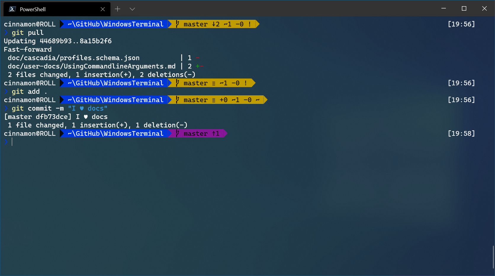

# Tutorial: Set up Powerline in Windows Terminal

Powerline provides a customized command prompt experience providing Git status color-coding and prompts.



In this tutorial, you learn how to:

> [!div class="checklist"]
>
> * Set up Powerline in PowerShell
> * Set up Powerline in Ubuntu/WSL
> * Add missing Powerline glyphs

> [!VIDEO https://www.youtube.com/embed/lu__oGZVT98]

## Prerequisites

### Install a Powerline font

Powerline uses glyphs in order to style the prompt. If your font does not include Powerline glyphs, you may see several Unicode replacement characters '&#x25AF;' throughout your prompt. Though [Cascadia Mono](./../cascadia-code.md) does not include Powerline glyphs, you can install Cascadia Code PL or Cascadia Mono PL, which have the Powerline glyphs included. These fonts can be installed from the [Cascadia Code GitHub releases page](https://github.com/microsoft/cascadia-code/releases).

## Set up Powerline in PowerShell

### PowerShell prerequisites

If you don't already have it, [install Git for Windows](https://git-scm.com/downloads).

Using PowerShell, install Posh-Git and Oh-My-Posh:

```powershell
Install-Module posh-git -Scope CurrentUser
Install-Module oh-my-posh -Scope CurrentUser
```

> [!TIP]
> You may need to install NuGet if you don't already have it. Your PowerShell command line will ask if you want to install NuGet if this is the case. Select [Y] Yes. You may also need to approve that you are installing modules from [PSGallery](https://docs.microsoft.com/powershell/scripting/gallery/getting-started), an 'untrusted repository'. Select [Y] Yes.

[Posh-Git](https://github.com/dahlbyk/posh-git) adds Git status information to your prompt as well as tab-completion for Git commands, parameters, remotes, and branch names. [Oh-My-Posh](https://github.com/JanDeDobbeleer/oh-my-posh) provides theme capabilities for your PowerShell prompt.

If you are using PowerShell Core, install PSReadline:

```powershell
Install-Module -Name PSReadLine -Scope CurrentUser -Force -SkipPublisherCheck
```

[PSReadline](https://docs.microsoft.com/powershell/module/psreadline) lets you customize the command line editing environment in PowerShell.

### Customize your PowerShell prompt

Open your PowerShell profile with `notepad $PROFILE` or the text editor of your choice. This is not your Windows Terminal profile. Your PowerShell profile is a script that runs every time PowerShell starts. [Learn more about PowerShell profiles](https://docs.microsoft.com/powershell/module/microsoft.powershell.core/about/about_profiles).

In your PowerShell profile, add the following to the end of the file:

```powershell
Import-Module posh-git
Import-Module oh-my-posh
Set-PoshPrompt -Theme paradox
```

Now, each new instance starts by importing Posh-Git and Oh-My-Posh, then setting the Paradox theme from Oh-My-Posh. Oh-My-Posh comes with several [built-in themes](https://ohmyposh.dev/docs/themes). If you decide to use Cascadia Code PL as a font, oh-my-posh themes that contain `minimal`
function without the need for additional icons. You can also [create a custom theme](https://ohmyposh.dev/docs/installation#change-the-theme) to match the font of your choice.

> [!IMPORTANT]
> Script execution policy must be set to either **RemoteSigned** or **Unrestricted** in order for the profile script to run. Run this command to see your current execution policy `Get-ExecutionPolicy`. [Learn more about Execution Policies](https://docs.microsoft.com/powershell/module/microsoft.powershell.core/about/about_execution_policies)

### Set Cascadia Code PL as your font

To set the Cascadia Code PL font for use with PowerLine (after downloading, unzipping, and installing on your system), you will need to open your [profile settings](../customize-settings/profile-appearance.md) in your settings.json file by selecting **Settings** (Ctrl+,) from your Windows Terminal dropdown menu. This can also be done using the settings UI if you have it enabled.

Once your settings.json file opens, find the Windows PowerShell profile and add: `"fontFace": "Cascadia Code PL"` to designate Cascadia Code PL as the font. This will provide those nice Cascadia Code Powerline glyphs. You should notice the change in your terminal as soon as you select **Save** in your editor.

Your Windows PowerShell profile settings.json file should now look like this:

```json
{
    // Make changes here to the powershell.exe profile.
    "guid": "{61c54bbd-c2c6-5271-96e7-009a87ff44bf}",
    "name": "Windows PowerShell",
    "commandline": "powershell.exe",
    "fontFace": "Cascadia Code PL",
    "hidden": false
},
```

> [!TIP]
> If you also use the integrated terminal in Visual Studio Code, you should add `"terminal.integrated.fontFamily": "Cascadia Code PL"` to your Visual Studio Code settings to make sure Powerline works there as well.

## Set up Powerline in WSL Ubuntu

### WSL Ubuntu prerequisites

Ubuntu has several Powerline options to install from. This tutorial will be using oh-my-posh for Linux:

First, install oh-my-posh:

```bash
wget https://github.com/JanDeDobbeleer/oh-my-posh/releases/latest/download/posh-linux-amd64 -O /usr/local/bin/oh-my-posh
chmod +x /usr/local/bin/oh-my-posh
```

The second step is optonal. Oh-my-posh can use the same theme config regardless of the shell or evironment, so if you're already using
it on Windows Powershell for example, you can reuse that theme configuration rather than download the themes.
If you plan to use it within Ubuntu WSL only, fetch the [themes](https://ohmyposh.dev/docs/themes) so you can get started right away:

```bash
mkdir ~/.poshthemes
wget https://github.com/JanDeDobbeleer/oh-my-posh/releases/latest/download/themes.zip -O ~/.poshthemes/themes.zip
unzip ~/.poshthemes/themes.zip -d ~/.poshthemes
chmod u+rw ~/.poshthemes/*.json
rm ~/.poshthemes/themes.zip
```

### Customize your Ubuntu prompt

Open your `~/.bashrc` file with `nano ~/.bashrc` or the text editor of your choice. This is a bash script that runs every time bash starts. Add the following (change the theme to the one you like):

```bash
eval "$(oh-my-posh --init --shell bash --config ~/.poshthemes/jandedobbeleer.omp.json)"
```

## Additional resources

* [Scott Hanselman's "How to make a pretty prompt in Windows Terminal"](https://www.hanselman.com/blog/HowToMakeAPrettyPromptInWindowsTerminalWithPowerlineNerdFontsCascadiaCodeWSLAndOhmyposh.aspx)
* [Oh my Posh documentation](https://ohmyposh.dev)
