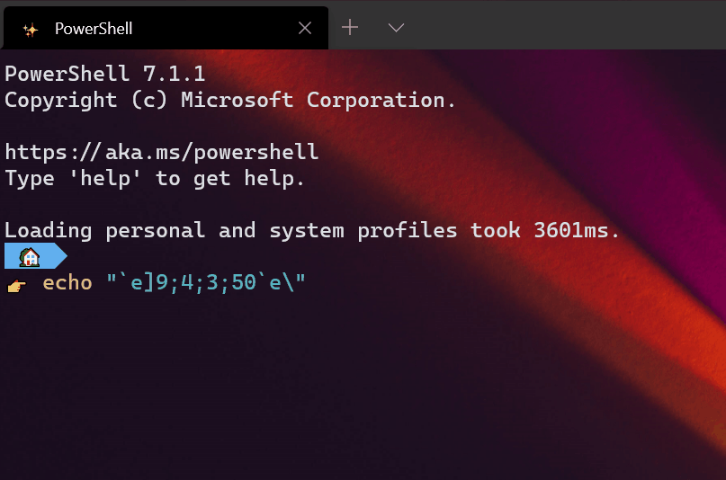

# Tutorial: Set the progress bar in the Windows Terminal

The Windows Terminal supports the ConEmu "Progress Bar" sequences, also known as "OSC 9;4". These sequences allow a command-line application to display a progress bar in the terminal window. This is useful for long-running commands, such as copying large files or deploying applications.

In the Windows Terminal, the progress bar is displayed in  two places:
* In the tab header, as a progress ring
* In the Windows taskbar, in the same manner as a download progress bar.



## Prerequisites

* Windows Terminal v1.6 or later.
* For the taskbar animation, you'll need to make sure "Show animations in Windows" is enabled in "Settings / Ease of Access / Display".


## Progress bar sequence format

To set the progress bar, you need to send the OSC 9;4 sequence to the terminal. This sequence has the following format:

```text

ESC ] 9 ; 4 ; <state> ; <progress> BEL

```

* `ESC` is the escape character, ASCII 27.
* `BEL` is the bell character, ASCII 7.
* `<state>` is one of `0`, `1`, `2`, `3`, or `4`.
  * `0` is the default state, and indicates that the progress bar should be hidden. Use this state when the command is complete, to clear out any progress state.
  * `1`: set progress value to `<progress>`, in the "default" state.
  * `2`: set progress value to `<progress>`, in the "Error" state
  * `3`: set the taskbar to the "Indeterminate" state. This is useful for commands that don't have a progress value, but are still running. This state ignores the `<progress>` value.
  * `4`: set progress value to `<progress>`, in the "Warning" state
* `<progress>` is a number between 0 and 100, inclusive.

## Examples

### PowerShell

```powershell
# Set the progress bar to 50%
Write-Host -NoNewline ([char]27 + "]9;4;1;50" + [char]7)
```

Or, alternatively, in PowerShell 7:

```powershell
# Set the progress bar to 50%
Write-Host -NoNewline ("`e]9;4;1;50`a")
```

### Bash

```bash
# Set the progress bar to 50%
echo -ne "\033]9;4;1;50\a"
```

### C#

```csharp
// Set the progress bar to 50%
Console.Write("\x1b]9;4;1;50\x07");
```

### Command Prompt

Command Prompt is a little trickier, since it doesn't have great support for escape sequences. You can use the `echo` command to send the escape sequence, but you'll need to use literal ESC and BEL characters in the file. These might be rendered as boxes in the web browser, but they should work in the terminal.

```bat
<NUL set /p =]9;4;1;50 
echo Started progress (normal, 50)
```

The above example uses the `NUL` device to write the escape sequence to the console without a newline.

### Nushell

```nu
# Set the progress bar to 50%
print "\u{1b}]9;4;1;50\u{07}"
```

> **Note**:
> Don't see your favorite shell here? If you figure it out, feel free to [contribute a solution for your preferred shell!](https://github.com/MicrosoftDocs/terminal/compare)
