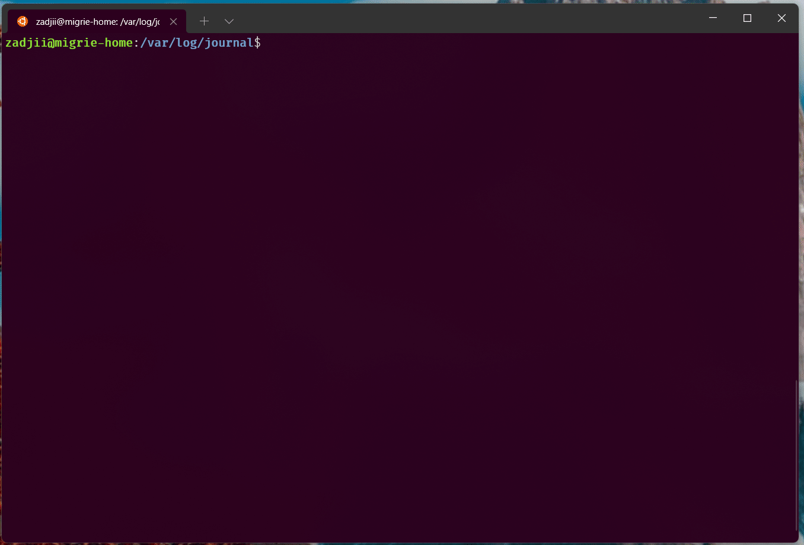
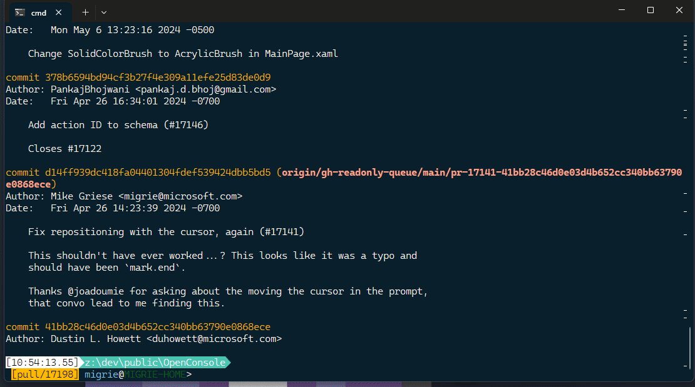

# Shell Integration

- [Shell Integration](#shell-integration)
  - [How does this work?](#how-does-this-work)
  - [How to enable shell integration marks](#how-to-enable-shell-integration-marks)
    - [PowerShell (`pwsh.exe`)](#powershell-pwshexe)
    - [Command Prompt](#command-prompt)
    - [Bash](#bash)
  - [Shell integration features](#shell-integration-features)
    - [Open new tabs in the same working directory](#open-new-tabs-in-the-same-working-directory)
    - [Show marks for each command in the scrollbar](#show-marks-for-each-command-in-the-scrollbar)
    - [Automatically jump between commands](#automatically-jump-between-commands)
    - [Select the entire output of a command](#select-the-entire-output-of-a-command)
    - [Recent command suggestions](#recent-command-suggestions)
  - [Additional resources](#additional-resources)


Starting in Terminal 1.15 Preview, the Windows Terminal has started experimentally supporting some "shell integration" features. These features make the command-line easier to use. In earlier releases, we enabled shell to tell the Terminal what the current working directory is. Now, we've added support for more sequences to allow your shell to semantically describe parts of the terminal output as a "prompt", a "command", or "output". The shell can also tell the terminal whether a command succeeded or failed.

This is a guide to some of the shell integration features we've rolled out as of Terminal v1.18. We're planning on building even more features on top of these in the future, so we'd love to get some additional feedback on how folks using them.

> **Note**:
>  As of Terminal 1.21, marks are now a stable feature. Prior to 1.21, marks were **only enabled for [Preview](https://aka.ms/terminal-preview) builds of the Terminal**.
> If you're using a version of Terminal before 1.21, the `showMarksOnScrollbar` setting was named `experimental.showMarksOnScrollbar`, and `autoMarkPrompts` was named `experimental.autoMarkPrompts`.

## How does this work?

Shell integration works by having the shell (or any command line application) write special "escape sequences" to the Terminal. These escape sequences aren't printed to the Terminal - instead, they provide bits of metadata the terminal can use to know more about what's going on in the application. By sticking these sequences into your shell's prompt, you can have the shell continuously provide info to the terminal that only the shell knows.

For the following sequences:

* `OSC` is the string `"\x1b]"` - an escape character, followed by `]`
* `ST` is the "string terminator", and can be either `\x1b\` (an ESC character, followed by `\`) or `\x7` (the BEL character)
* Spaces are merely illustrative.
* Strings in `<>` are parameters that should be replaced by some other value.

The relevant supported shell integration sequences as of Terminal v1.18 are:

* `OSC 133 ; A ST` ("_FTCS_PROMPT_") - The start of a prompt.
* `OSC 133 ; B ST` ("_FTCS_COMMAND_START_") - The start of a commandline (READ: the end of the prompt).
* `OSC 133 ; C ST` ("_FTCS_COMMAND_EXECUTED_") - The start of the command output / the end of the commandline.
* `OSC 133 ; D ; <ExitCode> ST` ("_FTCS_COMMAND_FINISHED_") - the end of a command. `ExitCode` If `ExitCode` is provided, then the Terminal will treat `0` as "success" and anything else as an error. If omitted, the terminal will just leave the mark the default color.

## How to enable shell integration marks

Supporting these features requires cooperation between your shell and the Terminal. You'll need to both enable settings in the Terminal to use these new features, as well as modify your shell's prompt.

To enable these features in the Terminal, you'll want to add the following to your settings:

```json
"profiles":
{
    "defaults":
    {
        // Enable marks on the scrollbar
        "showMarksOnScrollbar": true,

        // Needed for both pwsh, CMD and bash shell integration
        "autoMarkPrompts": true,

        // Add support for a right-click context menu
        // You can also just bind the `showContextMenu` action
        "experimental.rightClickContextMenu": true,
    },
}
"actions":
[
    // Scroll between prompts
    { "keys": "ctrl+up",   "command": { "action": "scrollToMark", "direction": "previous" }, },
    { "keys": "ctrl+down", "command": { "action": "scrollToMark", "direction": "next" }, },

    // Add the ability to select a whole command (or its output)
    { "command": { "action": "selectOutput", "direction": "prev" }, },
    { "command": { "action": "selectOutput", "direction": "next" }, },

    { "command": { "action": "selectCommand", "direction": "prev" }, },
    { "command": { "action": "selectCommand", "direction": "next" }, },
]
```

How you enable these marks in your shell varies from shell to shell. Below are tutorials for CMD, PowerShell and Zsh.

### PowerShell (`pwsh.exe`)

If you've never changed your PowerShell prompt before, you should check out [about_Prompts](/powershell/module/microsoft.powershell.core/about/about_prompts) first.

We'll need to edit your `prompt` to make sure we tell the Terminal about the CWD, and mark up the prompt with the appropriate marks. PowerShell also lets us include the error code from the previous command in the `133;D` sequence, which will let the terminal automatically colorize the mark based if the command succeeeded or failed.

Add the following to your [PowerShell profile](/powershell/module/microsoft.powershell.core/about/about_profiles):

```powershell
$Global:__LastHistoryId = -1

function Global:__Terminal-Get-LastExitCode {
  if ($? -eq $True) {
    return 0
  }
  $LastHistoryEntry = $(Get-History -Count 1)
  $IsPowerShellError = $Error[0].InvocationInfo.HistoryId -eq $LastHistoryEntry.Id
  if ($IsPowerShellError) {
    return -1
  }
  return $LastExitCode
}

function prompt {

  # First, emit a mark for the _end_ of the previous command.

  $gle = $(__Terminal-Get-LastExitCode);
  $LastHistoryEntry = $(Get-History -Count 1)
  # Skip finishing the command if the first command has not yet started
  if ($Global:__LastHistoryId -ne -1) {
    if ($LastHistoryEntry.Id -eq $Global:__LastHistoryId) {
      # Don't provide a command line or exit code if there was no history entry (eg. ctrl+c, enter on no command)
      $out += "`e]133;D`a"
    } else {
      $out += "`e]133;D;$gle`a"
    }
  }


  $loc = $($executionContext.SessionState.Path.CurrentLocation);

  # Prompt started
  $out += "`e]133;A$([char]07)";

  # CWD
  $out += "`e]9;9;`"$loc`"$([char]07)";

  # (your prompt here)
  $out += "PWSH $loc$('>' * ($nestedPromptLevel + 1)) ";

  # Prompt ended, Command started
  $out += "`e]133;B$([char]07)";

  $Global:__LastHistoryId = $LastHistoryEntry.Id

  return $out
}
```

#### Oh My Posh setup

Using oh-my-posh? You'll want to slightly modify the above, to stash away the
original prompt, then add it back in the middle of the shell integration escape
sequences.

```pwsh
# initialize oh-my-posh at the top of your profile.ps1
oh-my-posh init pwsh --config "$env:POSH_THEMES_PATH\gruvbox.omp.json" | Invoke-Expression
# then stash away the prompt() that oh-my-posh sets
$Global:__OriginalPrompt = $function:Prompt

function Global:__Terminal-Get-LastExitCode {
  if ($? -eq $True) { return 0 }
  $LastHistoryEntry = $(Get-History -Count 1)
  $IsPowerShellError = $Error[0].InvocationInfo.HistoryId -eq $LastHistoryEntry.Id
  if ($IsPowerShellError) { return -1 }
  return $LastExitCode
}

function prompt {
  $gle = $(__Terminal-Get-LastExitCode);
  $LastHistoryEntry = $(Get-History -Count 1)
  if ($Global:__LastHistoryId -ne -1) {
    if ($LastHistoryEntry.Id -eq $Global:__LastHistoryId) {
      $out += "`e]133;D`a"
    } else {
      $out += "`e]133;D;$gle`a"
    }
  }
  $loc = $($executionContext.SessionState.Path.CurrentLocation);
  $out += "`e]133;A$([char]07)";
  $out += "`e]9;9;`"$loc`"$([char]07)";
  
  $out += $Global:__OriginalPrompt.Invoke(); # <-- This line adds the original prompt back

  $out += "`e]133;B$([char]07)";
  $Global:__LastHistoryId = $LastHistoryEntry.Id
  return $out
}
```

### Command Prompt

Command Prompt sources it's prompt from the `PROMPT` environment variable. CMD.exe reads `$e` as the `ESC` character.  Unfortunately, CMD.exe doesn't have a way to get the return code of the previous command in the prompt, so we're not able to provide success / error information in CMD prompts.

You can change the prompt for the current CMD.exe instance by running:

```cmd
PROMPT $e]133;D$e\$e]133;A$e\$e]9;9;$P$e\$P$G$e]133;B$e\
```

Or, you can set the variable from the commandline for all future sessions:

```cmd
setx PROMPT $e]133;D$e\$e]133;A$e\$e]9;9;$P$e\$P$G$e]133;B$e\
```

These examples assume your current `PROMPT` is just `$P$G`. You can instead choose to wrap your current prompt with something like:

```cmd
PROMPT $e]133;D$e\$e]133;A$e\$e]9;9;$P$e\%PROMPT%$e]133;B$e\
```

### Zsh

Zsh provides the special hook functions `precmd`, `preexec` and `chpwd`:

* `precmd` - Executed before each prompt.
* `preexec` - Executed just after a command has been read and is about to be executed.
* `chpwd` - Executed whenever the current working directory is changed.

We'll be using these hooks to mark the start of a prompt, start of command output, end of command output, and to tell the Terminal about the CWD.

To mark the beginning of a command we can use the Zsh Line Editor special widget `zle-line-init`, which is executed every time the line editor is started to read a new line of input.

Add the following to your `.zshrc`:

```zsh
# CWD
keep_current_path() {
    printf "\e]9;9;%s\e\\" "$(wslpath -w "$PWD")"
}
chpwd_functions+=(keep_current_path)

mark_prompt_start() {
  printf "\e]133;A\e\\"
}

mark_command_start() {
  # Only emit mark if at the start of a command line
  if [[ $CONTEXT == "start" ]]; then
    printf "\e]133;B\e\\"
  fi
}

mark_command_executed() {
  printf "\e]133;C\e\\"
}

mark_command_finished() {
  # The special variable ? expands to the exit status of the last command
  printf "\e]133;D;%s\e\\" $?
}

# Before each prompt, emit a mark for the end of the previous command
# And after that, a mark for the start of the prompt
precmd_functions+=(mark_command_finished mark_prompt_start)

# Starting to read new line of input
zle -N zle-line-init mark_command_start

# Command has been read and is about to be executed
preexec_functions+=(mark_command_executed)
```

### Bash

You can add the following to the end of your `~/.bashrc` to enable shell integration in bash:

```bash
PS1="\[\033]133;D;\007\]\[\033]133;A;\007\]$PS1\[\033]133;B;\007\]"
```

This will wrap your existing `$PS1` with the necessary sequences to enable shell integration.

> **Note**:
> Don't see your favorite shell here? If you figure it out, feel free to [contribute a solution for your preferred shell!](https://github.com/MicrosoftDocs/terminal/compare)

## Shell integration features

### Open new tabs in the same working directory


### Show marks for each command in the scrollbar


### Automatically jump between commands

This uses the `scrollToMark` actions as we have them defined above.


### Select the entire output of a command

In this gif, we use the `selectOutput` action bound to `ctrl+g` to select the entire output of a command.


The following uses the `experimental.rightClickContextMenu` setting to enable a right-click context menu in the Terminal. With that and shell integration enabled, you can right-click on a command to select the entire command or its output.


### Recent command suggestions

With shell integration enabled, the Suggestions UI can be configured to also show your recent commands.



You can open this menu with the following action:

```json
{
    "command": { "action": "showSuggestions", "source": "recentCommands", "useCommandline": true },
},
```

(For more info, see the [Suggestions documentation](../customize-settings/actions.md#open-suggestions-menu))

## Additional resources
* [`autoMarkPrompts`](../customize-settings/profile-advanced.md#automatically-add-scroll-marks)
* [`showMarksOnScrollbar`](../customize-settings/profile-advanced.md#show-marks-on-scrollbar)
* [`showSuggestions`](../customize-settings/actions.md#open-suggestions-menu)
