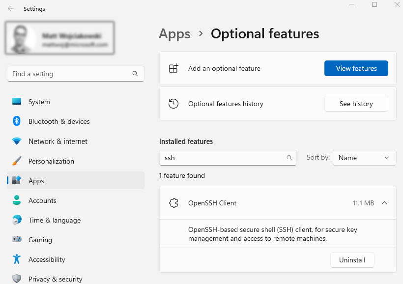

# Tutorial: SSH in Windows Terminal

Windows has a built-in SSH client that you can use in Windows Terminal. In this tutorial, you'll learn how to set up a profile in Windows Terminal that uses SSH.

## Access Windows SSH Client

The latest builds of Windows 10 and Windows 11 include a built-in SSH server and client that are based on OpenSSH, a connectivity tool for remote sign-in that uses the SSH protocol. OpenSSH encrypts all traffic between client and server to eliminate eavesdropping, connection hijacking, and other attacks.

By default, the OpenSSH client will be located in the directory: `C:\Windows\System32\OpenSSH`. You can also check that it is installed in Windows Settings > Apps > Optional features, then search for "OpenSSH" in your installed features.



## Create a profile

You can start an SSH session in your command prompt by executing `ssh user@machine` and you will be prompted to enter your password. You can create a Windows Terminal profile that does this on startup by adding the `commandline` setting to a profile in your [settings.json file](../install.md#settings-json-file) inside the `list` of profile objects.

```json
{
  "name": "user@machine ssh profile",
  "commandline": "ssh user@machine"
}
```

For more information, see:

* [Windows Terminal Profile - General settings](./../customize-settings/profile-general.md)

## Specify starting directory

To specify the starting directory for a ssh session invoked by Windows Terminal, you can use this command:

```json
{
  "commandline": "ssh -t bob@foo \"cd /data/bob && exec bash -l\""
}
```

The `-t` flag forces pseudo-terminal allocation. This can be used to execute arbitrary screen-based programs on a remote machine, e.g. when implementing menu services. You will need to use escaped double quotes as bourne shell derivatives don't do any additional parsing for a string in single quotes.

For more information, see:

* [GH Issue: How to specify the starting directory for a ssh session?](https://github.com/MicrosoftDocs/terminal/issues/25)
* [StackOverflow: How can I ssh directly to a particular directory?](https://stackoverflow.com/questions/626533/how-can-i-ssh-directly-to-a-particular-directory)

## Resources

* [How to Enable and Use Windows 10’s New Built-in SSH Commands](https://www.howtogeek.com/336775/how-to-enable-and-use-windows-10s-built-in-ssh-commands/)
